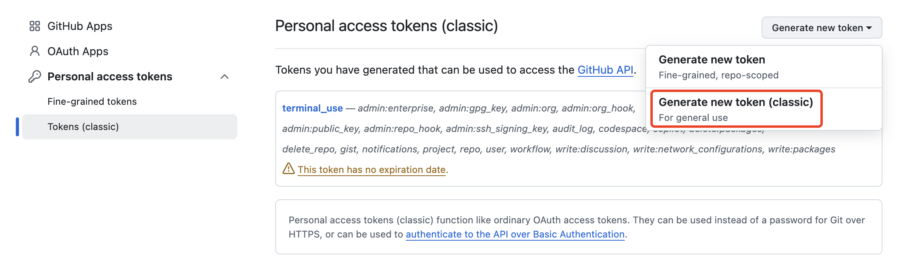
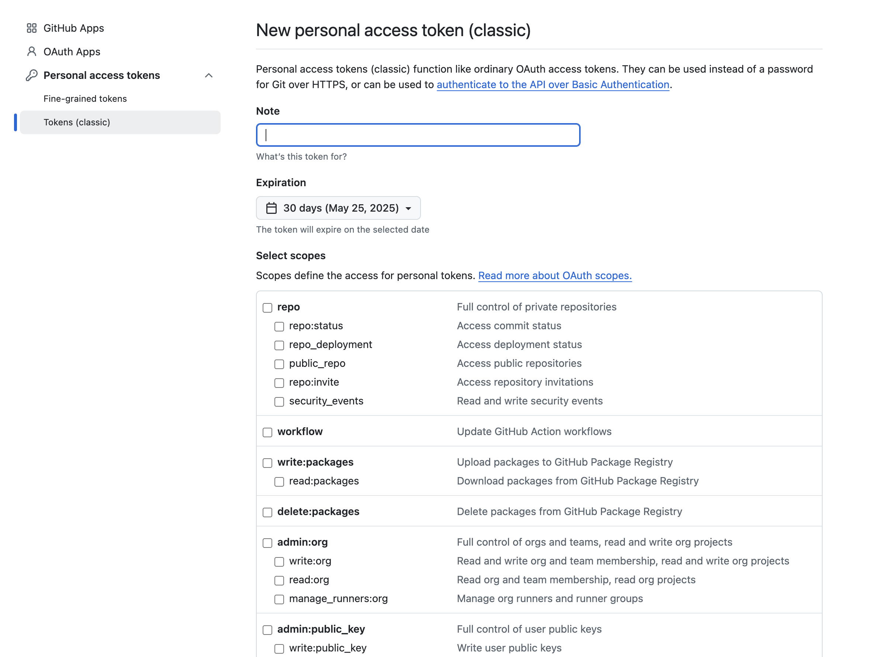

# Chapter 2 - Lab 1 - Git Practice

<div class="time-pill">ESTIMATED TIME TO COMPLETE: 25–30 MINUTES</div>


## Prerequisites:
- Install Git on your local machine if you haven't already. You can download it from [here](https://git-scm.com/).
- Recap basic Git commands such as `git init`, `git add`, `git checkout`, `git commit`, `git status`, and `git push`.

<hr>

## Request a GitHub Personal Access Token (Classic)

Before pushing code to GitHub, you may need a **Personal Access Token (Classic)** if you're using HTTPS. Follow these steps:

1. Go to your GitHub profile and click Settings (bottom-left sidebar).
2. Scroll down to the bottom and select Developer settings.
3. Under Personal access tokens, choose Tokens (classic).
4. Click Generate new token (classic).



5. Add a note (e.g., terminal_use), set an expiration date, and select the scopes you want to include.
   Make sure to include at least the following scopes:
   - repo (Full control of private repositories)
   - workflow (Update GitHub Actions workflows)
6. Click Generate token at the bottom.



7. **IMPORTANT**: Copy and store the token immediately and securely — you won’t be able to view it again, so make sure to save it in a safe place.


<hr>

## Hands-On Git Workflow

### Clone the Repository
Start by cloning the lab repository to your local machine.

```bash
    git clone https://github.com/open-devsecops/topic-1-lab-reference-app
```

### Navigate to the Repository Directory
Move into the directory of the cloned repository on your machine.

```bash
    cd <location_of_your_cloned_repo>
```

### Create a New Branch
Create a new branch named `feature-branch-<your_name>` (or a unique identifier for your branch).
    
```bash
    git checkout -b feature-branch-<your_name>
```

### Make Changes
Make changes to the code or README file in the repository. This could be as simple as adding your name to a list or modifying a line of code.

### Stage and Commit Your Changes
Stage your changes and then commit your changes with a descriptive message.

```bash
    git add .
```
```bash
    git commit -m "Changed README"
```

### Push Your Branch
Push your branch to the remote repository.
    
```bash
    git push origin feature-branch-<your_name>
```

### Authentication After Pushing

After running the git push command, you'll be prompted for:

- Username: Your GitHub username 
- Password: Paste the token you saved earlier

> Bonus: If you are using your personal machine and you want to avoid entering your username and password every time, you can cache your credentials. Follow the Git Credential instructions [here](https://git-scm.com/docs/gitcredentials).


### (Optional) Create a Pull Request
  - Navigate to the [GitHub repository page](https://github.com/open-devsecops/topic-1-lab-reference-app).
  - On the repo nav bar, click "Pull Requests."
  - On the right-hand side, click the green button titled "New Pull Request."
  - If it's not already there, change base branch to "main" and change compare to the branch you made.
  - Title it something meaningful, like "Added my name."
  - Click the green "Create pull request" button.
  - Click the green "Merge pull request" button and "Confirm."
    - **NOTE**: Typically in a professional setting, this is a step that the owner of a project will take after reviewing the changes you made. But for this exercise, you will do both steps.