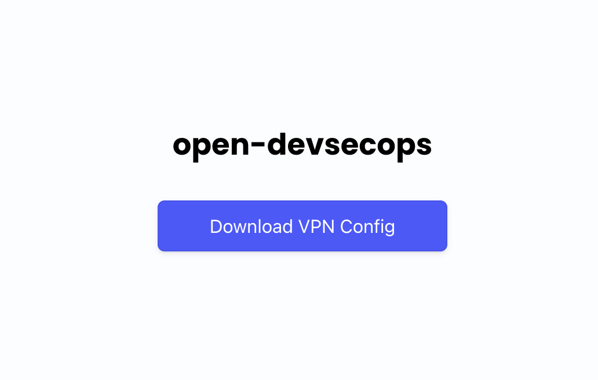
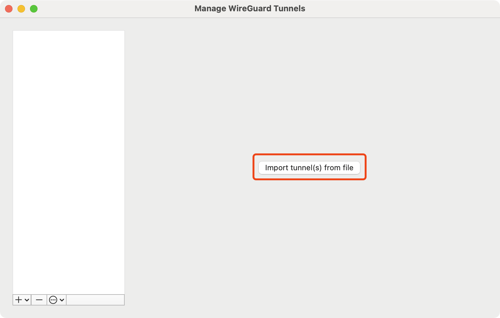
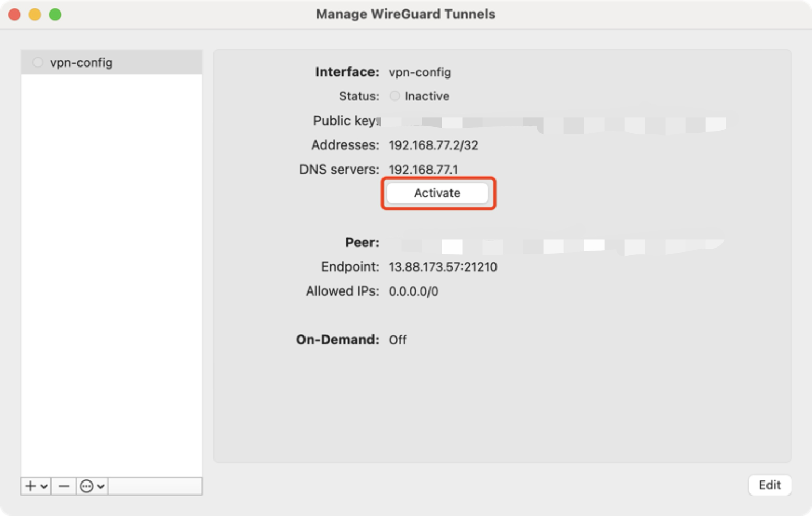
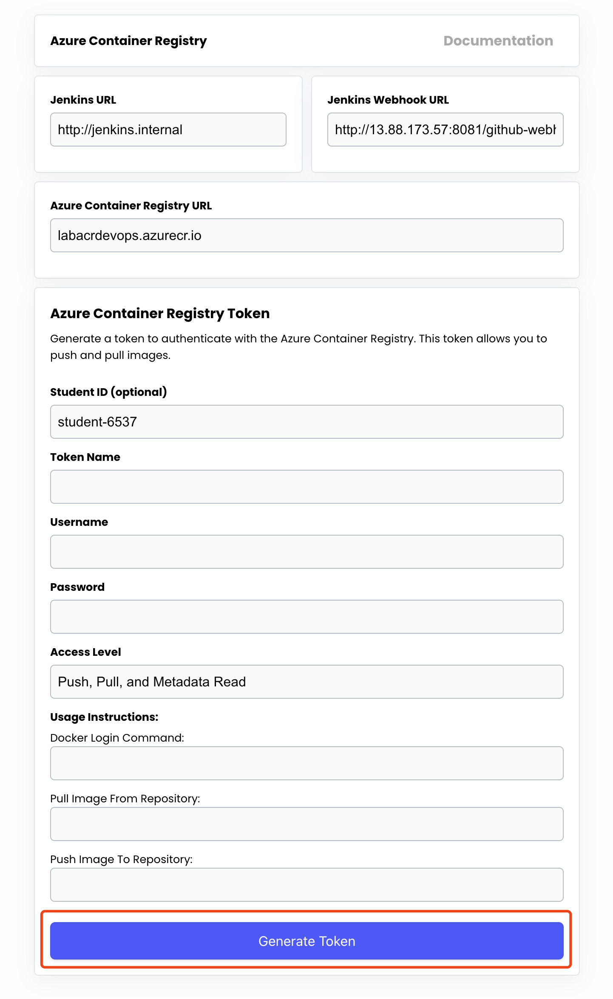
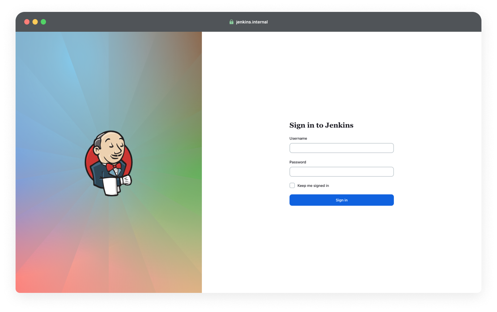

# Chapter 6 - Lab 2 - React + Node.js Project Deployment

<div class="time-pill">ESTIMATED TIME TO COMPLETE: 25–30 MINUTES</div>

## Introduction

THIS IS AN INTRODUCTION


<hr>

## Lab Overview

| Section | Topic                                                                                       |
| ------- | ------------------------------------------------------------------------------------------- |
| 1       | Containerizing a Web Application (React front-end and Node.js back-end seperately)          |
| 2       | Connecting to the Internal Network & Pushing Image to Shared Azure Container Registry (ACR) |

<hr>

## Prerequisites

### Software Requirements:

Before you begin this lab, ensure you have the following tools installed and ready on your machine:

| Name             | Description                                               | Installation Guide                                                                                |
| ---------------- | --------------------------------------------------------- | ------------------------------------------------------------------------------------------------- |
| Git              | To clone the infrastructure scripts.                      | [Getting Started - Installing Git](https://git-scm.com/book/en/v2/Getting-Started-Installing-Git) |
| Docker           | Used for building and running containerized applications. | [Get Docker](https://docs.docker.com/get-docker/)                                                 |
| Node.js          | To run the React application locally.                     | [Download Node.js](https://nodejs.org/en/download)                                                |
| Azure CLI        | To interact with Microsoft Azure Services.                | [How to install the Azure CLI](https://learn.microsoft.com/en-us/cli/azure/install-azure-cli)     |
| WireGuard Client | To access internal services.                              | [WireGuard Installation](https://www.wireguard.com/install/)                                      |

### Other Requirements:

- **Terminal / Linux Shell Access**: A terminal environment (such as Bash, Zsh, or Windows Subsystem for Linux) is required to run CLI commands, Terraform scripts, and Git operations.  
  
  - On Windows, it's recommended to install [Windows Subsystem for Linux (WSL)](https://learn.microsoft.com/en-us/windows/wsl/install).  
  - On macOS and Linux, a native terminal is already available.  

- **IDE**: You can use any code editor or IDE of your choice. Recommended options include:  
  
  - [Visual Studio Code](https://code.visualstudio.com/)  
  - [JetBrains IDEs](https://www.jetbrains.com/#for-developers)

### Skills and Knowledge

Below are the skills and knowledge expected to successfully complete the lab exercises:

- Basic command-line operations: You are comfortable navigating and executing commands in a terminal.
- Basic Git operations: cloning, forking, committing, pushing.
- Basic React knowledge: You understand how to run a React application locally

<hr>

## Prepare the Reference Application

### 1. Fork and Clone the Reference Application

Let's start by forking the reference application repository. This will create a copy that you can modify and use without affecting the original codebase. Cloning will then brings this copy to your local machine.

1. **Fork the Repository:** Navigate to the [reference application](https://github.com/open-devsecops/topic-2-lab-reference-app-azure) and fork the repository to your own GitHub account.
2. **Clone Your Fork:** Open your terminal and clone the forked repository to your local machine.

```bash
    git clone <your-forked-repo-url>
```

### 2. Run the React Application Locally

With the reference application repository cloned, let's run the React app locally to see how it looks and functions on your machine.

1. **Navigate to the Project Directory:** Move into the project directory in your terminal.
2. **Install Dependencies:** Run `npm install` to install the required node modules for the project.
3. **Start the Application:** Enter `npm start` to run the application locally. Your default web browser should automatically open to `http://localhost:3000`, displaying the reference application.

```bash
    cd topic-2-lab-reference-app
    npm install
    npm start
```

### 3. (Optional) Customize the React Application!

Now that you have the application running, feel free to personalize it if you want!

1. Open the project in your favorite code editor.
2. Make changes to alter the layout, style, or functionality of your app. For example, you might want to change text, font, or color!

<hr>

## Containerize the Application

You’ve built a powerful full-stack web application with a React front-end and a Node.js back-end. Now, let’s make sure it can run anywhere with ease—regardless of environment. The answer? **Containerization**.

In this section, you’ll learn how to containerize both parts of your project using **Docker**.

### 1. Containerizing the Front-End (React)

Since we are containerizing the front-end and back-end separately, we need to create individual `Dockerfile`s in each of their respective root directories.

Let’s begin with the front-end. You’ll start by creating a Dockerfile that compiles your React app and serves it using Nginx.

#### Step 1: Navigate to Root Directory

For the front-end, navigate to the `front_end/` directory and create a file named `Dockerfile`.

```bash
  cd front_end
```

#### Step 2: Write Dockerfile

**Build Stage:** This stage is for compiling the React app into static files.

- **Base Image:** Uses Node.js version 21 on Alpine Linux, a lightweight image ideal for quick builds.

- **`AS build`**: Labels this phase as `build` so it can be referenced later.
  
```dockerfile
  FROM node:21-alpine AS build
```

- **Working Directory:** Sets the working directory inside the container to `/app`. All commands below will run from here.
  
```dockerfile
  WORKDIR /app
```

- **Copy Dependency Files:** Copies `package.json` and `package-lock.json` (if exists) to the container. This allows Docker to cache dependencies separately from app code for faster rebuilds.
  
```dockerfile
  COPY package*.json ./
```

- **Install Dependencies:** Installs all required packages listed in the `package.json` files.
  
```dockerfile
  RUN npm install
```

- **Copy App Files:** Copies the rest of your project files into the container.
  
```dockerfile
  COPY . .
```

- **Build React App:** Runs the React build script. This generates optimized static files into the `/app/build` directory.
  
```dockerfile
  RUN npm run build
```

**Runtime Stage:** This stage is for serving the app using a production-ready web server.

- **Base Image:** Uses Alpine Linux version of Nginx. Lightweight and production-ready.

- **`AS runtime`**: Labels this stage as `runtime`, though the name isn’t used later—it’s just for clarity.
  
```dockerfile
  FROM nginx:alpine AS runtime
```

- **Working Directory:** Sets the working directory to Nginx’s default static file serving location.
  
```dockerfile
  WORKDIR /usr/share/nginx/html
```

- **Copy Build Files:** Copies the compiled static files from the `build` stage (`/app/build`) into Nginx’s serving directory (`/usr/share/nginx/html`).
  
```dockerfile
  COPY --from=build /app/build .
```

#### Complete Dockerfile for Front-End

```Dockerfile
  # Build stage
  FROM node:21-alpine AS build
  WORKDIR /app
  COPY package*.json ./
  RUN npm install
  COPY . .
  RUN npm run build
  
  # Runtime stage
  FROM nginx:alpine AS runtime
  WORKDIR /usr/share/nginx/html
  COPY --from=build /app/build .
```

#### Step 3: Build the Docker Image for Front-End

With your Dockerfile in place, let’s go ahead and build the Docker image. Run this command in `front_end/` directory to package the entire front-end code into a deployable image.

```bash
  docker build -t opendevops-nyctaxiweb-frontend:v1.0.0 .
```

#### Step 4: Run the Front-End Container

Once the image is built, you can run the container and expose the Nginx web server to your local machine’s port 8080.

```bash
  docker run -d -p 8000:80 --name opendevops-nyctaxiweb-frontend-dev opendevops-nyctaxiweb-frontend:v1.0.0
```

> **Why Map Ports?**
> 
> Inside the container, your React app is being served by Nginx on port 80 — but port 80 inside a container is not automatically accessible from your computer. By mapping it to port 8080 on your host machine, you’re saying:
> 
> "Hey Docker, whenever something tries to access my local machine at `localhost:8000`, forward that traffic to port 80 inside the container."
> 
> The `-p 8000:80` flag is telling Docker how to connect the container’s internal network to your local machine.
> 
> - The number after the colon (80) is the port inside the container — that’s where Nginx (the web server) is listening by default.
> 
> - The number before the colon (8000) is the port on your local machine (host) — this is where you’ll access the app in your browser.

Now visit [http://localhost:8000](http://localhost:8080) and you should see your React app up and running in the container.

#### Step 5: Stop the Front-End Container

If everything looks good, let’s clean up by stopping the test container:

```bash
  docker stop opendevops-nyctaxiweb-frontend-dev
```

### 2. Containerizing the Back-End (Node.js)

Similar to what we did for front-end, for the back-end, we’ll create another `Dockerfile` inside the `back_end/` directory. This file will define how Docker should run your Node.js server.

#### Step1: Navigate to Root Directory

For the back-end, navigate to the `back-end/` directory and create a file named `Dockerfile`.

```bash
  cd back_end
```

#### Step 2: Write Dockerfile

This Dockerfile contains a **single-stage build**, as the back-end does not need a separate runtime like the front-end did with Nginx. Node.js will serve your app directly.

- **Base Image:** Again, we’ll use Node.js version 21 on Alpine Linux. It’s small and efficient, perfect for production use.
  
```dockerfile
  FROM node:21-alpine
```

- **Working Directory:** Sets the working directory inside the container to `/app`, where all the server files will live.
  
```dockerfile
  WORKDIR /app
```

- **Copy Dependency Files:** Copies `package.json` and `package-lock.json` (if it exists) into the container. This is done first to enable Docker to cache `npm install` and avoid reinstalling packages unless dependencies change.
  
```dockerfile
  COPY package*.json ./
```

- **Install Dependencies:** Installs the required Node.js packages using npm.
  
```dockerfile
  RUN npm install
```

- **Copy App Files:** Transfers the rest of your server code into the container.
  
```dockerfile
  COPY . .
```

- **Default Command:** Tells Docker how to start your server when the container launches.
  
```dockerfile
  CMD ["node", "app.js"]
```

#### Complete Dockerfile for Front-End

```dockerfile
  FROM node:21-alpine
  WORKDIR /app
  COPY package*.json ./
  RUN npm install
  COPY . .
  
  CMD ["node", "app.js"]
```

#### Step 3: Build the Docker Image for Back-End

With the Dockerfile written, let’s build the Docker image for the back-end. Run this command from the `back_end/` directory:

```bash
  docker build -t opendevops-nyctaxiweb-backend:v1.0.0 .
```

This command tells Docker to create an image named `opendevops-nyctaxiweb-backend` using the instructions in the Dockerfile you just wrote.

#### Step 4: Test Run the Back-End Container

Once built, let’s run your container. If your Node.js server listens on port `3000`, we’ll map that port to your local machine like this:

```bash
  docker run -d -p 3000:3000 --name opendevops-nyctaxiweb-backend-dev opendevops-nyctaxiweb-backend:v1.0.0
```

> Similar to what we did for front-end, the Node.js server listens on port 3000 inside the container — but to access it from your browser or another service, you need to expose it to the host machine.
>  
> The `-p 3000:3000` flag means: “take requests from port 3000 on my laptop, and forward them to port 3000 inside the container where Node is running.”

Now visit [http://localhost:3000](http://localhost:3000) — and you should see your server responses just as if it were running natively on your machine.

#### Step 5: Stop the Back-End Container

If everything looks good, let’s clean up by stopping the test container:

```bash
  docker stop opendevops-nyctaxiweb-backend-dev
```

### 3. Push Your Dockfiles to GitHub

Now that you've successfully created Dockerfiles for both the front-end and back-end of your application, let’s make sure your changes are safely saved to your own forked repository on GitHub.

#### Step 1: Stage Your Changes

First, navigate back to the root directory of your forked project (where both `front_end/` and `back_end/` directories reside). Then, stage the newly created Dockerfiles:

```bash
  cd topic-2-lab-reference-app
  
  git add front_end/Dockerfile
  git add back_end/Dockerfile
```

#### Step 2: Commit Your Changes

Now that your Dockerfiles are staged, commit them with a clear message:

```bash
  git commit -m "Add Dockerfiles for React front-end and Node.js back-end"`
```

#### Step 3: Push to Your GitHub Repository

Finally, push your committed changes to your forked repository on GitHub:

```bash
  git push origin main
```

**Note:** If you are working on a different branch (e.g., `dev` or `feature`), replace `main` with your branch name.


<hr>

## Accessing the Corporate Network via VPN

### 1. VPN Configuration and Connection

Ask the lab administrator for the `public ip` of the internal network, and download the VPN configuration file from `https://{public_ip}`.

When you access the website using the public IP, you may encounter a security warning in your browser that states **"Your connection is not private"**. This warning appears because the site is using a **self-signed SSL certificate** rather than one issued by a recognized Certificate Authority. They offer the same level of encryption but are not verified by a third-party authority that your browser trusts by default ([Learn more here](https://en.wikipedia.org/wiki/Self-signed_certificate)). Click on "Advanced" or "Show Details" and proceed to the website (The exact wording may vary depending on your browser).



Import the VPN configuration file into the Wireguard Client to establish the VPN connection. This step provides access to internal services.




### 2. Navigate to the Dashboard

With the VPN connection activated, access `http://dashboard.internal` on your browser. This internal service dashboard is your gateway to various corporate resources.




<hr>

## Configuring CI/CD Pipeline
In the previous sections, we explored the fundamentals of containerization and how to manually build and distribute the Docker files. This manual process, however, introduces potential for human error.

In this section, we will transit from these manual workflows, and aim to streamline and automate these processes through the introduction of a basic CI/CD pipeline using Jenkins. By automating builds, tests, and deployments, we can significantly reduce the risk of errors, ensure consistency across environments, and accelerate the delivery of software updates.

**It's important to note that CI/CD pipelines in real-world scenarios involve more complexity and other CI/CD tools might use different syntax for defining pipelines.** However, understanding this basic structure will equip you with the fundamental knowledge required to grasp more complex workflows in the industry.

### 1. Accessing Jenkins
Once you're connected to the VPN, navigate to `http://jenkins.internal` in your browser to access the Jenkins dashboard. Ask the lab administrator for the credentials for jenkins.




### 2. Creating a Pipeline in Jenkins
- Create a New Item: From the Jenkins dashboard, select "New Item" at the top left.
- Name Your Pipeline: Enter a name for your project, and select "Pipeline" as the type.

**Configure the Pipeline:**

In the General section, choose "GitHub project" and enter the GitHub repository URL.

  - If you haven't already from the previous sections, fork the reference application repository and enter the forked repo URL.

In the Pipeline section, choose "Pipeline script from SCM" for the Definition.

  - Select "Git" as the SCM.
  - Enter the repository URL of your forked version of the reference application.
  - Change Branch Specifier from `*/master` to `*/main`.

Click `apply` and `save`.

### 3. Setting Up Webhooks

Webhooks allow GitHub to notify Jenkins about code changes, triggering the pipeline we have created.

**Configure Webhooks:**

  - Go to your forked repository on GitHub, navigate to "Settings" > "Webhooks" > "Add webhook."
  - Enter the URL provided on the `http://dashboard.internal` page into the Payload URL in GitHub Webhooks creation page.
  - Select `application/json` as the Content Type.
  - Save your webhook. This setup ensures Jenkins is notified on every code push, automating the build process.

### 4. Add Jenkins Credentials

To securely access your container registry, store the credentials in Jenkins:

1. Open Jenkins Dashboard.
2. Go to Manage Jenkins > Credentials > (select your scope, e.g., Global).
3. Click “Add Credentials”.
4. Select “Username with password” as the credential type.
5. Fill in the following:
   - ID: `jenkins-acr-scope-map-cred` (Make sure this ID matches what you use in your pipeline script)
   - Username: your registry username (e.g., Azure Service Principal or Docker ID)
   - Password: your registry password or client secret
6. Click Save.

These credentials will be securely accessed in later stages using withCredentials.

# TODO ADD SCREENSHOT OF CREDENTIALS 


### 5. Creating the Jenkinsfile

We're now going to create a Jenkinsfile.

Written in Groovy, Jenkinsfile provides a declarative way to define our CI/CD Pipeline, automating the steps we manually performed in previous sections.

####  Declarative Pipeline Syntax

Jenkinsfiles typically use a declarative syntax that outlines the pipeline in sections like `pipeline`, `agent`, `stages`, `stage`, and `steps` [More Information can be found in Jenkin's Documentation](https://www.jenkins.io/doc/book/pipeline/syntax/#declarative-sections).

#### Pipeline and Agent

All declarative pipelines are enclosed within a pipeline block. `agent` specifies where this pipeline will be executed. Let's keep this simple and tell Jenkins that it can use any available agent to run the pipeline.

```groovy
pipeline {
    agent any
}
```


#### Environment Variables

We will predefine some environment variables to make our pipeline cleaner and easier to maintain. These variables will be used throughout the pipeline, allowing us to change them in one place if needed.

```groovy
environment {
    AZURE_ACR_NAME = 'labacrdevops'
    IMAGE_NAME_FRONTEND = 'opendevops-nyctaxiweb-frontend:v1.0.0'
    IMAGE_NAME_BACKEND = 'opendevops-nyctaxiweb-backend:v1.0.0'
    ACR_LOGIN_SERVER = "${AZURE_ACR_NAME}.azurecr.io"
}
```


#### Stages

Now, we're going to use `stages` to include a sequence of one or more `stage` directives to define what work will be done in the pipeline.

```groovy
pipeline {
    agent any

    stages {
        // each stage goes in this block
    }
}
```

**Stage 1: Checkout**

In this stage, we will tell Jenkins to grab the latest version of our code from the repository we specified earlier in the Jenkins UI.

```groovy
stage('Checkout') {
    steps {
        checkout scm
    }
}
```

**Stage 2: Build**

Now that Jenkins has the codebase with the Dockerfile, we're going to ask it to build a Docker image. The `sh` is our way of telling Jenkins to execute the specified _shell_ command.

```groovy
stage('Build Frontend & Backend') {
    steps {
        dir('front_end') {
            sh 'docker build -t ${IMAGE_NAME_FRONTEND} .'
            sh 'docker tag ${IMAGE_NAME_FRONTEND} ${ACR_LOGIN_SERVER}/${IMAGE_NAME_FRONTEND}'
        }
        dir('back_end') {
            sh 'docker build -t ${IMAGE_NAME_BACKEND} .'
            sh 'docker tag ${IMAGE_NAME_BACKEND} ${ACR_LOGIN_SERVER}/${IMAGE_NAME_BACKEND}'
        }
    }
}
```

- The `<IMAGE_NAME_FRONTEND> and <IMAGE_NAME_BACKEND>` is where you specify your container image name. We have saved these as environment variables in the **Environment Variables** section for easy reference.


**Stage 3: Push Image**

With our Docker image built, it's time to push the image to a shared registry. This is where we will store our Docker images on the server that other machines can access. 

We will use the following variables:
  - `ACR_LOGIN_SERVER`: The login server for Azure Container Registry (ACR).
  - `IMAGE_NAME_FRONTEND`: The name of the front-end image.
  - `IMAGE_NAME_BACKEND`: The name of the back-end image.
  - `ACR_USER`: The username for ACR stored in Jenkins credentials.
  - `ACR_PASS`: The password for ACR stored in Jenkins credentials.

```groovy
stage('Push Image') {
    steps {
        script {
            withCredentials([
                usernamePassword(
                    credentialsId: 'jenkins-acr-scope-map-cred',  // Match the ID you set in Jenkins
                    usernameVariable: 'ACR_USER',
                    passwordVariable: 'ACR_PASS'
                )
            ]) {
                sh """
                    docker login ${ACR_LOGIN_SERVER} -u \$ACR_USER -p \$ACR_PASS
                    docker push ${ACR_LOGIN_SERVER}/${IMAGE_NAME_FRONTEND}
                    docker push ${ACR_LOGIN_SERVER}/${IMAGE_NAME_BACKEND}
                """
            }
        }
    }
}
```

> Using a shared registry is crucial because the image we've built needs to be accessible across different stages of the pipeline and potentially by different agents or nodes that might run these stages. These agents could be spread across various environments in the Cloud.

**Stage 4: Deploy**

Finally, we reach the deployment stage. This is where we take our Docker image and run it, making our application live and accessible to the world!

```groovy
stage('Deploy') {
    steps {
        sh 'docker pull ${ACR_LOGIN_SERVER}/${IMAGE_NAME_FRONTEND}'
        sh 'docker pull ${ACR_LOGIN_SERVER}/${IMAGE_NAME_BACKEND}'
        
        // List all containers (including stopped ones) to debug
        sh 'docker ps -a'
        
        // Stop any container using the names we want (one at a time)
        sh 'docker stop frontend || echo "No frontend container running"'
        sh 'docker stop backend || echo "No backend container running"'
        
        // Remove any container with these names (one at a time)
        sh 'docker rm -f frontend || echo "No frontend container to remove"'
        sh 'docker rm -f backend || echo "No backend container to remove"'
        
        // Check what's using our ports
        sh 'netstat -tuln | grep 8000 || echo "Port 8080 is free"'
        sh 'netstat -tuln | grep 3000 || echo "Port 3000 is free"'
        
        // Run with less common ports
        sh 'docker run -d --name frontend -p 8000:80 ${ACR_LOGIN_SERVER}/${IMAGE_NAME_FRONTEND}'
        sh 'docker run -d --name backend -p 3000:3000 ${ACR_LOGIN_SERVER}/${IMAGE_NAME_BACKEND}'
        
        // Verify the containers are running
        sh 'docker ps'
    }
}
```
In this deployment stage, we pull the images from the shared registry, stop any existing containers with the same name, and run new containers using the images we just pushed. We will run our front end services on port `8000` and back end services on port `3000`.


#### Complete Jenkinsfile

```groovy
pipeline {
    agent any

    environment {
        AZURE_ACR_NAME = 'labacrdevops'
        IMAGE_NAME_FRONTEND = 'opendevops-nyctaxiweb-frontend:v1.0.0'
        IMAGE_NAME_BACKEND = 'opendevops-nyctaxiweb-backend:v1.0.0'
        ACR_LOGIN_SERVER = "${AZURE_ACR_NAME}.azurecr.io"
    }

    stages {
        stage('Checkout') {
            steps {
                checkout scm
            }
        }

        stage('Build Frontend & Backend') {
            steps {
                dir('front_end') {
                    sh 'docker build -t ${IMAGE_NAME_FRONTEND} .'
                    sh 'docker tag ${IMAGE_NAME_FRONTEND} ${ACR_LOGIN_SERVER}/${IMAGE_NAME_FRONTEND}'
                }
                dir('back_end') {
                    sh 'docker build -t ${IMAGE_NAME_BACKEND} .'
                    sh 'docker tag ${IMAGE_NAME_BACKEND} ${ACR_LOGIN_SERVER}/${IMAGE_NAME_BACKEND}'
                }
            }
        }

        stage('Push Image') {
            steps {
                script {
                    withCredentials([
                        usernamePassword(
                            credentialsId: 'jenkins-acr-scope-map-cred',  // Match the ID you set in Jenkins
                            usernameVariable: 'ACR_USER',
                            passwordVariable: 'ACR_PASS'
                        )
                    ]) {
                        sh """
                            docker login ${ACR_LOGIN_SERVER} -u \$ACR_USER -p \$ACR_PASS
                            docker push ${ACR_LOGIN_SERVER}/${IMAGE_NAME_FRONTEND}
                            docker push ${ACR_LOGIN_SERVER}/${IMAGE_NAME_BACKEND}
                        """
                    }
                }
            }
        }

        stage('Deploy') {
            steps {
                sh 'docker pull ${ACR_LOGIN_SERVER}/${IMAGE_NAME_FRONTEND}'
                sh 'docker pull ${ACR_LOGIN_SERVER}/${IMAGE_NAME_BACKEND}'
                
                // List all containers (including stopped ones) to debug
                sh 'docker ps -a'
                
                // Stop any container using the names we want (one at a time)
                sh 'docker stop frontend || echo "No frontend container running"'
                sh 'docker stop backend || echo "No backend container running"'
                
                // Remove any container with these names (one at a time)
                sh 'docker rm -f frontend || echo "No frontend container to remove"'
                sh 'docker rm -f backend || echo "No backend container to remove"'
                
                // Check what's using our ports
                sh 'netstat -tuln | grep 8000 || echo "Port 8080 is free"'
                sh 'netstat -tuln | grep 3000 || echo "Port 3000 is free"'
                
                // Run with less common ports
                sh 'docker run -d --name frontend -p 8000:80 ${ACR_LOGIN_SERVER}/${IMAGE_NAME_FRONTEND}'
                sh 'docker run -d --name backend -p 3000:3000 ${ACR_LOGIN_SERVER}/${IMAGE_NAME_BACKEND}'
                
                // Verify the containers are running
                sh 'docker ps'
            }
        }
    }
}
```

### 6. Seeing the CI/CD pipeline in Action

After creating the Jenkinsfile, it's time to see the CI/CD pipeline in action!

1. Commit and push your Jenkinsfile if you haven't already
2. Make some changes to your application.
3. Push your changes to the remote repository. This will signal Jenkins to initiate the pipeline, thanks to the webhook you've set up previously.
4. Navigate to the Jenkins dashboard `http://jenkins.internal` and observe the pipeline you configured starting to run automatically.

Once the pipeline completes, view you application at the following url!

```
http://{public_ip}:{host_port}
```

Replace `{public_ip}` with the public IP address, and `{host_port}` with the specific port number you've chosen during the deployment stage in the Jenkinsfile.


> Don't forget to deactivate your VPN connection after you have completed the lab exercise!


