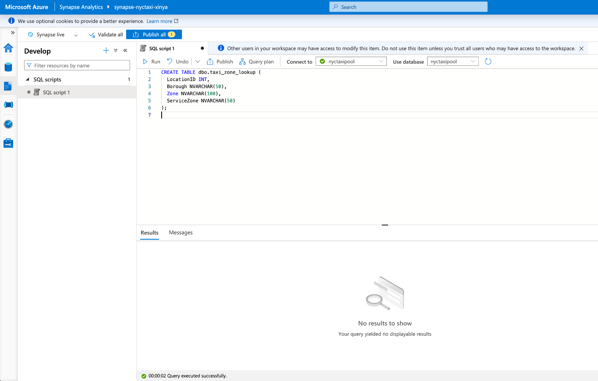

# Chapter 3 - ETL Pipeline Walkthrough

<div class="time-pill">ESTIMATED TIME TO COMPLETE: 25–30 MINUTES</div>

## Four-Stage Data Engineering Lab Overview


| Stage | Topic                                                                                       |
|-------| ------------------------------------------------------------------------------------------- |
| 1     | Data Ingestion & Storage -- Azure Data Factory + Blob Storage          |
| 2     | Data Reading & Initial Cleaning -- Azure Databricks + PySpark |
| 3     | Data Modeling -- on Synapse                                                                                            |
| 4     | Visualization -- Power BI                                                                                            |


## Prerequisites

You need to have an Azure account. You can sign up using the [[Azure Free Tier]](https://azure.microsoft.com/en-us/free/), which includes \$200 in free credits and 12 months of free services.

Log in to the [[Azure Portal]{.underline}](https://portal.azure.com)


| Item                              | Description                                                          |
| --------------------------------- | -------------------------------------------------------------------- |
| Databricks<br> Workspace          | Databricks<br> instance created on Azure; enter the Workspace Studio |
| Azure<br> Storage Account         | Blob<br> storage you previously created (already completed)          |
| Access Key<br> or SAS URL         | Required<br> to allow Databricks to access Blob Storage              |
| Notebook<br> Environment (Python) | Notebook<br> created within Databricks for writing PySpark code      |


## Data Ingestion & Storage

### 1. Create Azure Storage Account + Blob Container

Create an Azure Storage Account in your preferred region and set up a Blob Container within it to store incoming NYC Taxi data files.


#### Step 1：Create Storage Account

1. In the Azure Portal, type "Storage accounts" into the search bar and click the result.

2. Click the "Create" button at the top.

3. Fill out the form as follows:
   
   - **Subscription:** Select your subscription (default is fine)
   
   - **Resource Group:** You can create a new one, e.g., rg-nyc-taxi
   
   - **Storage Account Name:** Must be a globally unique lowercase string, e.g., nyctaxistorage2025
   
   - **Region:** Choose a region close to you, e.g., West US or East US
   
   - **Performance:** Standard
   
   - **Redundancy:** Locally-redundant storage (LRS)
   
   - **Account kind: StorageV2 (general-purpose v2)**


4. Important: Enable Hierarchical Namespace (for Azure Data Lake Storage Gen2)
   
   - Go to the "Advanced" tab
   
   - Locate the **Hierarchical Namespace** section, set **Enable Hierarchical Namespace**


5. Click "Review + Create", and once confirmed, click "Create", and "Go to resource".


#### Step 2: Create a Blob Container

1. After the storage account is created, click "Go to Resource"

2. In the left navigation pane, select **Containers**, then click the top "+ Container" button

3. Configure as follows:
   
   - **Name**: Enter a name such as nyc-taxi-raw
   
   - **Public access level**: Select **Private (no anonymous access)**

4. Click **Create**


#### Step 3：Record Access Keys (for use by Data Factory and Databricks)

1. Go back to the storage account overview page

2. In the left menu, click "Access keys"

3. Copy the following two values (you will use them in ADF and Databricks configurations):
   
   - **Storage account name** (e.g., nyctaxistorage2025)
   
   - **Key1** (a Base64-encoded key)


**You've now completed:**

- A Storage Account that supports ADLS (StorageV2 + Hierarchical Namespace enabled)

- A private blob container named nyc-taxi-raw

- Collected the account name and key for programmatic access

### 2. Create a Blob Container

#### Step 1：Create an Azure Data Factory Instance

1. Open the [[Azure Portal]](https://portal.azure.com)

2. Search for "Data Factories" and click Create

3. Fill in the form as follows：
   
   - **Resource group:** rg-nyc-taxi
   
   - **Name**: adf-nyc-taxi-xinya（for example）
   
   - **Region**: same as Storage Account (West US for example)
   
   - **Version**: V2（by default）
   
   - **Git Configuration**: optionally choose "Configure Git later"


4. Click "Review + Create" → "Create"

5. Once deployed, click Go to resource


#### Step 2：Enter the Authoring Interface

1. Click "**Launch Studio**"

> 

2. Click Launch Studio to open the ADF Studio in a new window

#### Step 3：Create Linked Services (Source and Destination Connections)

**A. Create HTTP Source Connection**

1. In the left pane, click **Manage** → **Linked services**

2. Click "+ New" → select **HTTP**


3. Configuration information is as below：
   
   - **Name**: HttpNycTaxi
   
   - **Base URL**: https://d37ci6vzurychx.cloudfront.net/trip-data/
   
   - Authentication type: **Anonymous**

4. Click "Create"


**B. Create Azure Blob Destination Connection**

1. Similarly, click "+ New" → **Azure Blob Storage**

2. Configuration information is as below：
   
   - **Name**: BlobNycTaxi
   
   - Authentication method: **Account key**

3. Click "Create"


#### Step 4：Create pipeline

1. Back in the Studio home page, click the first "Ingest" icon in the middle


2. Follow the visual steps using the Copy Data Tool to create a pipeline


> Relative URL: yellow_tripdata_2025-01.parquet
> 
> Compression type: None
> 
> Important: **Binary Copy** need to select


3. After deployment, check that the pipeline runs successfully in the Monitor：


4. In Azure Storage Account, check whether the file **yellow_tripdata_2025 01.parquet** was successfully saved in your Azure Blob container:


5. If you can see the file, repeat the above steps to also download and store green_tripdata_2025-01.parquet

At this point, you have successfully completed \[Stage 1: Data Ingestion & Storage --Azure Data Factory + Blob Storage\] and are ready to move on to \[Stage 2: Data Reading & Initial Cleaning -- Azure Databricks + PySpark\].


## Data Reading & Initial Cleaning

- Connect Databricks to Blob Storage

- Use PySpark to read Parquet files, check schema, and standardize formatting

- Write to Synapse tables (raw tables: green taxi 2025-01, yellow taxi 2025-01, zone lookup)


### 1. Connect Azure Databricks to Your Blob Storage

#### Step 1: Get Your Azure Blob Storage Access Info

In the Azure Portal, open your Storage Account：

1. Left menu → Access keys\
   Copy：
   
   - **Storage account name**（eg：nyctaxistorage2025）
   
   - **key1**

2. Configure Spark access like this (you'll use this later in your notebook):

```
spark.conf.set(
\"fs.azure.account.key.nyctaxistorage2025.blob.core.windows.net\",
\"\<your-key1\>\"
)
```

You'll use this configuration to read from blob file paths, for example:

```
wasbs://nyc-taxi-raw@\<your-storage-account\>.blob.core.windows.net/yellow/2025/01/yellow_tripdata_2025-01.parquet
```

#### Step 2：Open Azure Databricks → Create notebook

1. Log into the Azure Databricks Portal, and make sure your subscription is upgraded to Pay As You Go. (Student subscriptions are limited both in terms of available VM SKUs and vCPU quota in Azure Databricks). You should have 100 USD credit, which would be enough for our Lab.

2. Create an Azure Databricks workspace，use PAYG subscription. It will take \~5 minutes to deploy; be patient. Once deployed, launch the Databricks Workspace.


3. Inside the Workspace, click New \> Notebook, name it **read_nyc_yellow**, and choose Python as the language.

> 

4. Click run, you will find that up to now, you still do not have a
    cluster to compute. Go to the Cluster creation page and configure：
   
   a.  Name: nyc-taxi-cluster（for example）
   
   b.  Cluster Mode: Single Node
   
   c.  Worker type: Recommended Standard_DS3_v2 or Standard_D4as_v4
   
   d.  Databricks Runtime: Use the default
   
   e.  Click "Create Cluster" to start it
   
   f.  After a few minutes, the cluster status should be
   
       **Running**.**\
       **


5. Attach the notebook to this cluster. You can now run your code --- try a simple "hello world" to test.


### 2. Use PySpark to Read Parquet File, Check Schema, and Clean the Data

#### Step 1: Read the Parquet file

Copy and paste the example code into your Notebook：

```python
# Change to your value
storage_account_name = "nyctaxistorage2025"   # Change to your account name
storage_account_key = "*********"   # Change to your account key, to be consealed
container_name = "nyc-taxi-raw"
parquet_path = "green/2025/01/green_tripdata_2025-01.parquet"
#yellow taxi data similar, just change the name and rerun it:
#parquet_path = "yellow/2025/01/yellow_tripdata_2025-01.parquet"


# configure Spark to visit Azure Blob
spark.conf.set(
 f"fs.azure.account.key.{storage_account_name}.blob.core.windows.net",
 storage_account_key
)

# get the complete file path
file_path = f"wasbs://{container_name}@{storage_account_name}.blob.core.windows.net/{parquet_path}"

# read parquet file
df = spark.read.parquet(file_path)

# show df data and schema
df.show(5)
df.printSchema()
```

If you see a table preview and a correct schema, that means you've
successfully loaded the Parquet file from Azure Blob into Databricks
using PySpark.

#### Step 2: Rename Fields, Handle Nulls, Normalize Data Types

Although the DataFrame looks clean, we still want to ensure:

- All fields follow snake_case and lowercase naming convention

- Type conversions (e.g., long → IntegerType)

- Null value handling (e.g., fill passenger_count with 0 if null)

Copy and paste the example codes of cleaning the green/yellow taxi data into your Notebook:

Example code for Green taxi data cleaning

```python
# clean the Green taxi dataframe

# modify the column names mapping
rename_map = {
   "VendorID": "vendor_id",
   "lpep_pickup_datetime": "pickup_datetime",
   "lpep_dropoff_datetime": "dropoff_datetime",
   "store_and_fwd_flag": "store_and_fwd_flag",
   "RatecodeID": "rate_code_id",
   "PULocationID": "pu_location_id",
   "DOLocationID": "do_location_id",
   "passenger_count": "passenger_count",
   "trip_distance": "trip_distance",
   "fare_amount": "fare_amount",
   "extra": "extra",
   "mta_tax": "mta_tax",
   "tip_amount": "tip_amount",
   "tolls_amount": "tolls_amount",
   "ehail_fee": "ehail_fee",
   "improvement_surcharge": "improvement_surcharge",
   "total_amount": "total_amount",
   "payment_type": "payment_type",
   "trip_type": "trip_type",
   "congestion_surcharge": "congestion_surcharge"
}


from pyspark.sql.functions import col
from pyspark.sql.types import IntegerType

# rename the columns
for old_col, new_col in rename_map.items():
   df = df.withColumnRenamed(old_col, new_col)

# data type standardization（eg：convert passenger_count and vendor_id to Integer）
df = df.withColumn("vendor_id", col("vendor_id").cast(IntegerType()))
df = df.withColumn("passenger_count", col("passenger_count").cast(IntegerType()))
df = df.withColumn("rate_code_id", col("rate_code_id").cast(IntegerType()))
df = df.withColumn("pu_location_id", col("pu_location_id").cast(IntegerType()))
df = df.withColumn("do_location_id", col("do_location_id").cast(IntegerType()))
df = df.withColumn("payment_type", col("payment_type").cast(IntegerType()))
df = df.withColumn("trip_type", col("trip_type").cast(IntegerType()))

# Null value handling
df = df.na.fill({
   "passenger_count": 0,
   "trip_type": 1
})

# check schema again
df.printSchema()
df.show(5)
```

Example code for Yellow taxi data cleaning

```python
# Clean the Yellow taxi dataframe
# modify the column names mapping
rename_map = {
   "VendorID": "vendor_id",
   "tpep_pickup_datetime": "pickup_datetime",
   "tpep_dropoff_datetime": "dropoff_datetime",
   "passenger_count": "passenger_count",
   "trip_distance": "trip_distance",
   "RatecodeID": "rate_code_id",
   "store_and_fwd_flag": "store_and_fwd_flag",
   "PULocationID": "pu_location_id",
   "DOLocationID": "do_location_id",
   "payment_type": "payment_type",
   "fare_amount": "fare_amount",
   "extra": "extra",
   "mta_tax": "mta_tax",
   "tip_amount": "tip_amount",
   "tolls_amount": "tolls_amount",
   "improvement_surcharge": "improvement_surcharge",
   "total_amount": "total_amount",
   "congestion_surcharge": "congestion_surcharge",
   "Airport_fee": "airport_fee"
}

from pyspark.sql.functions import col
from pyspark.sql.types import IntegerType

# rename the columns
for old_col, new_col in rename_map.items():
   df = df.withColumnRenamed(old_col, new_col)

# data type standardization（eg：convert passenger_count and vendor_id to Integer）
df = df.withColumn("vendor_id", col("vendor_id").cast(IntegerType()))
df = df.withColumn("passenger_count", col("passenger_count").cast(IntegerType()))
df = df.withColumn("rate_code_id", col("rate_code_id").cast(IntegerType()))
df = df.withColumn("pu_location_id", col("pu_location_id").cast(IntegerType()))
df = df.withColumn("do_location_id", col("do_location_id").cast(IntegerType()))
df = df.withColumn("payment_type", col("payment_type").cast(IntegerType()))

# Null value handling
df = df.na.fill({"passenger_count": 0})

# check schema again
df.printSchema()
df.show(5)
```

If this step runs smoothly, you've now completed:

- Reading the Parquet file

- Cleaning and unifying schema with PySpark

- Data type normalization and null value handling

We're now ready to write the cleaned DataFrame into Azure SQL or Synapse Analytics.

### 3.Write the Cleaned DataFrame to Synapse

The next step is to create either an Azure SQL Server or Synapse Analytics instance and write the cleaned DataFrame into it as a raw table.

This table will later be used for:

- data modeling in Synapse

- Aggregations (e.g., revenue by zone and month)

- Final visualizations in Power BI or other BI tools.

#### Step 1: Create a Synapse WorkSpace + Dedicated SQL Pool:

Register synapse resource:


Search for Synapse workspace, click "Create"


Fill in the information


Click "Next: Security", then create the SQL Server admin login name and password, click "Allow network access to Data Lake Storage Gen2 account". Review + create the Synapse workspace

Create a dedicated SQL Pool:

Go to the created Synapse workspace, go to "Overview", click "Open Synapse Studio", you will go to a new page. On left bar click Manage - SQL Pools - click +NEW - New dedicated SQL pool

Performance level select DW100c


Go to Synapse Workspace - Networking, add Client IP address to the Firewall rules


#### Step 2: Use PySpark to write the cleaned dataframes into Synapse SQL database:

Run the code below in the Databricks Notebook:

```python
# connection parameter
jdbc_url = (
   "jdbc:sqlserver://synapse-nyctaxi-xinya.sql.azuresynapse.net:1433;"
   "database=nyctaxipool;"
   "encrypt=true;"
   "trustServerCertificate=false;"
   "hostNameInCertificate=*.sql.azuresynapse.net;"
   "loginTimeout=30;"
)

jdbc_username = "sqladminuser" #change to your username
jdbc_password = "YourPassword" #change to your password
#table_name = "green_tripdata_2025_01"
table_name = "yellow_tripdata_2025_01"

# Here, the tempDir is the staging container of Synapse
temp_dir = "wasbs://synapse-temp@nyctaxistorage2025.blob.core.windows.net/tempdir"

# write to Synapse（overwrite mode）
df.write \
 .format("com.databricks.spark.sqldw") \
 .option("url", jdbc_url) \
 .option("forwardSparkAzureStorageCredentials", "true") \
 .option("dbtable", table_name) \
 .option("user", jdbc_username) \
 .option("password", jdbc_password) \
 .option("tempDir", temp_dir) \
 .mode("overwrite") \
 .save()
```

After the notebook successfully run, go to Synapse studio - Data - Workspace tab, check that the two tables have been written into the nyctaxipool.


## Data Modeling

- Upload taxi_zone_lookup.csv into Synapse Dedicated SQL Pool
  (nyctaxipool)

- Create stg\_\* staging tables to clean and align fields

- Join trip tables with zone lookup to create fact_trip, and aggregate
  revenue by month and zone

### 1. Create zone lookup dim table

#### Step 1: Upload taxi_zone_lookup.csv (provided by xinya) into Synapse Dedicated SQL Pool (nyctaxipool)

In your storage account - container, click Upload to upload
taxi_zone_lookup.csv file


After uploading, copy the URL of the file


#### Step 2: Write SQL Script to create zone lookup table in Synapse SQL pool

Open a new SQL Script, run the code below:

```sql
CREATE TABLE dbo.taxi_zone_lookup (
 LocationID INT,
 Borough NVARCHAR(50),
 Zone NVARCHAR(100),
 ServiceZone NVARCHAR(50)
);
```



```sql
COPY INTO dbo.taxi_zone_lookup
FROM 'https://nyctaxistorage2025.blob.core.windows.net/nyc-taxi-raw/taxi_zone_lookup.csv'
WITH (
 FILE_TYPE = 'CSV',
 FIRSTROW = 2,
 FIELDTERMINATOR = ',',
 ROWTERMINATOR = '0x0A',
 MAXERRORS = 0,
 IDENTITY_INSERT = 'OFF'
);
```

Check the table is created successfully:

```sql
Select * FROM dbo.taxi_zone_lookup
ORDER BY LocationID
```


### 2. Create staging tables to clean and align fields

In this step of the pipeline, our goal is to create **cleaned and standardized staging tables** for the green and yellow taxi trip data. These staging tables are critical because the raw data from different sources (green vs. yellow taxis) are slightly different. Before we can build a unified fact table for analysis, we need to align and standardize them.

Before we dive into the SQL codes, let's figure out how and why we design them:

- **Align schemas**  
  The green taxi and yellow taxi tables have slightly different columns.  
  We need to make sure they have the same set of columns so they can later be UNIONed together in the unified `fact_trip` table.  
  Example:
  
  - `trip_type` and `ehail_fee` exist only in green taxi data → set as NULL in yellow taxi staging
  
  - `airport_fee` exists only in yellow taxi data → set as NULL in green taxi staging

- **Add taxi type flag**  
  We add a new column `taxi_type` to indicate "green" or "yellow".  
  This is very useful for reporting and analysis later when aggregating revenue or analyzing trips across types.

- **Handle datetime formats properly**  
  We cast pickup and dropoff datetimes to `DATETIME2` type to ensure compatibility and precision across SQL engine and BI tools.

#### Step 1: Create yellow_tripdata staging table

```sql
CREATE TABLE dbo.stg_yellow_tripdata
WITH (
DISTRIBUTION = ROUND_ROBIN
)
AS
SELECT
 vendor_id,
 CAST(pickup_datetime AS DATETIME2) AS pickup_datetime,
 CAST(dropoff_datetime AS DATETIME2) AS dropoff_datetime,
 passenger_count,
 trip_distance,
 rate_code_id,
 store_and_fwd_flag,
 pu_location_id,
 do_location_id,
 payment_type,
 fare_amount,
 extra,
 mta_tax,
 tip_amount,
 tolls_amount,
 NULL AS ehail_fee,            -- Not exist for yellow data. Make it NULL to be consisitent with green data
 improvement_surcharge,
 total_amount,
 NULL AS trip_type,           -- Not exist for yellow data. Make it NULL to be consisitent with green data
 congestion_surcharge,
 airport_fee,
 'yellow' AS taxi_type
FROM dbo.yellow_tripdata_2025_01;
```

#### Step 2: Create green_tripdata staging table

```sql
CREATE TABLE dbo.stg_green_tripdata
WITH (
 DISTRIBUTION = ROUND_ROBIN
)
AS
SELECT
 vendor_id,
 CAST(pickup_datetime AS DATETIME2) AS pickup_datetime,
 CAST(dropoff_datetime AS DATETIME2) AS dropoff_datetime,
 passenger_count,
 trip_distance,
 rate_code_id,
 store_and_fwd_flag,
 pu_location_id,
 do_location_id,
 payment_type,
 fare_amount,
 extra,
 mta_tax,
 tip_amount,
 tolls_amount,
 ehail_fee,
 improvement_surcharge,
 total_amount,
 trip_type,
 congestion_surcharge,
 NULL AS airport_fee,-- Not exist for green data. Make it NULL to be consisitent with yellow data
 'green' AS taxi_type
FROM dbo.green_tripdata_2025_01;
```

#### Step 3: Join staging trip tables with zone lookup to create fact_trip table

```sql
CREATE TABLE dbo.fact_trip
WITH (
DISTRIBUTION = ROUND_ROBIN
)
AS
SELECT
 t.taxi_type,
 t.pickup_datetime,
 t.dropoff_datetime,
 t.passenger_count,
 t.trip_distance,
 t.fare_amount,
 t.tip_amount,
 t.total_amount,
 zpu.Zone AS pickup_zone,
 zpu.Borough AS pickup_borough,
 zdo.Zone AS dropoff_zone,
 zdo.Borough AS dropoff_borough
FROM (
 SELECT * FROM dbo.stg_yellow_tripdata
 UNION ALL
 SELECT * FROM dbo.stg_green_tripdata
) t
LEFT JOIN dbo.taxi_zone_lookup zpu ON t.pu_location_id = zpu.LocationID
LEFT JOIN dbo.taxi_zone_lookup zdo ON t.do_location_id = zdo.LocationID;
```

#### Step 4: Create the view to aggregate the revenue by month and zone

```sql
CREATE VIEW dbo.vw_monthly_zone_revenue AS
SELECT
 FORMAT(pickup_datetime, 'yyyy-MM') AS trip_month,   -- eg. 2025-01
 pickup_zone,                                        
 taxi_type,                                          -- yellow / green
 COUNT(*) AS trip_count,                             
 SUM(total_amount) AS total_revenue                  
FROM dbo.fact_trip                                    
WHERE pickup_datetime IS NOT NULL
GROUP BY
 FORMAT(pickup_datetime, 'yyyy-MM'),
 pickup_zone,
 taxi_type;
```

Check the vw_monthly_zone_revenue by running the SQL script as shows below:


Next step: connect Power BI with Synapse to make visualization based on the aggregated view (vw_monthly_zone_revenue)

## Visualization - Optional

- Connect Power BI Desktop to Azure SQL

- Build a Monthly Zone Revenue dashboard

Open the Power BI Desktop, select Get Data - Azure SQL database - click Connect


Fill in the Server and Database connection information as shown below


Click OK, and in the next page, select Database tab in the left, then fill in the Username (sqladminuser) and Password that you chose when you configured the Synapse Workspace database

Then find vw_monthly_zone_revenue in the navigation pane, click it and and Load


Now you can create the visualization! Here are two examples.


