# Chapter 4 - IaC and DataOps Pipeline

<div class="time-pill">ESTIMATED TIME TO COMPLETE: 25–30 MINUTES</div>

## Set up: How to set up DataOps Infrastructure using Terraform

1\. Make sure your Azure account is set to pay as you go (a free subscription will not work for the databricks cluster creation, the CPU requirement exceeds the free subscription limit)

2\. Open your code editor such as VS code, open the terminal, clone the github repository: lab-infra-setup-dataops, by running this command in the terminal:

```
git clone https://github.com/open-devsecops/lab-infra-setup-dataops.git
```

After running this command, you will see that in your current directory, there is a new folder showing up called "lab-infra-setup-dataops", as shown below:

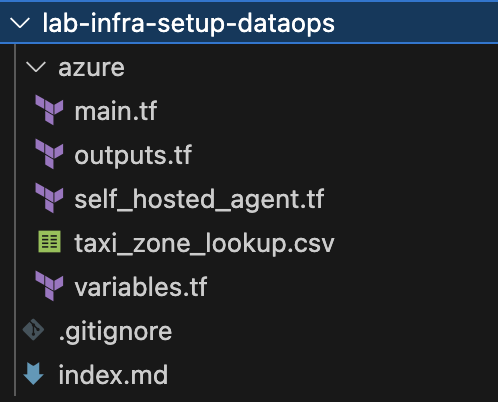

3\. Open the 'azure' folder, open the file called 'variables.tf', and start editing it:

1\) Subscription ID:

Run the following command in the terminal:

```
az account show \--query id \--output tsv
```

This will show you your Azure subscription ID.

Find the code below in the 'variables.tf' and add the subscription ID to the default section below:

```python
variable "subscription_id" {
 description = "The Azure subscription ID"
 type        = string
 default     = "ADD_YOUR_SUBSCRIPTION_ID"
}
```

2\) Azure DevOps Organizations

Go to Azure DevOps organizations


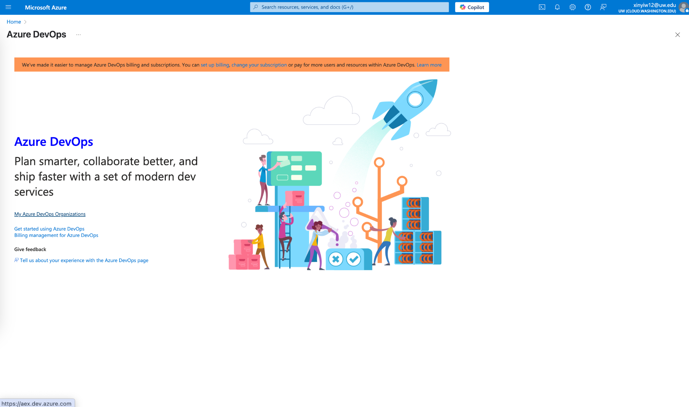

Go to my Azure DevOps organizations and create a new organization:


Remember the name of the organization you put in

After the organization is created, put the name of the organization in the codes below in the 'variables.tf'. Make sure you put the name in **both** variables.

```python
variable "azuredevops_org" {
 description = "Azure DevOps organization name"
 type        = string
 default     = "ADD_YOUR_DEVOPS_ORGANIZATION_NAME"
}


variable "ado_org_url" {
 description = "Azure DevOps organization URL"
 type        = string
 default     = "https://dev.azure.com/<ADD_YOUR_DEVOPS_ORGANIZATION_NAME>"
}
```

3\) Azure DevOps Organizations Personal Access Token

You will also need to set up your DevOps personal access token in the Azure portal, and then add it to the 'variables.tf'. This token can not be generated automatically in the CLI.

Go to the Azure DevOps Organizations page


Go into the organization you just created, go to personal access tokens


Create a new personal access token.

Make sure to select your newly created organization.

Select the scopes as 'Full access'.

Set the 'Expiration (UTC)' to 30 days.

You can customize the 'Name'.


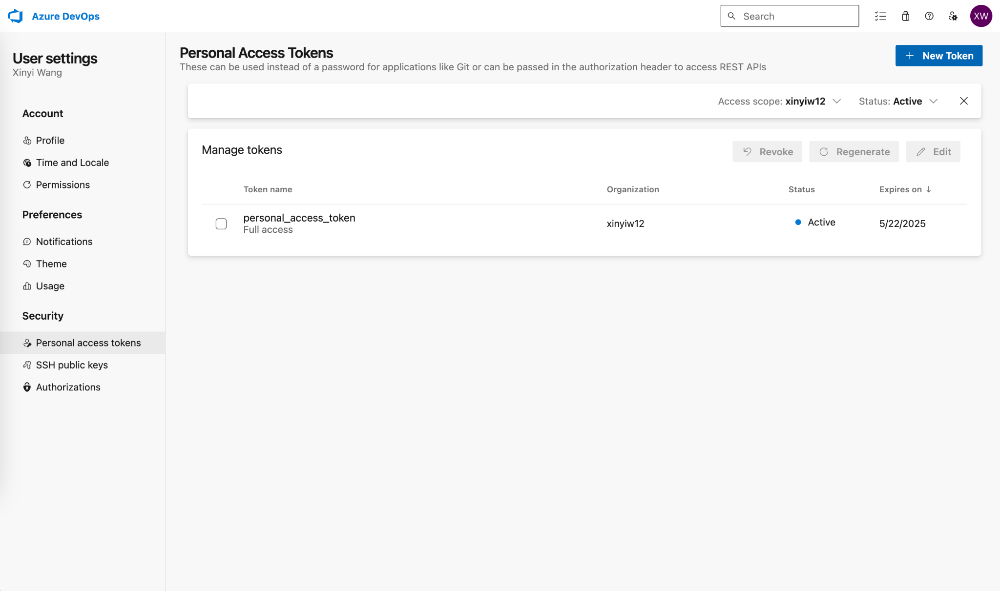

After the creation is complete, you will see the personal access token
in a pop up window. Copy and paste this personal access token to the
code below in the 'variables.tf'.

```python
variable "azuredevops_pat" {
 description = "Azure DevOps Personal Access Token"
 type        = string
 sensitive   = true
 default     = "ADD_YOUR_DEVOPS_PERSONAL_ACCESS_TOKEN"
}
```

**4) Client ID, Client Secret, and Tenant ID**

**Add your subscription id into the code below:**

```
az ad sp create-for-rbac \
  --name "MyServicePrincipal" \
  --role Contributor \
  --scopes /subscriptions/<ADD_YOUR_SUBSCRIPTION_ID>
```

This would create a new service principal under your current subscription

You will receive a response like this in the command line:

```
{
  "appId": "********-****-****-****-*****",
  "displayName": "MyServicePrincipal",
  "password": "********",
  "tenant": "********-****-****-****-*****"
}
```

The appId is the client_id, the password is the client_secret, and the tenant is the tenant_id

Put the client_id, client_secret, and the tenant_id into the codes below in the 'variables.tf'.

```python
variable "azure_client_id" {
 description = "Azure Service Principal Client ID"
 type        = string
 default     = "ADD_AZURE_CLIENT_ID"
}


variable "azure_client_secret" {
 description = "Azure Service Principal Client Secret"
 type        = string
 sensitive   = true
 default     = "ADD_AZURE_CLIENT_SECRET"
}


variable "azure_tenant_id" {
 description = "Azure Tenant ID"
 type        = string
 default     = "ADD_AZURE_TENANT_ID"
}
```

3\. Save the variables.tf file, then in the command line, run:

```
terraform init
terraform plan
terraform apply
```

4\. The deployment will run for approximately 15 min, after it is successful, you will see a message like this below in the terminal:

```
<Insert deployment success screenshot>
```

5\. Now we need to set up the databricks personal access token, to ensure that the dataops pipeline can have access to the databricks resources.

Go to Databricks on the portal:

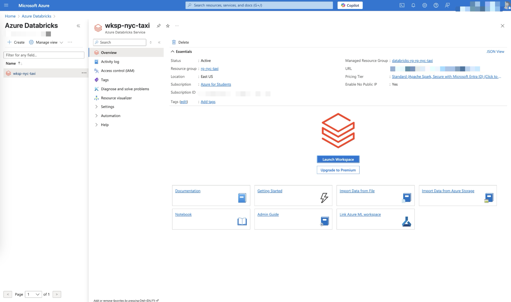

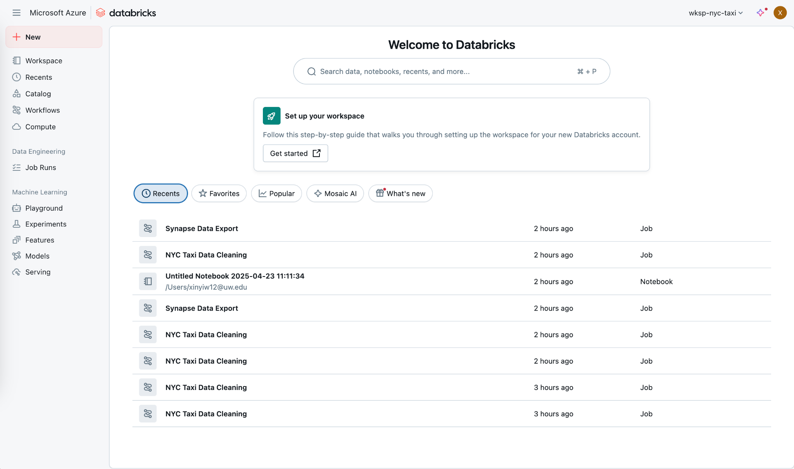

Go to settings

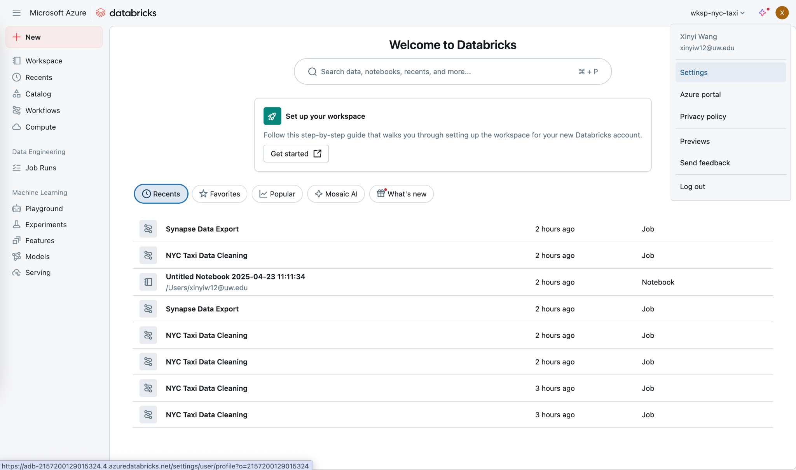

Go to Developer, Manage Access tokens


Click on the 'Generate new token'


Enter a comment for the token, you can just type: azure-devops-pipeline, or anything else you think is appropriate.

Set the Lifetime to 90.

Generate the token.

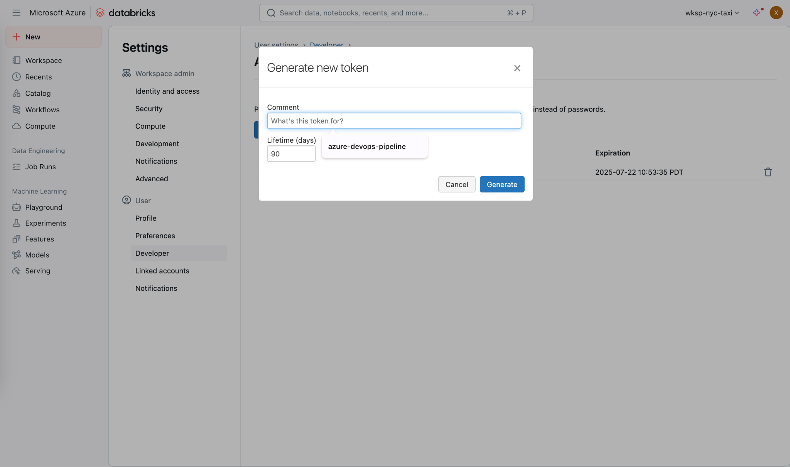

After the generation is complete, there will be a popup showing you the token.

Copy and paste the generated token into the code below in 'variables.tf':

```python
variable "databricks_pat" {
 description = "Databricks Personal Access Token"
 type        = string
 sensitive   = true
 default     = "ADD_DATABRICKS_PERSONAL_ACCESS_TOKEN"
}
```

6\. Now, rerun the commands below in the terminal to reflect changes in
the variables.tf:

```
terraform init
terraform plan
terraform apply
```

7\. Create a git repo for the azure dataops pipeline to read from.

In the terminal, run:

```
terraform output repo_url
```

Copy the repo_url that is returned

Make sure you're in the 'azure' folder in the 'lab-infra-setup-dataops' folder.

Run the command below in the terminal:

```
git clone <the repo_url you just copied>
```

You will see a new folder called 'nyc-taxi-repo' showing up in the 'azure' folder.

Go into the 'nyc-taxi-repo' folder, add the following two Python files.

**Process_data.py:**

It is used to process the data from the blob storage

```python
storage_account_name = dbutils.widgets.get("storage_account_name")  # Add this line
storage_account_key = dbutils.widgets.get("storage_account_key")


container_name = "nyc-taxi-raw"
parquet_path_green = "green/2025/01/green_tripdata_2025-01.parquet"
parquet_path_yellow = "yellow/2025/01/yellow_tripdata_2025-01.parquet"


# configure Spark to visit Azure Blob
spark.conf.set(
f"fs.azure.account.key.{storage_account_name}.blob.core.windows.net",
storage_account_key
)


# get the complete file path
file_path_green = f"wasbs://{container_name}@{storage_account_name}.blob.core.windows.net/{parquet_path_green}"
file_path_yellow = f"wasbs://{container_name}@{storage_account_name}.blob.core.windows.net/{parquet_path_yellow}"


# read parquet file
df_green = spark.read.parquet(file_path_green)
df_yellow = spark.read.parquet(file_path_yellow)


# show df data and schema
df_green.show(5)
df_yellow.show(5)
df_green.printSchema()
df_yellow.printSchema()


# Clean the Yellow taxi dataframe
# modify the column names mapping
rename_map_yellow = {
  "VendorID": "vendor_id",
  "tpep_pickup_datetime": "pickup_datetime",
  "tpep_dropoff_datetime": "dropoff_datetime",
  "passenger_count": "passenger_count",
  "trip_distance": "trip_distance",
  "RatecodeID": "rate_code_id",
  "store_and_fwd_flag": "store_and_fwd_flag",
  "PULocationID": "pu_location_id",
  "DOLocationID": "do_location_id",
  "payment_type": "payment_type",
  "fare_amount": "fare_amount",
  "extra": "extra",
  "mta_tax": "mta_tax",
  "tip_amount": "tip_amount",
  "tolls_amount": "tolls_amount",
  "improvement_surcharge": "improvement_surcharge",
  "total_amount": "total_amount",
  "congestion_surcharge": "congestion_surcharge",
  "Airport_fee": "airport_fee"
}


rename_map_green = {
  "VendorID": "vendor_id",
  "lpep_pickup_datetime": "pickup_datetime",
  "lpep_dropoff_datetime": "dropoff_datetime",
  "passenger_count": "passenger_count",
  "trip_distance": "trip_distance",
  "RatecodeID": "rate_code_id",
  "store_and_fwd_flag": "store_and_fwd_flag",
  "PULocationID": "pu_location_id",
  "DOLocationID": "do_location_id",
  "payment_type": "payment_type",
  "fare_amount": "fare_amount",
  "extra": "extra",
  "mta_tax": "mta_tax",
  "tip_amount": "tip_amount",
  "tolls_amount": "tolls_amount",
  "improvement_surcharge": "improvement_surcharge",
  "total_amount": "total_amount",
  "congestion_surcharge": "congestion_surcharge",
  "Airport_fee": "airport_fee"
}


from pyspark.sql.functions import col
from pyspark.sql.types import IntegerType


# rename the columns
for old_col, new_col in rename_map_green.items():
  df_green = df_green.withColumnRenamed(old_col, new_col)


# data type standardization（eg：convert passenger_count and vendor_id to Integer）
df_green = df_green.withColumn("vendor_id", col("vendor_id").cast(IntegerType()))
df_green = df_green.withColumn("passenger_count", col("passenger_count").cast(IntegerType()))
df_green = df_green.withColumn("rate_code_id", col("rate_code_id").cast(IntegerType()))
df_green = df_green.withColumn("pu_location_id", col("pu_location_id").cast(IntegerType()))
df_green = df_green.withColumn("do_location_id", col("do_location_id").cast(IntegerType()))
df_green = df_green.withColumn("payment_type", col("payment_type").cast(IntegerType()))


# Null value handling
df_green = df_green.na.fill({"passenger_count": 0})


# check schema again
df_green.printSchema()
df_green.show(5)


processed_path_green = f"wasbs://synapse-temp@{storage_account_name}.blob.core.windows.net/processed/green_tripdata_2025-01.parquet"
df_green.write.parquet(processed_path_green, mode="overwrite")


# rename the columns
for old_col, new_col in rename_map_yellow.items():
  df_yellow = df_yellow.withColumnRenamed(old_col, new_col)


# data type standardization（eg：convert passenger_count and vendor_id to Integer）
df_yellow = df_yellow.withColumn("vendor_id", col("vendor_id").cast(IntegerType()))
df_yellow = df_yellow.withColumn("passenger_count", col("passenger_count").cast(IntegerType()))
df_yellow = df_yellow.withColumn("rate_code_id", col("rate_code_id").cast(IntegerType()))
df_yellow = df_yellow.withColumn("pu_location_id", col("pu_location_id").cast(IntegerType()))
df_yellow = df_yellow.withColumn("do_location_id", col("do_location_id").cast(IntegerType()))
df_yellow = df_yellow.withColumn("payment_type", col("payment_type").cast(IntegerType()))


# Null value handling
df_yellow = df_yellow.na.fill({"passenger_count": 0})


# check schema again
df_yellow.printSchema()
df_yellow.show(5)


processed_path_yellow = f"wasbs://synapse-temp@{storage_account_name}.blob.core.windows.net/processed/yellow_tripdata_2025-01.parquet"
df_yellow.write.parquet(processed_path_yellow, mode="overwrite")
```

**export_to_synapse.py:**

It is used to write the processed data to Synapse:

```python
storage_account_name = dbutils.widgets.get("storage_account_name")  # Add this line
storage_account_key = dbutils.widgets.get("storage_account_key")
jdbc_username = dbutils.widgets.get("jdbc_username")
jdbc_password = dbutils.widgets.get("jdbc_password")


spark.conf.set(
   f"fs.azure.account.key.{storage_account_name}.blob.core.windows.net",
   storage_account_key
)


# Synapse configuration
jdbc_url = (
   "jdbc:sqlserver://synapse-nyctaxi-test.sql.azuresynapse.net:0000;"
   "database=nyctaxipool;"
   "encrypt=true;"
   "trustServerCertificate=false;"
   "hostNameInCertificate=*.sql.azuresynapse.net;"
   "loginTimeout=30;"
)


temp_dir = f"wasbs://synapse-temp@{storage_account_name}.blob.core.windows.net/tempdir"


def write_to_synapse(df, table_name, processed_path):
   """Helper function to write data to Synapse"""
   # Write processed data to Synapse
   df.write \
       .format("com.databricks.spark.sqldw") \
       .option("url", jdbc_url) \
       .option("forwardSparkAzureStorageCredentials", "true") \
       .option("dbtable", table_name) \
       .option("user", jdbc_username) \
       .option("password", jdbc_password) \
       .option("tempDir", temp_dir) \
       .mode("overwrite") \
       .save()


# Process and write YELLOW data
yellow_processed_path = f"wasbs://synapse-temp@{storage_account_name}.blob.core.windows.net/processed/yellow_tripdata_2025-01.parquet"
yellow_df = spark.read.parquet(yellow_processed_path)
write_to_synapse(yellow_df, "yellow_tripdata_2025_01", yellow_processed_path)


# Process and write GREEN data
green_processed_path = f"wasbs://synapse-temp@{storage_account_name}.blob.core.windows.net/processed/green_tripdata_2025-01.parquet"
green_df = spark.read.parquet(green_processed_path)
write_to_synapse(green_df, "green_tripdata_2025_01", green_processed_path)


print("Successfully wrote both yellow and green data to Synapse!")
```

Then create another .yml file in the 'nyc-taxi-repo' folder called 'azure-pipelines.yml'. This would be the file that contains the logic of the dataops CI/CD pipeline:

**azure-pipelines.yml**

```yaml
trigger:
- main


pool:
 name: self-hosted-agent
 variables:
 resourceGroup: 'rg-nyc-taxi'
 dataFactoryName: 'adf-nyc-taxi-25'
 pipelineName: 'CopyNYCTaxiData'
 storageAccountName: 'nyctaxistoragedataops'
 synapseSQLEndpoint: 'synapse-nyctaxi-test.sql.azuresynapse.net'


stages:
- stage: RunADFPipeline
 displayName: '🚀 Trigger Azure Data Factory Pipeline'
 jobs:
 - job: RunADFPipeline
   steps:
   - task: AzureCLI@2
     displayName: 'Trigger & Monitor ADF Pipeline'
     inputs:
       azureSubscription: 'AzureServiceConnection'
       scriptType: 'bash'
       scriptLocation: inlineScript
       inlineScript: |
         # Trigger pipeline
         runId=$(az datafactory pipeline create-run \
           --factory-name "$(dataFactoryName)" \
           --resource-group "$(resourceGroup)" \
           --name "$(pipelineName)" \
           --query 'runId' -o tsv)

         echo "##vso[task.setvariable variable=ADF_RUN_ID]$runId"
         echo "ADF Pipeline Run ID: $runId"

         # Monitor pipeline
         while true; do
           status=$(az datafactory pipeline-run show \
             --factory-name "$(dataFactoryName)" \
             --resource-group "$(resourceGroup)" \
             --run-id "$runId" \
             --query 'status' -o tsv)

           echo "ADF Status: $status"

           if [[ "$status" == "Succeeded" ]]; then break
           elif [[ "$status" == "Failed" ]]; then exit 1
           fi
           sleep 30
         done


   - script: |
       echo "$ADF_RUN_ID" > adf_run_id.txt
     displayName: "Save ADF Run ID"

   - publish: adf_run_id.txt
     artifact: adf-run-id


- stage: ProcessRawDataInDatabricks
 displayName: '⚡ Process Raw Data in Databricks'
 dependsOn: RunADFPipeline
 variables:
   - group: databricks-secrets
 jobs:
 - job: ProcessRawDataInDatabricks
   steps:
   - checkout: self
   - download: current
     artifact: adf-run-id
   - script: |
       set -e  # Exit immediately on error
       set -x  # Enable debug logging


       export DATABRICKS_HOST="https://$databricksWorkspaceUrl"
       echo "Using Databricks Host: $DATABRICKS_HOST"


       # Verify working directory structure
       echo "##[debug]Current directory: $(pwd)"
       echo "##[debug]Directory contents:"
       ls -al


       # Get ADF Run ID
       runId=$(cat $(Pipeline.Workspace)/adf-run-id/adf_run_id.txt)
       echo "Using ADF Run ID: $runId"

       # Install dependencies with explicit path
       sudo apt update && sudo apt install -y python3-pip
       # Upgrade dependencies and configure CLI
       sudo python3 -m pip install --upgrade "urllib3>=1.26.0" chardet databricks-cli jq
       databricks jobs configure --version=2.1
       export PATH="/root/.local/bin:$PATH"

       # Verify notebook file exists
       NOTEBOOK_PATH="$(System.DefaultWorkingDirectory)/process_data.py"
       echo "##[debug]Notebook path: $NOTEBOOK_PATH"
       if [ ! -f "$NOTEBOOK_PATH" ]; then
         echo "##[error]Notebook file not found at $NOTEBOOK_PATH"
         exit 1
       fi

       # Upload Python script as notebook
       echo "##[section]Uploading notebook to Databricks..."
       databricks workspace import --format SOURCE --language PYTHON --overwrite "$NOTEBOOK_PATH" "/Shared/process_data"

       # Create and run job
       echo "##[section]Submitting Databricks job..."
       # Updated jobJson section using existing cluster
       jobJson=$(cat <<EOF
       {
         "name": "NYC Taxi Data Cleaning",
         "existing_cluster_id": "$(clusterId)",
         "notebook_task": {
           "notebook_path": "/Shared/process_data",
           "base_parameters": {
             "storage_account_name": "$(storageAccountName)",
             "storage_account_key": "$(STORAGE_ACCOUNT_KEY)",
             "raw_container": "nyc-taxi-raw",
             "synapse_endpoint": "$(synapseSQLEndpoint)",
             "synapse_database": "nyctaxipool"
           }
         }
       }
       EOF
       )

       # Submit job with error handling
       jobId=$(databricks jobs create --json "$jobJson" | jq -r .job_id) || {
           echo "##[error]Failed to create job";
           exit 1;
       }


       runId=$(databricks jobs run-now --job-id $jobId | jq -r .run_id) || {
           echo "##[error]Failed to start job";
           exit 1;
       }

       # Monitor job execution with proper timeout
       echo "##[section]Monitoring job execution..."
       timeout=1200  # 60 minutes
       start_time=$(date +%s)
       while :; do
         current_time=$(date +%s)
         elapsed=$((current_time - start_time))

         status=$(databricks runs get --run-id $runId | jq -r '.state.life_cycle_state')
         result=$(databricks runs get --run-id $runId | jq -r '.state.result_state')

         echo "Databricks Status: $status | Result: $result | Elapsed: ${elapsed}s"

         if [[ "$status" == "TERMINATED" ]]; then
           if [[ "$result" != "SUCCESS" ]]; then exit 1; fi
           break
         fi

         if (( elapsed > timeout )); then
           echo "##[error]Timeout after 60 minutes"
           exit 1
         fi
         sleep 30
       done

       echo "##[section]Cleaning up notebook..."
       databricks workspace delete /Shared/process_data
     displayName: 'Run Cleaning Notebook'
     env:
       dbToken: $(dbToken)
       databricksWorkspaceUrl: $(databricksWorkspaceUrl)
       DATABRICKS_TOKEN: $(dbToken)
       STORAGE_ACCOUNT_KEY: $(STORAGE_ACCOUNT_KEY)


- stage: ExportToSynapse
 displayName: '📤 Export Clean Data to Synapse'
 dependsOn: ProcessRawDataInDatabricks
 variables:
   - group: databricks-secrets
 jobs:
 - job: ExportToSynapse
   steps:
   - checkout: self
   - script: |
       set -e  # Exit immediately on error
       set -x  # Enable debug logging


       export DATABRICKS_HOST="https://$databricksWorkspaceUrl"
       echo "Using Databricks Host: $DATABRICKS_HOST"


       # Verify working directory structure
       echo "##[debug]Current directory: $(pwd)"
       echo "##[debug]Directory contents:"
       ls -al


       # Get ADF Run ID
       runId=$(cat $(Pipeline.Workspace)/adf-run-id/adf_run_id.txt)
       echo "Using ADF Run ID: $runId"

       # Install dependencies with explicit path
       sudo apt update && sudo apt install -y python3-pip
       # Upgrade dependencies and configure CLI
       sudo python3 -m pip install --upgrade "urllib3>=1.26.0" chardet databricks-cli jq
       databricks jobs configure --version=2.1
       export PATH="/root/.local/bin:$PATH"


       # Verify notebook file exists
       NOTEBOOK_PATH="$(System.DefaultWorkingDirectory)/export_to_synapse.py"
       echo "##[debug]Notebook path: $NOTEBOOK_PATH"
       if [ ! -f "$NOTEBOOK_PATH" ]; then
         echo "##[error]Notebook file not found at $NOTEBOOK_PATH"
         exit 1
       fi


       # Upload and run Synapse notebook
       SYNAPSE_NOTEBOOK_PATH="$(System.DefaultWorkingDirectory)/export_to_synapse.py"
       databricks workspace import --format SOURCE --language PYTHON --overwrite \
         "$SYNAPSE_NOTEBOOK_PATH" "/Shared/export_to_synapse"


       jobJson=$(cat <<EOF
       {
         "name": "Synapse Data Export",
         "existing_cluster_id": "$(clusterId)",
         "notebook_task": {
           "notebook_path": "/Shared/export_to_synapse",
           "base_parameters": {
             "synapse_endpoint": "$(synapseSQLEndpoint)",
             "synapse_database": "nyctaxipool",
             "jdbc_username": "$(SYNAPSE_USER)",
             "jdbc_password": "$(SYNAPSE_PASSWORD)",
             "storage_account_name": "$(storageAccountName)",
             "storage_account_key": "$(STORAGE_ACCOUNT_KEY)"
           }
         }
       }
       EOF
       )

       # Execute and monitor job
       jobId=$(databricks jobs create --json "$jobJson" | jq -r .job_id)
       runId=$(databricks jobs run-now --job-id $jobId | jq -r .run_id)

       timeout=900
       start_time=$(date +%s)
       while :; do
         status=$(databricks runs get --run-id $runId | jq -r '.state.life_cycle_state')
         [[ "$status" == "TERMINATED" ]] && break
         sleep 30
       done

       databricks workspace delete /Shared/export_to_synapse
     displayName: 'Run Synapse Export'
     env:
       databricksWorkspaceUrl: $(databricksWorkspaceUrl)
       DATABRICKS_TOKEN: $(dbToken)
       SYNAPSE_USER: $(SYNAPSE_USER)
       SYNAPSE_PASSWORD: $(SYNAPSE_PASSWORD)
       STORAGE_ACCOUNT_KEY: $(STORAGE_ACCOUNT_KEY)


- stage: ExecuteSynapseSQLForDataModeling
 displayName: '💻 Execute Synapse SQL For Data Modeling'
 dependsOn: ExportToSynapse
 variables:
   - group: databricks-secrets  # Contains SYNAPSE_USER/SYNAPSE_PASSWORD
 jobs:
 - job: ExecuteSynapseSQLForDataModeling
   steps:
   - checkout: self  # Ensure SQL scripts are in repo


   - task: CmdLine@2
     displayName: 'Install sqlcmd'
     inputs:
       script: |
         curl https://packages.microsoft.com/keys/microsoft.asc | sudo apt-key add -
         curl https://packages.microsoft.com/config/ubuntu/20.04/prod.list | sudo tee /etc/apt/sources.list.d/msprod.list
         sudo apt-get update
         sudo ACCEPT_EULA=Y apt-get install -y mssql-tools unixodbc-dev


   - task: CmdLine@2
     displayName: 'Execute Schema Scripts'
     inputs:
       script: |
         # Ensure sqlcmd path is available in this shell
         export PATH="$PATH:/opt/mssql-tools/bin"


         echo "Current directory: $(pwd)"
         echo "Directory contents:"
         ls -al ./sql


         # Execute SQL scripts in sequence
         sqlcmd -S $(synapseSQLEndpoint) -d nyctaxipool -U $(SYNAPSE_USER) -P $(SYNAPSE_PASSWORD) -I -i ./sql/create_taxi_zone_lookup.sql
         sqlcmd -S $(synapseSQLEndpoint) -d nyctaxipool -U $(SYNAPSE_USER) -P $(SYNAPSE_PASSWORD) -I -i ./sql/create_staging_tables.sql
         sqlcmd -S $(synapseSQLEndpoint) -d nyctaxipool -U $(SYNAPSE_USER) -P $(SYNAPSE_PASSWORD) -I -i ./sql/create_fact_trip.sql
         sqlcmd -S $(synapseSQLEndpoint) -d nyctaxipool -U $(SYNAPSE_USER) -P $(SYNAPSE_PASSWORD) -I -i ./sql/create_view_monthly_revenue.sql
     env:
       SYNAPSE_USER: $(SYNAPSE_USER)
       SYNAPSE_PASSWORD: $(SYNAPSE_PASSWORD)
```

Now we need to create a new folder in the folder 'nyc-taxi-repo' called 'sql', where sql files would be stored. These sql files are used for data modelling in synapse.

Add the following sql files into the 'sql' folder.

**create_fact_trip.sql**

```sql
CREATE TABLE dbo.fact_trip
WITH (
DISTRIBUTION = ROUND_ROBIN
)
AS
SELECT
t.taxi_type,
t.pickup_datetime,
t.dropoff_datetime,
t.passenger_count,
t.trip_distance,
t.fare_amount,
t.tip_amount,
t.total_amount,
zpu.Zone AS pickup_zone,
zpu.Borough AS pickup_borough,
zdo.Zone AS dropoff_zone,
zdo.Borough AS dropoff_borough
FROM (
SELECT * FROM dbo.stg_yellow_tripdata
UNION ALL
SELECT * FROM dbo.stg_green_tripdata
) t
LEFT JOIN dbo.taxi_zone_lookup zpu ON t.pu_location_id = zpu.LocationID
LEFT JOIN dbo.taxi_zone_lookup zdo ON t.do_location_id = zdo.LocationID;
```

**create_staging_tables.sql**

```sql
CREATE TABLE dbo.stg_yellow_tripdata
WITH (
DISTRIBUTION = ROUND_ROBIN
)
AS
SELECT
vendor_id,
CAST(pickup_datetime AS DATETIME2) AS pickup_datetime,
CAST(dropoff_datetime AS DATETIME2) AS dropoff_datetime,
passenger_count,
trip_distance,
rate_code_id,
store_and_fwd_flag,
pu_location_id,
do_location_id,
payment_type,
fare_amount,
extra,
mta_tax,
tip_amount,
tolls_amount,
NULL AS ehail_fee,            -- not exist for yellow.make it NULL to be consisitent with green
improvement_surcharge,
total_amount,
NULL AS trip_type,           -- not exist for yellow.make it NULL to be consisitent with green
congestion_surcharge,
airport_fee,
'yellow' AS taxi_type
FROM dbo.yellow_tripdata_2025_01;


----------------------------------
CREATE TABLE dbo.stg_green_tripdata
WITH (
DISTRIBUTION = ROUND_ROBIN
)
AS
SELECT
vendor_id,
CAST(pickup_datetime AS DATETIME2) AS pickup_datetime,
CAST(dropoff_datetime AS DATETIME2) AS dropoff_datetime,
passenger_count,
trip_distance,
rate_code_id,
store_and_fwd_flag,
pu_location_id,
do_location_id,
payment_type,
fare_amount,
extra,
mta_tax,
tip_amount,
tolls_amount,
ehail_fee,
improvement_surcharge,
total_amount,
trip_type,
congestion_surcharge,
NULL AS airport_fee,-- not exist for green.make it NULL to be consisitent with yellow
'green' AS taxi_type
FROM dbo.green_tripdata_2025_01;
```

**create_taxi_zone_lookup.sql**

```sql
CREATE TABLE dbo.taxi_zone_lookup (
LocationID INT,
Borough NVARCHAR(50),
Zone NVARCHAR(100),
ServiceZone NVARCHAR(50)
);


----------------------------------
COPY INTO dbo.taxi_zone_lookup
FROM 'https://nyctaxistoragedataops.blob.core.windows.net/nyc-taxi-raw/taxi_zone_lookup.csv'
WITH (
FILE_TYPE = 'CSV',
FIRSTROW = 2,
FIELDTERMINATOR = ',',
ROWTERMINATOR = '0x0A',
MAXERRORS = 0,
CREDENTIAL = (IDENTITY = 'Managed Identity')
);


----------------------------------
Select * from dbo.taxi_zone_lookup
order by LocationID
```

**create_view_monthly_revenue.sql**

```sql
CREATE VIEW dbo.vw_monthly_zone_revenue AS
SELECT
FORMAT(pickup_datetime, 'yyyy-MM') AS trip_month,   -- eg. 2025-01
pickup_zone,                                       
taxi_type,                                          -- yellow / green
COUNT(*) AS trip_count,                            
SUM(total_amount) AS total_revenue                 
FROM dbo.fact_trip                                   
WHERE pickup_datetime IS NOT NULL
GROUP BY
FORMAT(pickup_datetime, 'yyyy-MM'),
pickup_zone,
taxi_type;


----------------------------------
select * from dbo.vw_monthly_zone_revenue
order by trip_month, pickup_zone
```

**taxi_zone_lookup.sql**

```sql
CREATE TABLE dbo.taxi_zone_lookup (
LocationID INT,
Borough NVARCHAR(50),
Zone NVARCHAR(100),
ServiceZone NVARCHAR(50)
);


----------------------------------
COPY INTO dbo.taxi_zone_lookup
FROM 'https://nyctaxistoragedataops.blob.core.windows.net/nyc-taxi-raw/taxi_zone_lookup.csv'
WITH (
FILE_TYPE = 'CSV',
FIRSTROW = 2,
FIELDTERMINATOR = ',',
ROWTERMINATOR = '0x0A',
MAXERRORS = 0,
CREDENTIAL = (IDENTITY = 'Managed Identity')
);


----------------------------------
Select * from dbo.taxi_zone_lookup
order by LocationID


----------------------------------
CREATE TABLE dbo.stg_yellow_tripdata
WITH (
DISTRIBUTION = ROUND_ROBIN
)
AS
SELECT
vendor_id,
CAST(pickup_datetime AS DATETIME2) AS pickup_datetime,
CAST(dropoff_datetime AS DATETIME2) AS dropoff_datetime,
passenger_count,
trip_distance,
rate_code_id,
store_and_fwd_flag,
pu_location_id,
do_location_id,
payment_type,
fare_amount,
extra,
mta_tax,
tip_amount,
tolls_amount,
NULL AS ehail_fee,            -- not exist for yellow.make it NULL to be consisitent with green
improvement_surcharge,
total_amount,
NULL AS trip_type,           -- not exist for yellow.make it NULL to be consisitent with green
congestion_surcharge,
airport_fee,
'yellow' AS taxi_type
FROM dbo.yellow_tripdata_2025_01;


----------------------------------
CREATE TABLE dbo.stg_green_tripdata
WITH (
DISTRIBUTION = ROUND_ROBIN
)
AS
SELECT
vendor_id,
CAST(pickup_datetime AS DATETIME2) AS pickup_datetime,
CAST(dropoff_datetime AS DATETIME2) AS dropoff_datetime,
passenger_count,
trip_distance,
rate_code_id,
store_and_fwd_flag,
pu_location_id,
do_location_id,
payment_type,
fare_amount,
extra,
mta_tax,
tip_amount,
tolls_amount,
ehail_fee,
improvement_surcharge,
total_amount,
trip_type,
congestion_surcharge,
NULL AS airport_fee,-- not exist for green.make it NULL to be consisitent with yellow
'green' AS taxi_type
FROM dbo.green_tripdata_2025_01;


----------------------------------
CREATE TABLE dbo.fact_trip
WITH (
DISTRIBUTION = ROUND_ROBIN
)
AS
SELECT
t.taxi_type,
t.pickup_datetime,
t.dropoff_datetime,
t.passenger_count,
t.trip_distance,
t.fare_amount,
t.tip_amount,
t.total_amount,
zpu.Zone AS pickup_zone,
zpu.Borough AS pickup_borough,
zdo.Zone AS dropoff_zone,
zdo.Borough AS dropoff_borough
FROM (
SELECT * FROM dbo.stg_yellow_tripdata
UNION ALL
SELECT * FROM dbo.stg_green_tripdata
) t
LEFT JOIN dbo.taxi_zone_lookup zpu ON t.pu_location_id = zpu.LocationID
LEFT JOIN dbo.taxi_zone_lookup zdo ON t.do_location_id = zdo.LocationID;


----------------------------------
CREATE VIEW dbo.vw_monthly_zone_revenue AS
SELECT
FORMAT(pickup_datetime, 'yyyy-MM') AS trip_month,   -- eg. 2025-01
pickup_zone,                                       
taxi_type,                                          -- yellow / green
COUNT(*) AS trip_count,                            
SUM(total_amount) AS total_revenue                 
FROM dbo.fact_trip                                   
WHERE pickup_datetime IS NOT NULL
GROUP BY
FORMAT(pickup_datetime, 'yyyy-MM'),
pickup_zone,
taxi_type;


----------------------------------
select * from dbo.vw_monthly_zone_revenue
order by trip_month, pickup_zone
```

The final folder structure of 'nyc-taxi-repo' is like this:

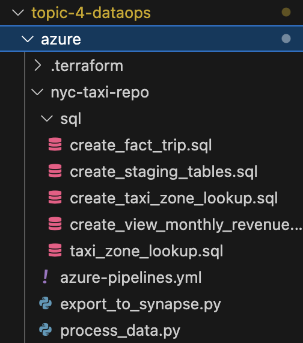

In the 'nyc-taxi-repo' folder, run the following commands in the terminal:

```
git add .
git commit -m “added pipeline setup files”
git push
```

This will make sure the local changes we made are reflected in the remote git repo as well.

8\. Go to the azure portal, find the 'adf-nyc-taxi-25' resource, which is an azure data factory resource. Go into it.\


Go into the linked services


Create a new HTTP source (the creation of this source is currently not supported in Terraform, so we have to do it manually)

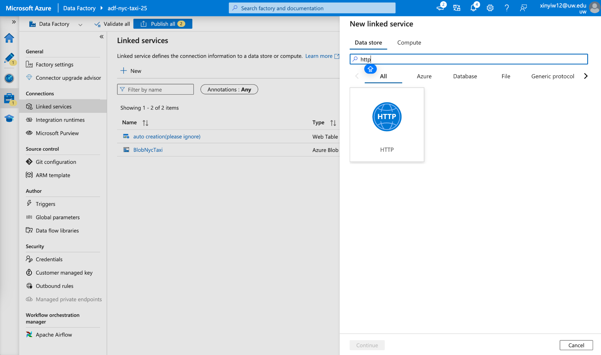

Use the configuration info below to set it up:

- **Name**: HttpNycTaxi

- **Base URL**: https://d37ci6vzurychx.cloudfront.net/trip-data/

- **Authentication type**: Anonymous


After the creation is complete, make sure you click "Publish all" to publish the change

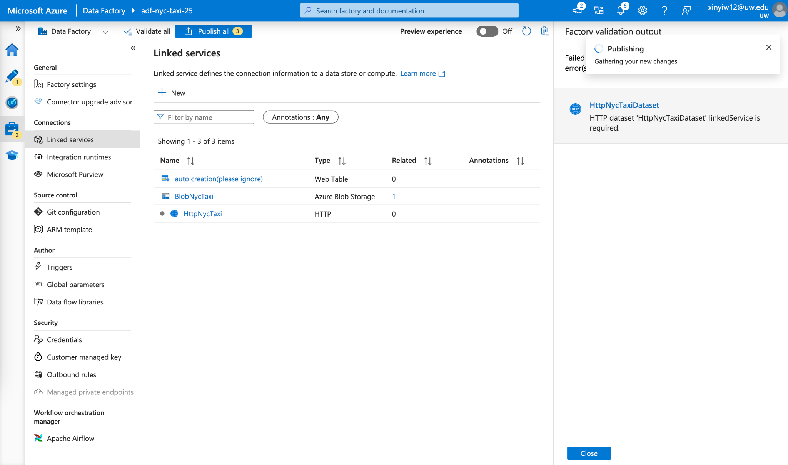

Go to the Factory Resources page, select the dataset 'HttpNycTxiDataset', choose our newly created 'HttpNycTaxi' as the linked service.

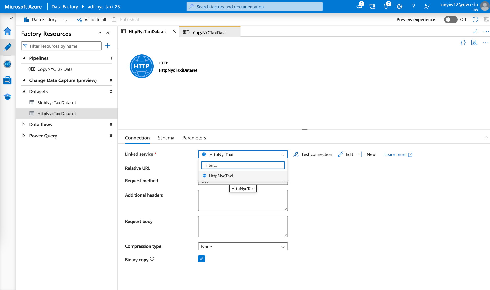

Click 'Publish all' to publish this change.


9\. Now go to Azure DevOps on the azure portal, go to the 'NYC Taxi Pipeline', click 'Run pipeline'.


Click 'Run'


The first time you run this pipeline, you will see that the pipeline will not automatically start.

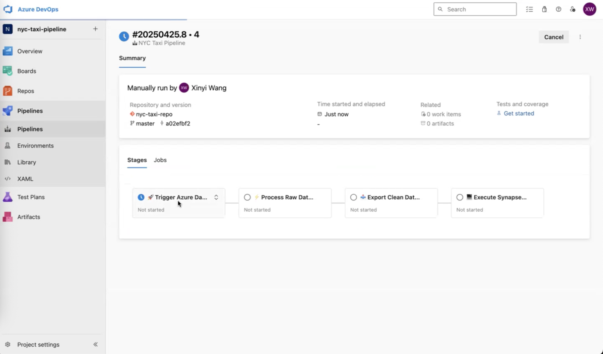

You would need to click into the first stage called 'Trigger Data Factory', and grant your permission to run this pipeline, by clicking the 'Permit' button shown below.


After the first time you've granted permission, you would not need to do the same and grant permissions again in your future runs of the pipeline.

As you can see, the pipeline has finished running and is successful!


## Post completion: How to delete the lab resources

When finished with the lab,

Go to the Azure portal and delete:

1\. All resources

2\. All resource groups

3\. Go to Azure DevOps, and delete the pipeline: 'nyc-taxi-pipeline'


4\. Go to Azure DevOps -\> [Organization] Settings(not Project Settings) -\> agent pools, and delete the agent called 'self-hosted-agent'

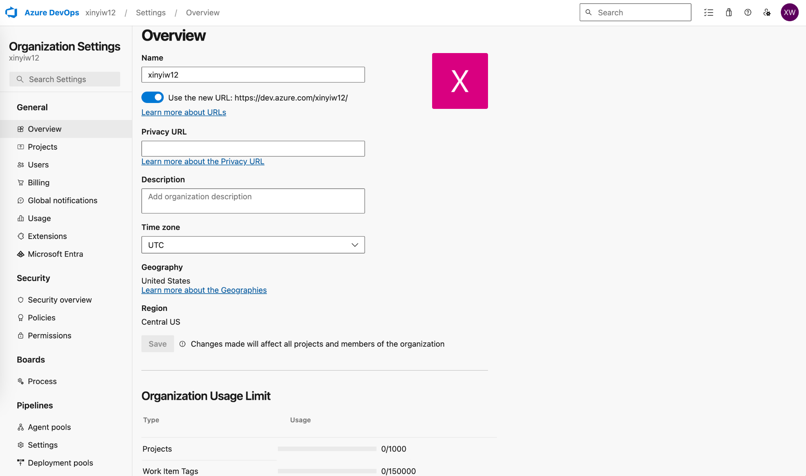


Now you have successfully deleted all resources related to the lab!
