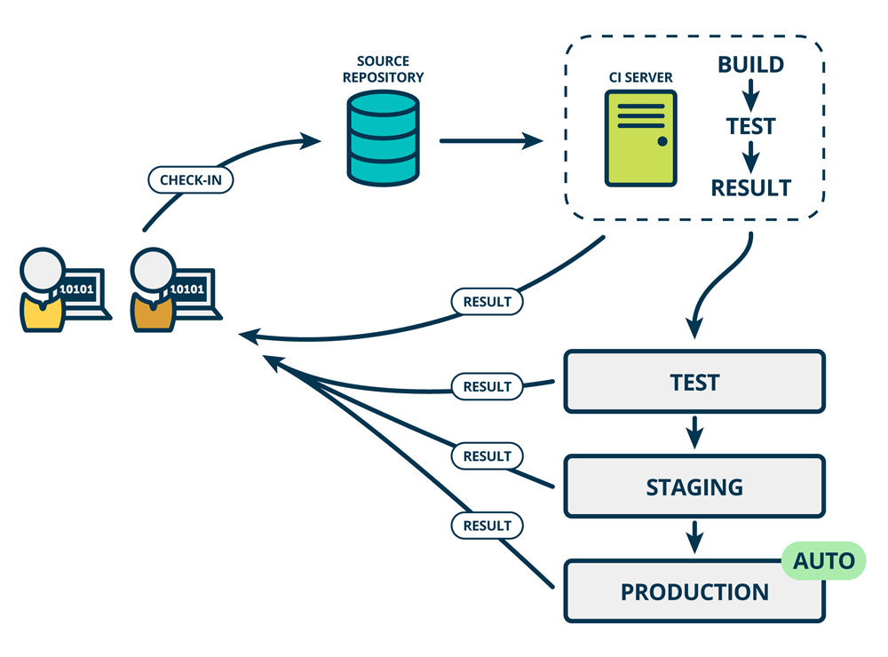

# Chapter 4 - CI/CD with Jenkins

<div class="time-pill">ESTIMATED TIME TO COMPLETE: 25–30 MINUTES</div>


## Introduction to CI/CD
CI/CD, short for **Continuous Integration and Continuous Delivery**, is a part of the DevOps process. “It is a collection of principles and practices designed to help development teams ensure the reliable delivery of frequent code changes.”



<div style="text-align: center;">
    
    <p><em>Source: <a href="http://www.mindtheproduct.com/what-the-hell-are-ci-cd-and-devops-a-cheatsheet-for-the-rest-of-us/">Mind The Product</a></em></p>
</div>

<hr>

## DevOps vs. CI/CD
| **Category**   | **DevOps**                                                                                                                 | **CI**                                                                                                           | **CD**                                                                                                                           |
|----------------|-----------------------------------------------------------------------------------------------------------------------------|------------------------------------------------------------------------------------------------------------------|----------------------------------------------------------------------------------------------------------------------------------|
| **Purpose**    | Facilitate collaboration and efficiency across the development lifecycle.                                                  | Automate testing to ensure code compatibility.                                                                  | Automate deployment for seamless software releases.                                                                              |
| **Methods**    | - Implement automation to streamline collaboration between development and operations teams.  <br> - Use infrastructure as code (IaC) to provision and manage infrastructure.  <br> - Integrate continuous feedback loops to gather insights from stakeholders and improve processes iteratively. | - Automate the build and testing process for every code change.  <br> - Identify integration issues early in the development lifecycle.  <br> - Support the principle of "fail fast" by providing rapid feedback to developers. | - Encompass both Continuous Integration and Continuous Deployment.  <br> - Automate the deployment process to production environments.  <br> - Enable organizations to release software updates quickly and reliably while minimizing risks. |
| **Key Benefits** | - Promotes a culture of shared responsibility and accountability.  <br> - Emphasizes the importance of automating repetitive tasks to reduce manual errors and increase efficiency.  <br> - Focuses on delivering value to customers through rapid and iterative development cycles. | - Increases code quality by identifying issues early in the development process.  <br> - Speeds up the development cycle by automating build and testing processes.  <br> - Enables rapid feedback to developers for quick iterations. | - Accelerates time to market by automating deployment processes.  <br> - Minimizes risks associated with manual deployments.  <br> - Enhances overall software reliability and stability. |


<hr>

## What is Jenkins?

**Jenkins** is a leading automation tool used to implement CI/CD pipelines. It integrates with virtually every development, testing, and deployment tool, and is highly customizable via plugins.

You can think of Jenkins as your personal automation butler — it watches your code repository, runs tests, builds the application, and even ships it when ready.

<hr>

## Jenkins Pipeline Architecture

A Jenkins CI/CD pipeline typically consists of these stages:

   1. Checkout/Clone: Pull code from a VCS like GitHub/GitLab.
   2. Build: Compile code, install dependencies.
   3. Test: Run unit/integration tests.
   4. Package: Create build artifacts or Docker images.
   5. Push: Push artifacts to a registry or storage (e.g., ACR, Docker Hub).
   6. Deploy: Deploy to a staging or production environment.

All this is defined in a Jenkinsfile, which lives with your code.

<hr>

## CI/CD Best Practices with Jenkins

1. Pipeline as Code
   - Use Declarative Pipelines for readability and guardrails.
   - Keep Jenkinsfile in the root of your repo for traceability.
   - Use shared libraries for reusable pipeline logic.

```groovy
    pipeline {
      agent any
      stages {
        stage('Build') { steps { sh 'npm run build' } }
        stage('Test')  { steps { sh 'npm test' } }
        stage('Deploy') { steps { sh './deploy.sh' } }
      }
    }
```

2. Fail Fast, Fail Loud
- Break the pipeline if unit or integration tests fail. 
- Use parallelism to speed up builds (parallel { } block). 
- Run linters and static analysis early.

3. Artifact Versioning & Promotion 
- Tag builds with Git SHA or version numbers. 
- Store artifacts in registries (e.g., JFrog Artifactory, ACR). 
- Promote stable builds manually or automatically to production.

4. Secure Credentials
- Never hard-code secrets. 
- Use Jenkins Credentials Plugin to store API keys, tokens. 
- Inject credentials via environment variables in pipeline.

5. Observability 
- Enable build logs, test reports, and dashboards. 
- Use plugins: JUnit, Allure, Slack notifier, etc. 
- Monitor pipeline trends and failures over time.

6. Scalability
- Use Jenkins agents (nodes) to distribute load. 
- For high-concurrency needs, configure auto-scaling agents (e.g., with Kubernetes plugin). 
- Isolate pipelines to specific agents with labels (e.g., agent { label 'docker-node' }).

7. Trigger Strategies 
- GitHub webhooks: Trigger on push/PR. 
- Polling (less ideal): Jenkins checks periodically. 
- Cron-style triggers: For scheduled nightly builds.


<hr>

### References
<details>
  <Summary>Expand</Summary>
    <b>1.</b> Ashtari, Hossein et al. “Key Differences between CI/CD and DevOps.” <i>Spiceworks</i>, <a href="http://www.spiceworks.com/tech/devops/articles/cicd-vs-devops/" target="_blank">www.spiceworks.com/tech/devops/articles/cicd-vs-devops/</a>. Accessed 20 Feb. 2024.<br>
    <b>2.</b> Ferringer, Megan. “Here’s the Difference between CI/CD and Devops-and How They Work Together to Drive Innovation.” <i>Navisite</i>, 2 Mar. 2023, <a href="http://www.navisite.com/blog/insights/ci-cd-vs-devops/" target="_blank">www.navisite.com/blog/insights/ci-cd-vs-devops/</a>.<br>
    <b>3.</b> “What the Hell Are CI/CD and DevOps? A Cheatsheet for the Rest of Us.” <i>Mind the Product</i>, <a href="http://www.mindtheproduct.com/what-the-hell-are-ci-cd-and-devops-a-cheatsheet-for-the-rest-of-us/" target="_blank">www.mindtheproduct.com/what-the-hell-are-ci-cd-and-devops-a-cheatsheet-for-the-rest-of-us/</a>. Accessed 20 Feb. 2024.<br>
    <b>4.</b> “The IDEAL & Practical CI / CD Pipeline - Concepts Overview.” <i>YouTube</i>, 17 Feb. 2022, <a href="https://www.youtube.com/watch?v=OPwU3UWCxhw" target="_blank">www.youtube.com/watch?v=OPwU3UWCxhw</a>.<br>
    <b>5.</b> Morg, Brad. “How to Design a Modern CI/CD Pipeline.” <i>YouTube</i>, 17 Oct. 2023, <a href="https://www.youtube.com/watch?v=KnSBNd3b0qI" target="_blank">www.youtube.com/watch?v=KnSBNd3b0qI</a>.<br>
    <b>6.</b> Morg, Brad. “How to Design a Deployment Pipeline (GitOps).” <i>YouTube</i>, 30 Oct. 2023, <a href="https://www.youtube.com/watch?v=pJ9f7w4AxtU" target="_blank">www.youtube.com/watch?v=pJ9f7w4AxtU</a>.<br>
</details>
