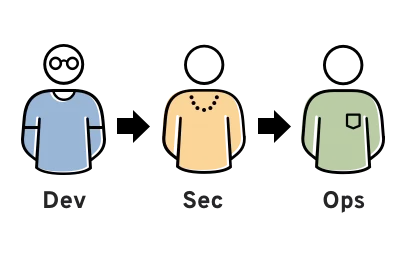
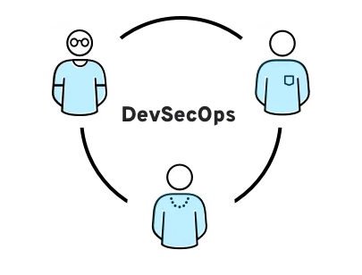

# Chapter 2 - DevSecOps Foundation

ESTIMATED TIME TO COMPLETE: 25–30 MINUTES

## Defining DevSecOps
- Dev = Development
- Sec = Security
- Ops = Operations

**DevSecOps is a methodology that integrates security practices within the DevOps process.** The main goal of DevSecOps is to embed security in every part of the development lifecycle, from initial design through integration, testing, deployment, and software delivery.

Ok, now what? You just have to start integrating this into your coding practices? Actually yes, the whole reason this curriculum is applicable for every person working in IT is because it is best development practice to have a secure lifecycle throughout all of the processes IT goes through when developing a project.

|  |  |
|-------------------------------|------------------------------------------|

DevSecOps - Source: [Red Hat](https://www.redhat.com/en/topics/devops/what-is-devsecops)

## Why Implement DevSecOps:

**The Importance of Security in SDLC:**

The software development lifecycle (SDLC) is a framework used to develop, deploy, and maintain software. A common problem in software development is that security related activities are deferred until the testing phase, which is late in the SDLC after most of the critical design and implementation has been completed. Missing a security related risk could be costly, set back progress, and go unnoticed causing room for further severe impact.

**What is "Shift" Testing:**

"Shift left" and "shift right" are terms that emphasize implementing security practices throughout the SDLC. By adopting shift left and shift right principles, teams are able to fix security flaws early on. They are meant to evaluate and ensure quality of the project by focusing on continuous testing methods.

To **shift left** is to incorporate security testing as soon as possible to find vulnerabilities and fix defects as early as possible in development.

To **shift right** is to monitor user behavior, usage, performance, and security metrics in the production stage to verify software operability.

<em>Source: <a href="https://www.redhat.com/en/topics/devops/shift-left-vs-shift-right">Red Hat</a></em>

## Tools and technologies:
<!-- Infrastructure as Code Scanning -->

<b>Infrastructure as code scanning</b>

<li> DevSecOps teams use open source tools like <b>Terraform</b> to manage and provision infrastructure like networks, virtual machines, and load balancers through code rather than doing it manually</li>

<li> Terraform helps ensure that infrastructure is set up and updated consistently across hundreds or thousands of servers</li>

<li> Infrastructure as a code scanning tools automatically check the infrastructure at the code level for noncompliance with security policies and standards</li>

<em>Source: <a href="https://www.microsoft.com/en-us/security/business/security-101/what-is-devsecops">Microsoft</a></em>

<!-- Dynamic and Static application security testing -->

<b>Dynamic and Static Application Security Testing</b>

<li> Dynamic application security testing: This process of testing tests the methods a bad actor might use to attack an application. This testing occurs while the application is running and is based on predefined use cases.</li>

<li> Static application security testing: Before their code compiles, DevSecOps developers begin testing their custom code for security vulnerabilities. Static application security testing tools make this process easier with automatic checks and real-time feedback, often specifying exactly where an vulnerability is</li>

<li> </li>

<em>Source: <a href="https://www.microsoft.com/en-us/security/business/security-101/what-is-devsecops">Microsoft</a></em>

<!-- Container Scanning -->

<b>Container Scanning</b>

<li> Container: A container is a standard unit of software that packages up code and all its dependencies so the application runs quickly and reliably from one computing environment to another</li>

<li>Containers are widely used in DevSecOps because they help developers easily deploy self-contained units of code</li>

<li>Container Image: Within a container is a container image, which is a executable software bundle that runs processes for the container. These images are often built using existing images or pulled from public repositories.</li>

<em>Source 1: <a href="https://www.docker.com/resources/what-container/">Docker</a></em>

<em>Source 2: <a href="https://www.microsoft.com/en-us/security/business/security-101/what-is-devsecops">Microsoft</a></em>

 

 
### References

  
Expand

    <b>1.</b> “What is DevSecOps?” <i>Red Hat</i>, <a href="https://www.redhat.com/en/topics/devops/what-is-devsecops" target="_blank">www.redhat.com/en/topics/devops/what-is-devsecops</a>. Accessed 8 Apr. 2024. 
    <b>2.</b> “What is DevSecOps?” <i>Microsoft</i>, <a href="https://www.microsoft.com/en-us/security/business/security-101/what-is-devsecops" target="_blank">www.microsoft.com/en-us/security/business/security-101/what-is-devsecops</a>. Accessed 8 Apr. 2024. 
    <b>3.</b> “Use containers to Build, Share and Run your applications.” <i>Docker</i>, <a href="https://www.docker.com/resources/what-container/" target="_blank">www.docker.com/resources/what-container/</a>. Accessed 8 Apr. 2024. 
    <b>4.</b> “Shift left vs. shift right.” <i>Red Hat</i>, <a href="https://www.redhat.com/en/topics/devops/shift-left-vs-shift-right" target="_blank">www.redhat.com/en/topics/devops/shift-left-vs-shift-right</a>. Accessed 8 Apr. 2024. 

