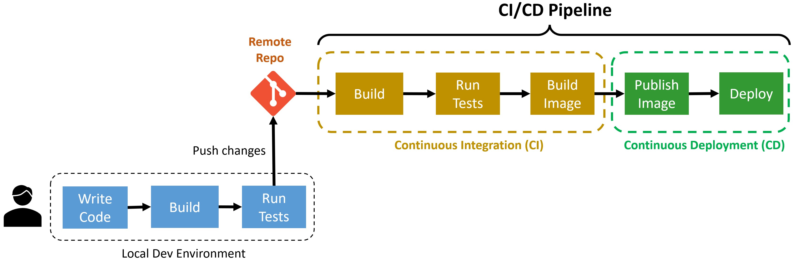
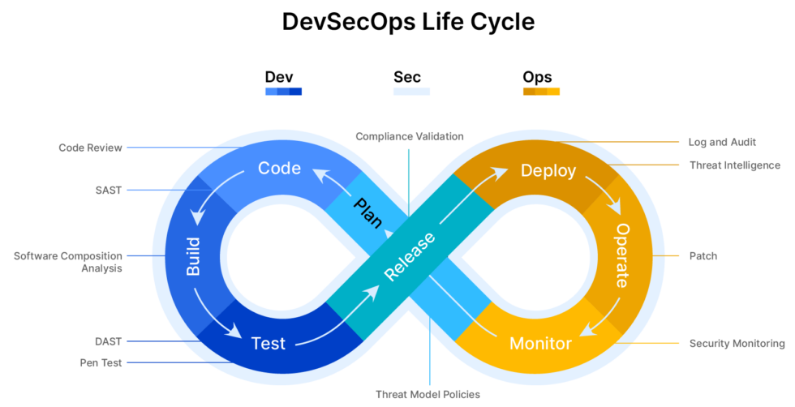

# Chapter 4 - CI/CD in DevOps and DevSecOps

ESTIMATED TIME TO COMPLETE: 25–30 MINUTES

## Quick Recap: What is CI/CD?

Before we dive into CI/CD in the context of DevSecOps, let’s briefly recap what you’ve already learned about CI/CD in the Topic 1 Chapter 4:

Continuous Integration (CI) automates the process of merging code changes, running tests, and ensuring builds don’t break.

Continuous Deployment (CD) takes it further by automatically pushing those validated changes to production.

In modern **DevOps** workflows, CI/CD helps teams deliver features faster, with fewer bugs, and with greater confidence.

You’ve also explored how Jenkins supports these workflows—automating build, test, and deployment stages, and implementing best practices like pipeline-as-code, fail-fast testing, secure credentials management, and artifact promotion.

Now, let’s build on that foundation by integrating security into every CI/CD stage—the core of **DevSecOps**.

---

## CI/CD in DevOps

In DevOps, CI/CD focuses on:

- **Automation**: Reducing manual effort and human error in the release process
- **Speed**: Delivering features faster to production
- **Collaboration**: Ensuring development and operations teams work together
- **Reliability**: Increasing confidence that code changes are safe and production-ready

### DevOps CI/CD Pipeline Diagram

---

## CI/CD in DevSecOps

DevSecOps enhances the CI/CD pipeline by embedding **security checks** into every stage:

- **Static Analysis (SAST)**: Analyze code for vulnerabilities (e.g., SonarQube)
- **Dependency Scanning (SCA)**: Identify insecure packages (e.g., Trivy, Snyk)
- **Secrets Detection**: Catch hardcoded tokens or passwords
- **Security Unit Tests**: Run pattern-based checks for SQLi, XSS, etc.
- **Dynamic Analysis (DAST)**: Simulate attacks on a running app (e.g., OWASP ZAP)

### DevSecOps CI/CD Diagram

---

## Key Differences: DevOps vs. DevSecOps CI/CD

|Feature|DevOps CI/CD|DevSecOps CI/CD|
|---|---|---|
|Focus|Speed and reliability|Security integrated into speed and quality|
|Security|Performed post-deployment|Performed during every pipeline stage|
|Tools|Jenkins, GitHub Actions, Docker|SonarQube, Trivy, ZAP, ESLint, Checkov|
|Testing Types|Unit, integration|Unit, integration, security (SAST/DAST)|
|Culture|Dev + Ops|Dev + Sec + Ops|

---

## Why CI/CD with DevSecOps Matters

1. **Faster, Safer Releases**: Automated checks mean issues are found early and fixed faster.
2. **Reduced Risk**: Vulnerabilities are detected before they reach production.
3. **Compliance**: Supports industry standards like NIST, ISO, and OWASP.
4. **Developer Empowerment**: Developers learn secure coding through feedback loops.
5. **Scalability**: Automating security scales better than manual reviews.

---

## Conclusion

CI/CD is essential for modern software delivery, and integrating DevSecOps into it ensures that speed doesn't come at the cost of security. By embedding security into every phase of the pipeline, teams can confidently ship secure, high-quality code at scale.

---

## References

- Julio Casal, "Building a CI/CD Pipeline with Azure DevOps": https://juliocasal.com/blog/Building-A-CICD-Pipeline-With-Azure-DevOps
- OpsMx Blog, "DevOps vs DevSecOps - Similarities, Differences, and When to Transition": https://www.opsmx.com/blog/devops-vs-devsecops-similarities-differences-right-time-to-transition
- OWASP DevSecOps Guideline: https://owasp.org/www-project-devsecops-guideline/
- SonarQube Documentation: https://docs.sonarqube.org/
- Jenkins Pipeline Documentation: https://www.jenkins.io/doc/book/pipeline/
- GitHub Actions for CI/CD: https://docs.github.com/en/actions
- NIST Secure Software Development Framework: https://csrc.nist.gov/publications/detail/white-paper/2020/04/23/ssdf/final
- Trivy Vulnerability Scanner: https://aquasecurity.github.io/trivy/
- OWASP ZAP User Guide: https://www.zaproxy.org/docs/