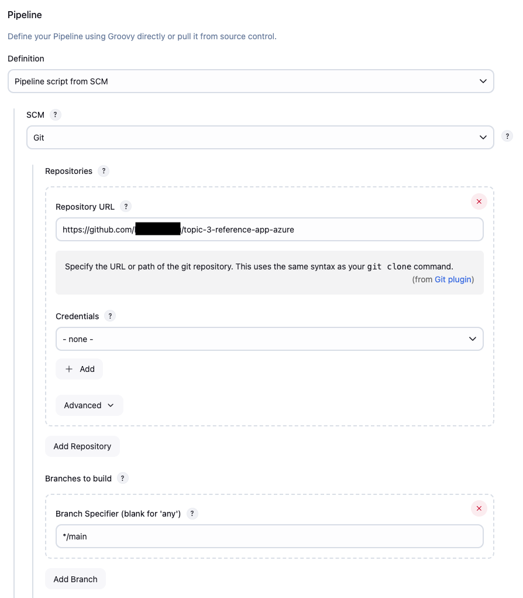

# Chapter 7 - Lab 3 - Secure A Vulnerable Application

<div class="time-pill">ESTIMATED TIME TO COMPLETE: 25–30 MINUTES</div>


## Introduction

In this lab, you will learn how to apply **DevSecOps principles** by integrating automated security testing tools like **SonarQube** (static analysis) and **security unit tests** into a Jenkins pipeline. You'll work with a vulnerable Node.js + Express application that intentionally contain sample security flaws such as **SQL injection**, **XSS**, and **path traversal**.

You'll fork the reference app, analyze the code, fix vulnerabilities, and verify your changes with automated scans.

---
## Lab Overview

| Section | Topic                                                                     |
| ------- | ------------------------------------------------------------------------- |
| 1       | Preparing the Reference Application                                       |
| 2       | Addressing & Testing vulnerabilities (SQL Injection, XSS, Path Traversal) |
| 3       | Understanding Security Unit Tests                                         |
| 4       | Automating DevSecOps via Jenkins                                          |
| 5       | Configuring the CI/CD Pipeline with DevSecOps                             |
| 6       | Interpret Jenkins Pipeline Output                                         |
| 7       | Fix Vulnerabilities in the source code                                    |
| 8       | Re-run Jenkins pipeline and verify improved security posture              |

---

## Preparing the Reference Application

### 1. Fork and Clone the Reference Application

1. Visit: [https://github.com/open-devsecops/topic-3-lab-reference-app-azure](https://github.com/open-devsecops/topic-3-lab-reference-app-azure)
2. Click "Fork" to create your own copy of the repository.
3. Clone the forked repository to your local machine:

```bash
git clone https://github.com/<your-username>/topic-3-lab-reference-app-azure.git
cd topic-3-lab-reference-app-azure
```


### 2. Build and Run the Application with Docker Compose

With your project cloned locally, let’s run the entire full-stack application using Docker.

#### Step 1: Initialize the Database (one-time)

Run the following command to create the SQLite database using the init container:

```bash
docker-compose run --rm init-db
```

#### Step 2: Start All Services

Now that the database is initialized, bring up the full stack:

```bash
docker-compose up --build
```

This will:

- Build and start the backend (Node.js)
- Build and start the frontend (static Nginx)
- Mount the SQLite DB volume


The application will be accessible at:

- Frontend: `http://localhost:8080`
- Backend API: `http://localhost:3009`


### 3. (Optional) Customize the React Application!

Now that you have the application running, feel free to personalize it!

1. Open the project in your favorite code editor.

2. Make changes to alter the layout, style, or functionality of your app. For example, you might want to change text, font, or color!

---
## Addressing & Testing Vulnerabilities

This sample vulnerable application contains several common web application security flaws. Below are the key vulnerabilities present and why they matter:

### [SQL Injection](https://owasp.org/www-community/attacks/SQL_Injection)

**What it is:**  
SQL Injection allows an attacker to modify a database query through unsanitized user inputs. By injecting SQL syntax, the attacker can bypass authentication, extract data, or even drop tables.

**Why it matters:**  
If left unaddressed, it could lead to unauthorized access to sensitive user information such as emails, passwords, or personal data.


### [Cross-Site Scripting (XSS)](https://owasp.org/www-community/attacks/xss/)

**What it is:**  
XSS happens when untrusted user input is rendered into a web page without proper escaping or validation. This can lead to the execution of malicious JavaScript in the browser.

**Why it matters:**  
Attackers can steal session cookies, redirect users to malicious websites, or deface the application.


### [Path Traversal](https://owasp.org/www-community/attacks/Path_Traversal)

**What it is:**  
Path traversal lets attackers manipulate file paths to access restricted files on the server by using `../` sequences.

**Why it matters:**  
This could expose sensitive files such as `/etc/passwd` on UNIX systems or server configuration files.


### 1. SQL Injection – Login Bypass

1. Go to the **Login** form on the homepage (`http://localhost:8080`).

2. Input the following:

    - **Username**: `admin'--`
    - **Password**: `test` (any value)

3. Click **Login**.
4. You should see a successful login message even without knowing the actual password.

> This demonstrates a SQL Injection vulnerability where the WHERE clause is bypassed due to improper input sanitization.


### 2. Cross-Site Scripting (XSS)

1. Scroll to the **Register** section.
2. Input the following:

    - **Username**: ``
    - **Email**: `test@example.com`
    - **Password**: `123456`

3. Click **Register**.
4. You may see a pop-up reflected once you registered.


> This demonstrates a Reflected XSS vulnerability due to the lack of input sanitization and output encoding.


### 3. Path Traversal – File Access

1. Go to the **Download File** input at the bottom of the page.
2. Enter the following filename:

    ```
    ../../../../etc/passwd
    ```

3. Click **Download**.
4. If the app is running on a Unix-based OS, it will attempt to return the system password file.


> This demonstrates a Path Traversal vulnerability allowing attackers to access sensitive files on the server.

⚠️ **WARNING:** These features are intentionally vulnerable and meant for educational use only. Do **not** deploy this app in a production environment or over the public internet.

--- 
## Understanding Security Unit Tests

Before diving into the Jenkins pipeline configuration, it's important to understand how security unit tests complement traditional security scanning tools.

###  1. Why Security Unit Tests?

Traditional security tools like OWASP ZAP and static analyzers are excellent, but they have limitations:

- **Static Analysis** (SonarQube): May miss context-specific vulnerabilities
- **Dynamic Analysis** (ZAP): Requires a running application and can be slow
- **Coverage Gaps**: Some attack vectors may not be detected by automated tools

**Security Unit Tests** fill these gaps by:

- **Targeted Testing**: Specifically test known vulnerability patterns
- **Fast Execution**: Run in seconds, not minutes
- **Educational Value**: Show developers exactly how attacks work
- **Immediate Feedback**: Catch issues during development

###  2. Setting Up Security Unit Tests

Note that these files have been and should be created in the forked repository. Feel free to follow along to understand the code.
#### 1. Create the Test Structure

In your `backend` directory, ensure the following structure:

```
backend/
├── tests/
│   └── security-patterns.test.js
├── package.json
├── app.js
└── ...
```

#### 2. Update package.json

Check that `backend/package.json` contains the following code:

```json
{
  "name": "devsecops-vulnerable-app",
  "version": "1.0.0",
  "scripts": {
    "start": "node app.js",
    "test": "node tests/security-patterns.test.js",
    "test:security": "node tests/security-patterns.test.js"
  },
  "dependencies": {
    "express": "^4.18.2",
    "body-parser": "^1.20.2",
    "sqlite3": "^5.1.6",
    "cors": "^2.8.5"
  }
}
```

###  3. Understanding Each Test

This tutorial breaks down each security test in our DevSecOps pipeline, explaining what it does, why it's important, and how it works. If you want to just run the code file, you can skip to the next part of the tutorial.


#### Test 1: SQL Injection Pattern Detection

#### What This Test Does

This test scans your JavaScript code to find dangerous SQL query patterns that could lead to SQL injection vulnerabilities.
#### The Code Breakdown

```javascript
// Test 1: SQL Injection Detection
console.log('\n1. SQL Injection Pattern Detection:');
const sqlInjectionPatterns = [
  /`SELECT.*FROM.*WHERE.*=.*'\$\{.*\}'/g,    // Pattern 1: Template literals with SQL
  /SELECT.*FROM.*WHERE.*=.*'\$\{.*\}'/g,     // Pattern 2: Regular strings with SQL  
  /'.*\$\{username\}.*'/g,                   // Pattern 3: Username interpolation
  /'.*\$\{hashedPassword\}.*'/g              // Pattern 4: Password interpolation
];
```
#### Pattern 1: ``/`SELECT.*FROM.*WHERE.*=.*'\$\{.*\}'/g``

- **What it finds**: Template literals (backticks) containing SQL with variable interpolation
- **Example vulnerable code**:
    ```javascript
    const query = `SELECT * FROM users WHERE username = '${username}'`;
    ```
- **Why it's dangerous**: Direct variable interpolation allows attackers to manipulate the SQL structure
#### Pattern 2: `/SELECT.*FROM.*WHERE.*=.*'\$\{.*\}'/g`

- **What it finds**: Regular strings containing SQL with template literal interpolation
- **Example vulnerable code**:
    ```javascript
    const query = "SELECT * FROM users WHERE id = '" + ${userId} + "'";
    ```
- **Why it's dangerous**: Similar to pattern 1, allows SQL structure manipulation
#### Pattern 3: `/'.*\$\{username\}.*'/g`

- **What it finds**: Any string that interpolates a username variable
- **Example vulnerable code**:
    ```javascript
    const condition = 'username = "${username}"';
    ```
- **Why it's dangerous**: Username is common injection point for authentication bypass
#### Pattern 4: `/'.*\$\{hashedPassword\}.*'/g`

- **What it finds**: Any string that interpolates password-related variables
- **Example vulnerable code**:
    ```javascript
    const authQuery = 'password = "${hashedPassword}"';
    ```
- **Why it's dangerous**: Password fields are prime targets for injection attacks

#### How the Test Works

```javascript
let sqlVulnFound = false;
sqlInjectionPatterns.forEach((pattern, index) => {
  const matches = appContent.match(pattern);  // Search for pattern in code
  if (matches) {
    console.log(`   🚨 FOUND: SQL injection pattern ${index + 1}`);
    matches.forEach(match => {
      console.log(`   📍 Code: ${match.substring(0, 80)}...`); // Show first 80 chars
    });
    sqlVulnFound = true;
  }
});
```
#### What You'll See

**If vulnerabilities are found:**

```
1. SQL Injection Pattern Detection:
   🚨 FOUND: SQL injection pattern 1
   📍 Code: `SELECT * FROM users WHERE username = '${username}' AND password = '${hashedPa...
```

**If no vulnerabilities:**

```
1. SQL Injection Pattern Detection:
   ✅ No SQL injection patterns detected
```

#### Test 2: Weak Cryptography Detection

#### What This Test Does

This test identifies the use of weak cryptographic algorithms, specifically MD5 hashing, which is considered insecure for password storage.

#### The Code Breakdown
```javascript
// Test 2: MD5 Usage Detection  
console.log('\n2. Weak Cryptography Detection:');
const md5Pattern = /createHash\(['"]md5['"]\)/g;
const md5Matches = appContent.match(md5Pattern);
```
#### Pattern: `/createHash\(['"]md5['"]\)/g`

- **What it finds**: Calls to Node.js crypto.createHash() function using MD5
- **Example vulnerable code**:
    ```javascript
    crypto.createHash('md5').update(password).digest('hex');
    ```
- **Why it's dangerous**:
    - MD5 is cryptographically broken
    - Fast computation enables brute force attacks
    - Vulnerable to collision attacks
    - No built-in salt protection

#### How the Test Works
```javascript
if (md5Matches) {
  console.log('   🚨 FOUND: Weak MD5 hashing detected');
  console.log(`   📍 Occurrences: ${md5Matches.length}`);
  console.log('   💡 Recommendation: Use bcrypt or Argon2');
  vulnerabilityCount++;
  findings.push('Weak MD5 cryptography detected');
}
```

#### What You'll See

**If MD5 is found:**

```
2. Weak Cryptography Detection:
   🚨 FOUND: Weak MD5 hashing detected
   📍 Occurrences: 1
   💡 Recommendation: Use bcrypt or Argon2
```

**If secure hashing is used:**

```
2. Weak Cryptography Detection:
   ✅ No weak hashing detected
```

#### Test 3: Path Traversal Detection

#### What This Test Does

This test identifies code patterns that could allow attackers to access files outside the intended directory structure using "../" sequences.

#### The Code Breakdown
```javascript
// Test 3: Path Traversal Detection
console.log('\n3. Path Traversal Detection:');
const pathTraversalPatterns = [
  /path\.join\(__dirname,.*req\.params\.\w+/g,  // Pattern 1: Direct path.join with request params
  /res\.download\(.*filename/g,                 // Pattern 2: Download with filename variable
  /req\.params\.filename/g                      // Pattern 3: Direct access to filename param
];
```
#### Pattern 1: `/path\.join\(__dirname,.*req\.params\.\w+/g`

- **What it finds**: Direct use of request parameters in path.join() calls
- **Example vulnerable code**:
    ```javascript
    const filePath = path.join(__dirname, 'uploads', req.params.filename);
    ```
- **Why it's dangerous**: Allows attackers to use "../" to navigate outside intended directory

#### Pattern 2: `/res\.download\(.*filename/g`

- **What it finds**: Express response.download() calls using filename variables
- **Example vulnerable code**:
    ```javascript
    res.download(filePath, filename);
    ```
- **Why it's dangerous**: If filename isn't sanitized, it can contain path traversal sequences

#### Pattern 3: `/req\.params\.filename/g`

- **What it finds**: Direct access to filename parameters from requests
- **Example vulnerable code**:
    ```javascript
    const filename = req.params.filename; // No validation
    ```
- **Why it's dangerous**: Request parameters are controlled by attackers

#### How the Test Works
```javascript
let pathVulnFound = false;
pathTraversalPatterns.forEach((pattern, index) => {
  const matches = appContent.match(pattern);
  if (matches) {
    console.log(`   🚨 FOUND: Path traversal pattern ${index + 1}`);
    matches.forEach(match => {
      console.log(`   📍 Code: ${match}`);  // Show exact match
    });
    pathVulnFound = true;
  }
});
```

#### What You'll See

**If vulnerabilities are found:**

```
3. Path Traversal Detection:
   🚨 FOUND: Path traversal pattern 1
   📍 Code: path.join(__dirname, 'public', 'downloads', filename)
```

**If no vulnerabilities:**

```
3. Path Traversal Detection:
   ✅ No path traversal patterns detected
```

#### Test 4: XSS (Cross-Site Scripting) Detection

#### What This Test Does

This test identifies code patterns where user input might be reflected back to users without proper sanitization, potentially allowing XSS attacks.

#### The Code Breakdown

```javascript
// Test 4: XSS Vulnerability Detection
console.log('\n4. XSS Vulnerability Detection:');
const xssPatterns = [
  /message:.*\`.*\$\{username\}/g,    // Pattern 1: Username in template literal messages
  /\`.*\$\{email\}/g,                // Pattern 2: Email in template literals  
  /res\.send\(.*username/g,          // Pattern 3: Username in response.send()
  /Welcome.*\$\{.*\}/g               // Pattern 4: Welcome messages with interpolation
];
```
#### Pattern 1: ``/message:.*\`.*\$\{username\}/g``

- **What it finds**: Message properties containing username interpolation
- **Example vulnerable code**:
    ```javascript
    message: `Welcome back ${username}!`
    ```
- **Why it's dangerous**: If username contains script tags, they'll be executed

#### Pattern 2: ``/\`.*\$\{email\}/g``

- **What it finds**: Template literals containing email interpolation
- **Example vulnerable code**:
    ```javascript
    const notification = `Email sent to ${email}`;
    ```
- **Why it's dangerous**: Email fields often contain malicious scripts

#### Pattern 3: `/res\.send\(.*username/g`

- **What it finds**: Express response.send() calls including username
- **Example vulnerable code**:
    ```javascript
    res.send('<h1>Hello ' + username + '</h1>');
    ```
- **Why it's dangerous**: Direct HTML output without escaping

#### Pattern 4: `/Welcome.*\$\{.*\}/g`

- **What it finds**: Welcome messages with any variable interpolation
- **Example vulnerable code**:
    ```javascript
    `Welcome ${userInput}! Thanks for joining.`
    ```
- **Why it's dangerous**: Welcome messages are commonly displayed to users

### How the Test Works
```javascript
let xssVulnFound = false;
xssPatterns.forEach((pattern, index) => {
  const matches = appContent.match(pattern);
  if (matches) {
    console.log(`   🚨 FOUND: Potential XSS pattern ${index + 1}`);
    matches.forEach(match => {
      console.log(`   📍 Code: ${match.substring(0, 60)}...`); // Show first 60 chars
    });
    xssVulnFound = true;
  }
});
```

### What You'll See

**If vulnerabilities are found:**

```
4. XSS Vulnerability Detection:
   🚨 FOUND: Potential XSS pattern 1
   📍 Code: message: `Welcome ${username}! Registration email sent to ${email}
```

**If no vulnerabilities:**

```
4. XSS Vulnerability Detection:
   ✅ No XSS patterns detected
```
--- 
### 4. Test Locally

Before committing, test your security unit tests locally:

```bash
cd backend
npm test
```

You should see output similar to:

```
🔍 DevSecOps Security Pattern Analysis
=====================================

1. SQL Injection Pattern Detection:
   🚨 FOUND: SQL injection pattern 1
   📍 Code: `SELECT * FROM users WHERE username = '${username}' AND password = '${hashedPassword}'`

2. Weak Cryptography Detection:
   🚨 FOUND: Weak MD5 hashing detected
   📍 Occurrences: 1

3. Path Traversal Detection:
   🚨 FOUND: Path traversal pattern 1
   📍 Code: path.join(__dirname, 'public', 'downloads', filename)

4. XSS Vulnerability Detection:
   🚨 FOUND: Potential XSS pattern 1
   📍 Code: message: `Welcome ${username}! Registration email sent to ${email}

=== SECURITY ANALYSIS SUMMARY ===
Total vulnerability categories found: 4
❌ Security vulnerabilities detected
```
---
## Automating DevSecOps via Jenkins

To strengthen your workflow beyond containerization, this section guides you through setting up a DevSecOps pipeline using Jenkins to automate:

- Source checkout
- Static code analysis (SonarQube)
- Security testing
- Docker image build & deployment

For full instructions on setting up your Jenkins instance and internal VPN access, refer to the **Accessing the Corporate Network via VPN section.**

--- 
## Configuring the CI/CD Pipeline with DevSecOps

In the previous sections, you learned how to containerize and manually run your application. Now, it's time to take that a step further by integrating security directly into your CI/CD workflow.

In this section, you'll configure a pipeline that not only builds and deploys your application but also automatically scans it for vulnerabilities using core DevSecOps principles:

- **Static Application Security Testing (SAST)** with SonarQube to catch insecure code patterns
- **Dynamic Application Security Testing (DAST)** with OWASP ZAP to test the running app for exploitable flaws

By incorporating these scans into your automated build process, you'll achieve:

- Continuous visibility into code quality and security
- Immediate feedback after code changes
- A reproducible, secure deployment pipeline aligned with modern DevOps best practices

> ⚠️ Note: While real-world pipelines may use additional tools like Trivy, Snyk, or Aqua, this lab focuses on foundational concepts you can build upon later.

### 1. Accessing Jenkins
Once you're connected to the VPN, navigate to `http://jenkins.internal` in your browser to access the Jenkins dashboard. Ask the lab administrator for the credentials for Jenkins.


### 2.Installing the SonarQube Plugin in Jenkins

Before configuring SonarQube, ensure the plugin is installed:

1. Go to **Manage Jenkins > Plugins > Available Plugins**
2. Search for **SonarQube Scanner**
3. Select it and click **Install**
4. Wait for the installation to complete (confirm by scrolling down to see all Success checkmarks)

Once the plugin is installed, continue to the next section.


### 3. Obtaining the SonarQube Token

Before you can connect SonarQube with Jenkins, you need to generate a personal access token:

1. Open a browser and go to `http://sonar.internal:9000`


2. Log in using the default credentials if it's your first time:
    - **Username**: `admin`
    - **Password**: `admin`
3. You'll be prompted to set a new password. Choose a secure one and continue.
4. Click on your **profile icon** in the top-right corner, and click **My Account**.


5. Go to the **Security** tab
6. Under **Generate Tokens**, type a name like `sonar-token`.
7. For **Type**, select the **User Token**. You can leave the **Expires in** field as default.
8. Click **Generate**


9. **Copy the token immediately** and store it somewhere safe. You won’t be able to see it again!

Use this token when adding a credential to Jenkins in the next step.
### 4. Add SonarQube Token to Jenkins Credentials

1. Now, navigate back to `http://jenkins.internal`.
2. Go to **Manage Jenkins > Credentials > System > Global Credentials.
3. Click **Add Credentials**:

    - Kind: `Secret text`
    - Secret: your SonarQube token
    - ID: `SONAR_TOKEN`
    - Description: `Token for SonarQube Analysis`
4. Click **Create**.


### 3. Configure SonarQube in Jenkins

1. Go to **Manage Jenkins >  System** or navigate to `http://jenkins.internal/manage/configure`.
2. Under **SonarQube Servers**, click **Add SonarQube**:
    - Name: `SonarQube Server`
    - URL: `http://sonar.internal:9000`
    - Server Authentication Token: If you configured the token correctly, it should be selectable as `Token for SonarQube Analysis`.
    - Click **Apply** and **Save**.


This would help you configure the SonarQube Servers on our Jenkins. Now we want to configure our Global Tools on our Jenkins.

1. Navigate to **Manage Jenkins** > **Tools**.
2. Go to **SonarQube Scanner installations** under **Global Tool Configuration**:
    - Click **Add SonarQube Scanner**
    - Name: `SonarScanner`
    - Check "Install automatically"
    - Click **Apply**, then **Save**.


### 5. Creating a New Jenkins Pipeline

1. On the Jenkins dashboard, click **New Item**.
2. Enter the project name: `devsecops-lab-pipeline`.
3. Select **Pipeline**, then click **OK**.
4. Scroll to the **Pipeline** section at the bottom.
5. Under **Definition**, select **Pipeline script from SCM**.
6. Set **SCM** to **Git**.
7. Set **Branch** to **\*/main** .
8. For **Repository URL**, enter:
```bash
https://github.com/<your-username>/topic-3-lab-reference-app-azure
```
9. Set **Script Path** to: Jenkinsfile
10. Click **Apply** and **Save**.



### 6. Triggering a Jenkins Build

After the pipeline is created:

1. On the project page, click **Build Now**.
2. The build will go through each of the defined stages:
    - Code checkout from GitHub
    - Run Unit Tests Targeting
    - SonarQube Static Analysis
    - Report Output

3. Click on the build number to view logs and results.

### Setting Up GitHub Webhook (Optional)

To enable auto-builds when you push to GitHub:

1. Go to your GitHub repo > **Settings > Webhooks > Add Webhook**.
2. Enter the following:
- **Payload URL**: `http://jenkins.internal/github-webhook/`
- **Content type**: `application/json`
- **Events**: Just the push event
3. Click **Add Webhook**.

Your Jenkins pipeline will now automatically trigger on every `git push`.

---
## Interpreting Jenkins Pipeline Output

The Jenkinsfile contains:

- **Checkout**: Pulls code from GitHub
- **Security Pattern Tests**: Runs custom Node.js tests to detect vulnerability patterns
- **SonarQube Analysis**: Performs static code analysis
- **Archive**: Saves the security test results in Jenkins for download

Before diving into the results, it's important to understand what types of security scans are being run:

### Understanding Different Security Testing Approaches

- **Custom Security Unit Tests**:
    - Fast execution (seconds)
    - Targeted vulnerability pattern detection
    - Educational value - shows exactly what code patterns are dangerous
    - Immediate feedback during development
- **SAST (Static Application Security Testing)**:
    - Scans source code before the application is run
    - Finds issues like insecure functions, hardcoded secrets, and logic errors
    - Comprehensive coverage but may have false positives

### Understanding Test Results

#### Security Pattern Test Output

When the security tests run, you'll see output like this in the Jenkins console:

```
🔍 DevSecOps Security Pattern Analysis
=====================================

1. SQL Injection Pattern Detection:
   🚨 FOUND: SQL injection pattern 1
   📍 Code: `SELECT * FROM users WHERE username = '${username}' AND password = '${hashedPassword}'

2. Weak Cryptography Detection:
   🚨 FOUND: Weak MD5 hashing detected
   📍 Occurrences: 1
   💡 Recommendation: Use bcrypt or Argon2

3. Path Traversal Detection:
   🚨 FOUND: Path traversal pattern 1
   📍 Code: path.join(__dirname, 'public', 'downloads', filename)

4. XSS Vulnerability Detection:
   🚨 FOUND: Potential XSS pattern 1
   📍 Code: message: `Welcome ${username}! Registration email sent to ${email}

=== SECURITY ANALYSIS SUMMARY ===
Total vulnerability categories found: 4
❌ Security vulnerabilities detected
```

**What this means:**

- ✅ **Green checkmarks**: No vulnerabilities found in that category
- 🚨 **Red alerts**: Specific vulnerability patterns detected
- 📍 **Code snippets**: Exact location of the vulnerable code
- 💡 **Recommendations**: Specific guidance on how to fix

---

## Review Results

After the Jenkins pipeline finishes running, it's time to examine the security scan results generated by your custom security tests and SonarQube:

### Reviewing Security Pattern Test Results

1. Go back to your Jenkins pipeline run
2. Click on the latest build number (e.g., `#1`)
3. Click **Console Output** to see the detailed security test results
4. Look for the security analysis summary that shows:
    - Which vulnerability patterns were detected
    - Specific code snippets that are problematic
    - Recommendations for fixes

### Reviewing SonarQube Results

1. Open your browser and go to `http://sonar.internal:9000`
2. Log in with your account if needed
3. Click on the project associated with your application (e.g., `devsecops_lab_<your-student-id>`)
4. Explore the **Issues** tab to see categorized vulnerabilities such as Bugs, Code Smells, and Security Hotspots
5. Pay special attention to security-related rules (e.g., hardcoded credentials, unsafe SQL statements)

### Understanding Build Status

- **✅ SUCCESS**: No security vulnerabilities detected
- **⚠️ UNSTABLE**: Security vulnerabilities found, but build completed
- **❌ FAILED**: Critical errors prevented build completion

---

## Fixing Vulnerabilities

> 💡 **Note:** SonarQube may also detect additional issues beyond the core vulnerabilities discussed here. You are encouraged to explore those scan results further and apply fixes where appropriate. This provides an opportunity to deepen your understanding of secure coding practices and tackle more nuanced warnings flagged by automated tools.

Your task is to apply secure coding best practices to resolve the vulnerabilities identified by both the custom security tests and SonarQube.


### 🔧 Vulnerability 1: SQL Injection in `/api/login`

**Issue:** User input is directly concatenated into SQL query strings, allowing attackers to manipulate the database query.

**What the test detected:**

```javascript
// VULNERABLE - String interpolation allows SQL injection
const query = `SELECT * FROM users WHERE username = '${username}' AND password = '${hashedPassword}'`;
db.get(query, (err, user) => {
  // ... rest of code
});
```


**Fix:** Use parameterized queries.

```javascript
// SECURE - Use parameterized queries
app.post('/api/login', (req, res) => {
  const { username, password } = req.body;

  if (!username || !password) {
    return res.status(400).json({ error: 'Username and password required' });
  }

  const hashedPassword = hashPassword(password);

  // Use parameterized query with placeholders
  const query = 'SELECT * FROM users WHERE username = ? AND password = ?';
  
  db.get(query, [username, hashedPassword], (err, user) => {
    if (err) {
      return res.status(500).json({ error: 'Database error' });
    }

    if (!user) {
      return res.status(401).json({ error: 'Invalid credentials' });
    }

    res.json({
      success: true,
      message: 'Login successful',
      user: {
        id: user.id,
        username: user.username,
        email: user.email
      }
    });
  });
});
```

---

### 🔧 Vulnerability 2: Cross-Site Scripting (XSS) in `/api/register`

**Issue:** User input is directly interpolated into response messages without sanitization, allowing script injection.

**What the test detected:**

```javascript
// VULNERABLE - Direct interpolation of user input
res.json({
  success: true,
  message: `Welcome ${username}! Registration email sent to ${email}`
});
```

**Fix:** Sanitize and encode user input using a library like `validator`.

```js
// SECURE - Manual HTML escaping function
function escapeHtml(text) {
  const map = {
    '&': '&amp;',
    '<': '&lt;',
    '>': '&gt;',
    '"': '&quot;',
    "'": '&#039;'
  };
  return text.replace(/[&<>"']/g, (m) => map[m]);
}

function normalizeEmail(email) {
  return email.toLowerCase().trim();
}

app.post('/api/register', (req, res) => {
  const { username, email, password } = req.body;

  if (!username || !email || !password) {
    return res.status(400).json({ error: 'All fields are required' });
  }

  // Basic input validation
  if (username.length > 50 || email.length > 100) {
    return res.status(400).json({ error: 'Input too long' });
  }

  const hashedPassword = hashPassword(password);

  // Sanitize inputs before storing
  const safeUsername = escapeHtml(username.trim());
  const safeEmail = normalizeEmail(email);

  db.run(
    'INSERT INTO users (username, password, email) VALUES (?, ?, ?)',
    [safeUsername, hashedPassword, safeEmail],
    function (err) {
      if (err) {
        console.error(err.message);
        return res.status(500).json({ error: 'Registration failed' });
      }

      // Use safe static message instead of interpolation
      res.json({
        success: true,
        message: 'Registration successful! Welcome to the platform.',
        user: {
          id: this.lastID,
          username: safeUsername,
          email: safeEmail
        }
      });
    }
  );
});
```


### 🔧 Vulnerability 3: Path Traversal in `/api/download/:filename`

**Issue:** Direct use of user input in file paths allows attackers to access files outside the intended directory.

**What the test detected:**

```javascript
// VULNERABLE - No path validation
const filename = req.params.filename;
const filePath = path.join(__dirname, 'public', 'downloads', filename);
```

**Fix:** Restrict allowed files and sanitize the filename using `path.basename()`.

```js
// SECURE - Path validation and sanitization
app.get('/api/download/:filename', (req, res) => {
  const requestedFilename = req.params.filename;

  // Input validation
  if (!requestedFilename || requestedFilename.trim() === '') {
    return res.status(400).json({ error: 'Filename is required' });
  }

  // Remove any path traversal attempts using path.basename
  const sanitizedFilename = path.basename(requestedFilename);
  
  // Additional security: only allow specific file extensions
  const allowedExtensions = ['.txt', '.pdf', '.jpg', '.png', '.doc'];
  const fileExtension = path.extname(sanitizedFilename).toLowerCase();
  
  if (!allowedExtensions.includes(fileExtension)) {
    return res.status(400).json({ error: 'File type not allowed' });
  }

  // Construct safe file path
  const downloadsDir = path.join(__dirname, 'public', 'downloads');
  const filePath = path.join(downloadsDir, sanitizedFilename);
  
  // Double-check: ensure the resolved path is still within downloads directory
  if (!filePath.startsWith(downloadsDir)) {
    return res.status(400).json({ error: 'Invalid file path' });
  }

  // Check if file exists before attempting download
  if (!fs.existsSync(filePath)) {
    return res.status(404).json({ error: 'File not found' });
  }

  console.log(`Serving safe file: ${filePath}`);
  
  res.download(filePath, sanitizedFilename, (err) => {
    if (err) {
      console.error('Download error:', err.message);
      res.status(500).json({ error: 'Download failed' });
    }
  });
});
```

### Bonus Fixes: Weak Cryptography (MD5 Hashing)

**Issue:** MD5 is cryptographically weak and vulnerable to collision and brute force attacks.

**What the test detected:**
```javascript
// VULNERABLE - MD5 is cryptographically broken
function hashPassword(password) {
  return crypto.createHash('md5').update(password).digest('hex');
}
```

**Fix:** Using built-in algorithms like SHA-256
```javascript
// SECURE - Use stronger hashing with salt
function hashPassword(password) {
  // Generate a random salt
  const salt = crypto.randomBytes(16).toString('hex');
  
  // Use SHA-256 with salt (much stronger than MD5)
  const hash = crypto.pbkdf2Sync(password, salt, 10000, 64, 'sha256').toString('hex');
  
  // Return salt and hash combined
  return salt + ':' + hash;
}

function verifyPassword(password, storedHash) {

  const [salt, hash] = storedHash.split(':');
  const testHash = crypto.pbkdf2Sync(password, salt, 10000, 64, 'sha256').toString('hex');
  return hash === testHash;
}

// Updated login function to use new password verification
app.post('/api/login', (req, res) => {
  const { username, password } = req.body;

  if (!username || !password) {
    return res.status(400).json({ error: 'Username and password required' });
  }

  const query = 'SELECT * FROM users WHERE username = ?';
  
  db.get(query, [username], (err, user) => {
    if (err) {
      return res.status(500).json({ error: 'Database error' });
    }

    if (!user) {
      return res.status(401).json({ error: 'Invalid credentials' });
    }

    // Use secure password verification
    if (!verifyPassword(password, user.password)) {
      return res.status(401).json({ error: 'Invalid credentials' });
    }

    res.json({
      success: true,
      message: 'Login successful',
      user: {
        id: user.id,
        username: user.username,
        email: user.email
      }
    });
  });
});
```

### Bonus Fixes: CORS Configuration

```javascript
// More secure CORS configuration
app.use(cors({
  origin: ['http://localhost:3000', 'http://localhost:8080'], // Restrict to specific origins
  methods: ['GET', 'POST'],
  allowedHeaders: ['Content-Type', 'Authorization'],
  credentials: true
}));
```


### Bonus Fixes: Input Validation Helper Functions
```javascript
// Validation helper functions
function isValidEmail(email) {
  const emailRegex = /^[^\s@]+@[^\s@]+\.[^\s@]+$/;
  return emailRegex.test(email) && email.length <= 254;
}

function isValidUsername(username) {
  // Allow only alphanumeric characters and underscores
  const usernameRegex = /^[a-zA-Z0-9_]+$/;
  return usernameRegex.test(username) && username.length >= 3 && username.length <= 30;
}

function isStrongPassword(password) {
  // At least 8 characters, include letters and numbers
  return password.length >= 8 && /[A-Za-z]/.test(password) && /[0-9]/.test(password);
}
```

---
## Secured version of app.js

Because it is not required to understand all the JavaScript code in this tutorial, we have provided the full, secure version of the application code here as well.

```javascript
const express = require('express');
const bodyParser = require('body-parser');
const sqlite3 = require('sqlite3').verbose();
const crypto = require('crypto');
const path = require('path');
const fs = require('fs');
const cors = require('cors');

const app = express();

// More secure CORS configuration
app.use(cors({
  origin: ['http://localhost:3000', 'http://localhost:8080'],
  methods: ['GET', 'POST'],
  allowedHeaders: ['Content-Type', 'Authorization'],
  credentials: true
}));

app.use(bodyParser.json());
app.use(express.static('public'));

// Initialize SQLite database
const db = new sqlite3.Database('./database/userapp.db', (err) => {
  if (err) {
    console.error('Database connection error:', err.message);
  } else {
    console.log('Connected to SQLite database');
  }
});

// Secure password hashing with salt
function hashPassword(password) {
  const salt = crypto.randomBytes(16).toString('hex');
  const hash = crypto.pbkdf2Sync(password, salt, 10000, 64, 'sha256').toString('hex');
  return salt + ':' + hash;
}

function verifyPassword(password, storedHash) {
  const [salt, hash] = storedHash.split(':');
  const testHash = crypto.pbkdf2Sync(password, salt, 10000, 64, 'sha256').toString('hex');
  return hash === testHash;
}

// Security helper functions
function escapeHtml(text) {
  const map = {
    '&': '&amp;',
    '<': '&lt;',
    '>': '&gt;',
    '"': '&quot;',
    "'": '&#039;'
  };
  return text.replace(/[&<>"']/g, (m) => map[m]);
}

function normalizeEmail(email) {
  return email.toLowerCase().trim();
}

function isValidEmail(email) {
  const emailRegex = /^[^\s@]+@[^\s@]+\.[^\s@]+$/;
  return emailRegex.test(email) && email.length <= 254;
}

function isValidUsername(username) {
  const usernameRegex = /^[a-zA-Z0-9_]+$/;
  return usernameRegex.test(username) && username.length >= 3 && username.length <= 30;
}

function isStrongPassword(password) {
  return password.length >= 8 && /[A-Za-z]/.test(password) && /[0-9]/.test(password);
}

// Ensure downloads directory exists
const downloadsDir = path.join(__dirname, 'public', 'downloads');
if (!fs.existsSync(downloadsDir)) {
  fs.mkdirSync(downloadsDir, { recursive: true });
}

// HOME PAGE
app.get('/', (req, res) => {
  res.send(`
    <h1>DevSecOps Secure Application</h1>
    <p>This app has been secured against common vulnerabilities:</p>
    <ul>
      <li><strong>SQL Injection:</strong> ✅ Fixed with parameterized queries</li>
      <li><strong>XSS:</strong> ✅ Fixed with input sanitization</li>
      <li><strong>Path Traversal:</strong> ✅ Fixed with path validation</li>
      <li><strong>Weak Crypto:</strong> ✅ Fixed with strong hashing</li>
    </ul>
    <h3>API Endpoints:</h3>
    <ul>
      <li>POST /api/login - Secure login with username/password</li>
      <li>POST /api/register - Secure user registration</li>
      <li>GET /api/download/:filename - Secure file downloads</li>
    </ul>
  `);
});

// SECURE LOGIN
app.post('/api/login', (req, res) => {
  const { username, password } = req.body;

  if (!username || !password) {
    return res.status(400).json({ error: 'Username and password required' });
  }

  const query = 'SELECT * FROM users WHERE username = ?';
  
  db.get(query, [username], (err, user) => {
    if (err) {
      return res.status(500).json({ error: 'Database error' });
    }

    if (!user) {
      return res.status(401).json({ error: 'Invalid credentials' });
    }

    if (!verifyPassword(password, user.password)) {
      return res.status(401).json({ error: 'Invalid credentials' });
    }

    res.json({
      success: true,
      message: 'Login successful',
      user: {
        id: user.id,
        username: user.username,
        email: user.email
      }
    });
  });
});

// SECURE REGISTRATION
app.post('/api/register', (req, res) => {
  const { username, email, password } = req.body;

  if (!username || !email || !password) {
    return res.status(400).json({ error: 'All fields are required' });
  }

  if (!isValidUsername(username)) {
    return res.status(400).json({ error: 'Username must be 3-30 characters, alphanumeric and underscores only' });
  }

  if (!isValidEmail(email)) {
    return res.status(400).json({ error: 'Invalid email format' });
  }

  if (!isStrongPassword(password)) {
    return res.status(400).json({ error: 'Password must be at least 8 characters with letters and numbers' });
  }

  const hashedPassword = hashPassword(password);
  const safeUsername = escapeHtml(username.trim());
  const safeEmail = normalizeEmail(email);

  db.run(
    'INSERT INTO users (username, password, email) VALUES (?, ?, ?)',
    [safeUsername, hashedPassword, safeEmail],
    function (err) {
      if (err) {
        if (err.message.includes('UNIQUE constraint failed')) {
          return res.status(409).json({ error: 'Username or email already exists' });
        }
        console.error(err.message);
        return res.status(500).json({ error: 'Registration failed' });
      }

      res.json({
        success: true,
        message: 'Registration successful! Welcome to the platform.',
        user: {
          id: this.lastID,
          username: safeUsername,
          email: safeEmail
        }
      });
    }
  );
});

// SECURE FILE DOWNLOAD

app.get('/api/download/:filename', (req, res) => {

	const userInput = req.params['filename'];
	if (!userInput || userInput.trim() === '') {
		return res.status(400).json({ error: 'Filename is required' });
	}
	
	// Sanitize the filename to prevent path traversal
	const safeFilename = path.basename(userInput);
	
	// Only allow specific file types
	const allowedExtensions = ['.txt', '.pdf', '.jpg', '.png', '.doc'];
	const fileExtension = path.extname(safeFilename).toLowerCase();
	if (!allowedExtensions.includes(fileExtension)) {
		return res.status(400).json({ error: 'File type not allowed' });
	}
	
	  
	
	// Build safe file path
	const downloadsDir = path.join(__dirname, 'public', 'downloads');
	const safePath = path.join(downloadsDir, safeFilename);
	
	// Double-check the path is still within downloads directory
	if (!safePath.startsWith(downloadsDir)) {
		return res.status(400).json({ error: 'Invalid file path' });
	}
	
	// Check if file exists
	if (!fs.existsSync(safePath)) {
		return res.status(404).json({ error: 'File not found' });
	}
	
	// Serve the file
	res.download(safePath, safeFilename, (err) => {
		if (err) {
			console.error('Download error:', err.message);
			res.status(500).json({ error: 'Download failed' });
		}
	});

});
// Health check endpoint
app.get('/health', (req, res) => {
  res.json({ status: 'healthy', timestamp: new Date().toISOString() });
});

// Start server
const PORT = process.env.PORT || 3009;
app.listen(PORT, '0.0.0.0', () => {
  console.log(`Secure app running on port ${PORT}`);
  console.log('Application secured against common vulnerabilities!');
});
```

--- 
## Rerun the Pipeline

After fixing all vulnerabilities in your code, it's time to verify that your security improvements work correctly through the automated pipeline.

### Automatic Pipeline Trigger

1. **If a GitHub webhook is configured**, Jenkins will automatically start the pipeline when you push changes
2. **Otherwise**, go to your Jenkins job and click **Build Now** manually

### Monitor the Build

1. **Watch the pipeline execute** through each stage in real-time
2. **Pay special attention** to the **Security Pattern Tests** stage
3. **The console output should now show**:

    ```
    🔍 DevSecOps Security Pattern Analysis
    =====================================
    
    1. SQL Injection Pattern Detection:
       ✅ No SQL injection patterns detected
    
    2. Weak Cryptography Detection:
       ✅ No weak hashing detected
    
    3. Path Traversal Detection:
       ✅ No path traversal patterns detected
    
    4. XSS Vulnerability Detection:
       ✅ No XSS patterns detected
    
    === SECURITY ANALYSIS SUMMARY ===
    Total vulnerability categories found: 0
    🎉 Security test passed!
    ```


### Verify Results

After the pipeline completes, check these key indicators:

#### 1. Security Test Results
- **Before Fixes**: ❌ FAILED: 4 vulnerabilities found
- **After Fixes**: ✅ PASSED: No vulnerabilities detected
- **Build Status**: Should change from ⚠️ UNSTABLE to ✅ SUCCESS

#### 2. SonarQube Dashboard

1. Visit `http://sonar.internal:9000`
2. Navigate to your project: `devsecops_lab_<your-student-id>`
3. **Before Fixes**: Multiple security hotspots and issues
4. **After Fixes**: Significantly reduced or eliminated security issues


### Understanding the Pipeline Success

You can repeat the **fix-and-run process** multiple times until your scan results show no security concerns. Each iteration teaches you more about:

- **Secure coding patterns**
- **Vulnerability detection techniques**
- **DevSecOps workflow automation**

---

## Advanced Security Testing

Now that you've mastered the basics, let's explore how to expand your security testing capabilities.

### Expanding Your Security Tests

You can enhance your security testing by adding more specific test patterns to catch additional vulnerabilities:
#### 1. Hardcoded Secrets Detection

Add this to your `security-patterns.test.js`:
```javascript
// Test 5: Hardcoded Secrets Detection
console.log('\n5. Hardcoded Secrets Detection:');
const secretPatterns = [
  /password\s*=\s*['"][^'"]{8,}['"]/gi,
  /api[_-]?key\s*=\s*['"][^'"]+['"]/gi,
  /secret\s*=\s*['"][^'"]+['"]/gi,
  /token\s*=\s*['"][^'"]{20,}['"]/gi
];

let secretsFound = false;
secretPatterns.forEach((pattern, index) => {
  const matches = appContent.match(pattern);
  if (matches) {
    console.log(`   🚨 FOUND: Potential hardcoded secret ${index + 1}`);
    matches.forEach(match => {
      console.log(`   📍 Code: ${match.substring(0, 40)}...`);
    });
    secretsFound = true;
  }
});

if (secretsFound) {
  vulnerabilityCount++;
  findings.push('Hardcoded secrets detected');
} else {
  console.log('   ✅ No hardcoded secrets detected');
}
```

#### 2. Security Headers Check
```javascript
// Test 6: Security Headers Check
console.log('\n6. Security Headers Analysis:');
const securityHeaderPatterns = [
  /helmet\(\)/g,
  /X-Frame-Options/g,
  /Content-Security-Policy/g,
  /X-XSS-Protection/g
];

let securityHeadersFound = false;
securityHeaderPatterns.forEach((pattern) => {
  if (appContent.match(pattern)) {
    securityHeadersFound = true;
  }
});

if (!securityHeadersFound) {
  console.log('   ⚠️  No security headers implementation detected');
  console.log('   💡 Consider adding helmet middleware for security headers');
  console.log('   📋 Example: app.use(helmet())');
} else {
  console.log('   ✅ Security headers implementation found');
}
```

#### 3. Insecure Dependencies Check
```javascript
// Test 7: Insecure Package Patterns
console.log('\n7. Insecure Dependencies Check:');
const packageJsonPath = path.join(__dirname, '..', 'package.json');

if (fs.existsSync(packageJsonPath)) {
  const packageContent = fs.readFileSync(packageJsonPath, 'utf8');
  const insecurePackages = ['eval', 'vm2', 'serialize-javascript'];
  
  let insecureFound = false;
  insecurePackages.forEach(pkg => {
    if (packageContent.includes(`"${pkg}"`)) {
      console.log(`   🚨 FOUND: Potentially insecure package: ${pkg}`);
      insecureFound = true;
    }
  });
  
  if (!insecureFound) {
    console.log('   ✅ No obviously insecure packages detected');
  }
} else {
  console.log('   ⚠️  package.json not found for dependency analysis');
}
```

### Integrating Additional Tools

While this lab focuses on custom security tests and SonarQube, you can expand your pipeline with additional industry-standard tools:
#### Adding npm audit for Dependency Scanning

```groovy
stage('Dependency Vulnerability Scan') {
  steps {
    dir('backend') {
      sh '''
        echo "🔍 Scanning dependencies for known vulnerabilities..."
        npm audit --audit-level moderate || true
        npm audit --json > npm-audit-results.json || true
        echo "✅ Dependency scan completed"
      '''
    }
  }
  post {
    always {
      archiveArtifacts artifacts: 'backend/npm-audit-results.json', allowEmptyArchive: true
    }
  }
}
```

#### Adding ESLint Security Plugin

First, install the plugin:
```bash
npm install --save-dev eslint eslint-plugin-security
```

Create `.eslintrc.js` in your backend directory:
```javascript
module.exports = {
  plugins: ['security'],
  extends: ['plugin:security/recommended'],
  rules: {
    'security/detect-sql-injection': 'error',
    'security/detect-non-literal-fs-filename': 'error',
    'security/detect-unsafe-regex': 'error',
    'security/detect-buffer-noassert': 'error',
    'security/detect-child-process': 'error',
    'security/detect-disable-mustache-escape': 'error',
    'security/detect-eval-with-expression': 'error',
    'security/detect-no-csrf-before-method-override': 'error',
    'security/detect-non-literal-regexp': 'error',
    'security/detect-object-injection': 'error',
    'security/detect-possible-timing-attacks': 'error',
    'security/detect-pseudoRandomBytes': 'error'
  }
};
```

Add ESLint stage to Jenkins:

```groovy
stage('ESLint Security Scan') {
  steps {
    dir('backend') {
      sh '''
        echo "🔍 Running ESLint security analysis..."
        npx eslint . --format json --output-file eslint-security-results.json || true
        npx eslint . || true
        echo "✅ ESLint security scan completed"
      '''
    }
  }
  post {
    always {
      archiveArtifacts artifacts: 'backend/eslint-security-results.json', allowEmptyArchive: true
    }
  }
}
```

---

## Best Practices for DevSecOps

### 1. Security-First Development Approach

**Shift Left Strategy:**
- Write security tests **before** implementing features
- Include security requirements in user stories
- Regular security training for development teams

**Test Coverage:**
- **Positive tests**: Verify security controls work correctly
- **Negative tests**: Ensure invalid inputs are rejected
- **Edge cases**: Test boundary conditions and unusual scenarios

### 2. Continuous Security Monitoring

**Pipeline Integration:**
- Run security tests on **every commit**
- Set up **notifications** for security failures
- **Block deployments** when critical vulnerabilities are found

**Metrics and Reporting:**
- Track security debt over time
- Monitor time-to-fix for vulnerabilities
- Generate executive dashboards for security posture

### 3. Security Test Maintenance

**Regular Updates:**
- Keep vulnerability patterns current with emerging threats
- Update security tools and their rule sets
- Review and refine test effectiveness regularly

**False Positive Management:**
- Fine-tune regex patterns to reduce noise
- Implement whitelisting for known safe patterns
- Regular review of suppressed findings

### 4. Team Collaboration

**Cross-functional Security:**
- Developers write and maintain security tests
- Security teams provide guidance and oversight
- Operations teams monitor security in production

**Knowledge Sharing:**
- Document security patterns and anti-patterns
- Conduct regular security design reviews
- Share lessons learned from security incidents

---
## Congratulations! 🎉

You have successfully completed the DevSecOps CI/CD Security Lab. You've learned to:

-  ** Implement a complete DevSecOps security testing pipeline**
-  ** Detect and fix common web application vulnerabilities**
-  ** Integrate security testing with industry-standard tools**
-  ** Apply secure coding practices and security-first development**

Remember: **Security is not a destination, it's a continuous journey of improvement.**

---

## Additional Resources

### OWASP Resources
- [OWASP Top 10](https://owasp.org/www-project-top-ten/)
- [OWASP DevSecOps Guideline](https://owasp.org/www-project-devsecops-guideline/)
- [OWASP Code Review Guide](https://owasp.org/www-project-code-review-guide/)

### Security Testing Tools
- [SonarQube Documentation](https://docs.sonarqube.org/)
- [OWASP ZAP User Guide](https://www.zaproxy.org/docs/)
- [Jenkins Pipeline Documentation](https://www.jenkins.io/doc/book/pipeline/)

### Secure Development
- [Node.js Security Best Practices](https://nodejs.org/en/docs/guides/security/)
- [NIST Secure Software Development Framework](https://csrc.nist.gov/Projects/ssdf)
- [Microsoft Security Development Lifecycle](https://www.microsoft.com/en-us/securityengineering/sdl)

### Advanced Topics
- [Container Security with Trivy](https://aquasecurity.github.io/trivy/)
- [Infrastructure as Code Security](https://www.checkov.io/)
- [API Security Testing](https://owasp.org/www-project-api-security/)