# Lab Infrastructure Setup Guide for DevOps & DevSecOps

<div class="time-pill">ESTIMATED TIME TO COMPLETE: 25–30 MINUTES</div>

## Before You Begin

> If you are an educator, lab administrator, or an independent learner, please read and complete this section carefully. As someone responsible for or engaging with the lab environment, your role involves provisioning all necessary infrastructure to support hands-on learning. This setup will install all required Azure resources and generate access tokens for students, allowing them to connect to a shared environment and access the same Azure container registry. For independent learners, completing this setup ensures a consistent and secure environment to follow along with the lab exercises and gain practical experience.
>
> This setup simulates a real-world corporate environment where administrators are responsible for provisioning secure, scalable infrastructure, and end users like hired engineers or team members can access shared resources for development and deployment tasks.

<hr>

## Introduction

This guide provides detailed instructions for setting up the necessary infrastructure on **Microsoft Azure** to support the DevOps and DevSecOps labs in our curriculum. By following this guide, educators and learners will be able to prepare a robust environment for hands-on practice with continuous integration and continuous delivery using Azure services.

### Estimated Cost Summary

| User Type              | Approx. Daily Cost | Notes                            |
|------------------------| ----------------- | -------------------------------- |
| **Educators/Students** | $0/day            | Within free tier and $100 credit |
| **Non-Students**       | ~$0.5/day         | For always-on usage              |

*Prices may vary based on Azure region, VM type, or additional usage (e.g., outbound data, diagnostics, backup). Always check the [Azure Pricing Calculator](https://azure.microsoft.com/en-us/pricing/calculator/) for the most accurate estimates.


<hr>

## Prerequisites

Before setting up the infrastructure, ensure that you have the following tools installed and configured on your machine. These tools are necessary for interacting with Azure services and for deploying and managing the infrastructure.

### Software Requirements

| Name             | Purpose                                                              | Installation Guide                                                                                   |
| ---------------- | -------------------------------------------------------------------- |------------------------------------------------------------------------------------------------------|
| Azure CLI        | To interact with Microsoft Azure Services.                           | [How to install the Azure CLI](https://learn.microsoft.com/en-us/cli/azure/install-azure-cli)        |
| Terraform        | To provision Azure Infrastructure consistently and programmatically. | [Install Terraform](https://developer.hashicorp.com/terraform/tutorials/aws-get-started/install-cli) |
| Git              | To clone the infrastructure scripts.                                 | [Getting Started - Installing Git](https://git-scm.com/book/en/v2/Getting-Started-Installing-Git)    |
| WireGuard Client | To access internal services.                                         | [WireGuard Installation](https://www.wireguard.com/install/)                                         |

### Other Requirements

- **Active Azure Account**: You need an active Microsoft Azure account to provision Azure services. You will be billed according to the resources you use during the labs. 
  
  If you are an educator or student, you can activate your Azure for Students account to start using your 100 USD free credit which valid for up to 12 months, without needing a credit card. 

- **Terminal / Linux Shell Access**: A terminal environment (such as Bash, Zsh, or Windows Subsystem for Linux) is required to run CLI commands, Terraform scripts, and Git operations.
    - On Windows, it's recommended to install [Windows Subsystem for Linux (WSL)](https://learn.microsoft.com/en-us/windows/wsl/install).
    - On macOS and Linux, a native terminal is already available.

- **IDE**: You can use any code editor or IDE of your choice. Recommended options include:
  - [Visual Studio Code](https://code.visualstudio.com/)
  - [JetBrains IDEs](https://www.jetbrains.com/#for-developers)

### Configure the Azure CLI and Login Azure Account

1. Open your terminal.

2. Log in to Azure:

```bash
   az login
```
   
3. Get your Azure subscription ID:

```bash
   az account show --query id --output tsv

   Outputs:
   xxxxxxxx-xxxx-xxxx-xxxx-xxxxxxxxxxxx
```
   
<hr>

## Setting Up Infrastructure With Terraform

With the Azure CLI configured, the next step is to set up the actual lab infrastructure using Terraform. Terraform will allow you to automate the deployment of all required Azure resources.

### Clone  Infrastructure Setup Scripts

1. Open your terminal.

2. Clone the lab infrastructure setup repository. This repository contains all the necessary Terraform scripts for various lab topics.
   
```bash
   git clone https://github.com/open-devsecops/lab-infra-setup.git
```

### Manually Add your Azure Subscription ID

1. Open the azure folder in your preferred code editor or IDE.

2. Locate the file named **variables.tf**. This file defines input variables used by the Terraform scripts.

3. Find the line that defines the subscription_id variable, and update it with your own Azure Subscription ID:
   
 ```hcl
    variable "subscription_id" {
      description = "The Azure subscription ID"
      type        = string
      default     = "ADD_YOUR_SUBSCRIPTION_ID" # Replace with your actual subscription ID
    }
```

4. Save the changes to the variables.tf file.

### Initialize Terraform

1. Open your terminal and navigate to the directory where you cloned the lab infrastructure setup repository.

```bash
   cd {path_to_your_cloned_repo}
```

2. Change into the directory containing the Terraform scripts for DevOps and DevSecOps lab:

```bash
   cd {path_to_your_cloned_repo}/lab-infra-setup/topic-2-devops/azure
```

3. Inside the `~/azure` directory, run the following command to initialize Terraform: 

```bash
   terraform init
```

4. Review the execution plan to see what resources will be created:

```bash
   terraform plan
```

5. Apply the Terraform configuration to provision the Azure infrastructure:
   
```bash
   terraform apply
```

6. When prompted to `Enter a value:`, enter `yes`.


### Check Deployment Success

1. Once the deployment is complete, you should see outputs in your terminal similar to the following:

 ```hcl
    Apply complete! Resources: 16 added, 0 changed, 0 destroyed.
    
    Outputs:
    
    SSH = "ssh -i lab_key.pem azureuser@104.45.230.119"
    acr_login_server = "labacrdevops.azurecr.io"
    acr_student_token_password = <sensitive>
    acr_student_token_username = "StudentToken"
    please_note = [
    "Tool installation could take several minutes to complete.",
    "Verify completion by entering the following command on the server:",
    "grep 'Lab Infrastructure Provisioning Complete' /var/log/cloud-init-output.log",
    ]
    vm_public_ip = "104.45.230.119"
 ```

2. You can also verify that everything was created properly by checking in the Azure Portal.

   - Go to the [Azure Portal](https://portal.azure.com/) and sign in.
   - Navigate to the 'All resources', 'Resource groups', and 'Container registries' section.
   - Under 'All resources', you should see a list of newly created resources such as VMs, virtual networks, public IPs, etc.
   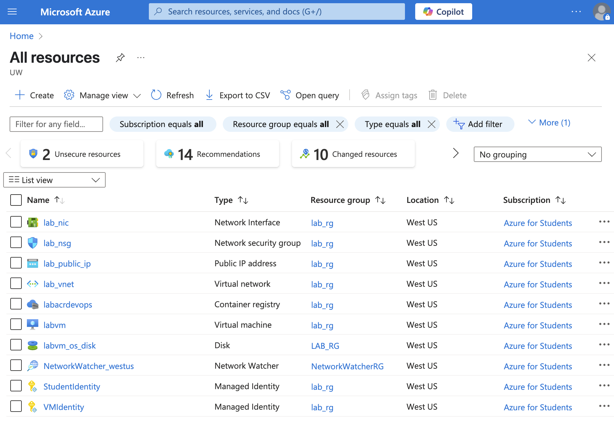
   - Under 'Resource groups', you should see two new resource groups: `lab-infra-devops` and `lab-infra-devsecops`.
   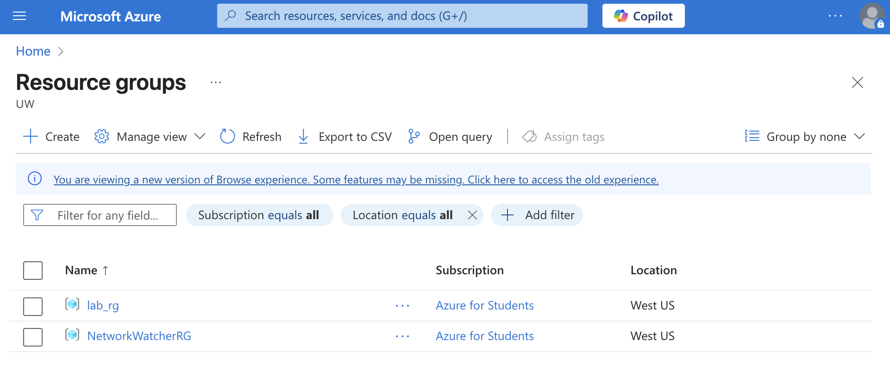
   - Under 'Container registries', you should see a new container registry named `labacrdevops`.
   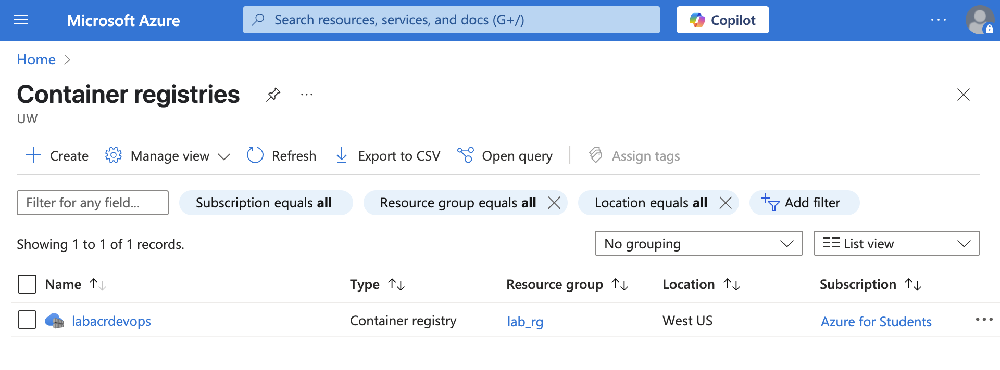


### Generate and Distribute Student Token

After the infrastructure is successfully deployed, you will need to retrieve the container registry token to distribute to students so they can access the Azure Container Registry.

1. Run the following command to output the student token information.

```bash
   terraform output acr_student_token_password
```

2. The output will look similar to this:

```hcl
   tolist([
   {
    "expiry" = "2025-12-31T23:59:59+00:00"
    "value"  = "xxxxxxxxxx"
   },
   ])
```

3. **NOTE**: 
   - If you are a lab administrator, record the value field (the actual token string) carefully and store it in a secure location. 
   - You will need to distribute this token to your students so they can authenticate and pull/push images to the Azure Container Registry (labacrdevops). 
   - Do not share the token publicly. Only distribute it privately to the intended students.


<hr>


## Accessing Internal Services

### Use the VPN Config

1. Navigate to the VPN Config at `https://{vm_public_ip}`. Replace `{vm_public_ip}` with the actual public IP address output by Terraform.
   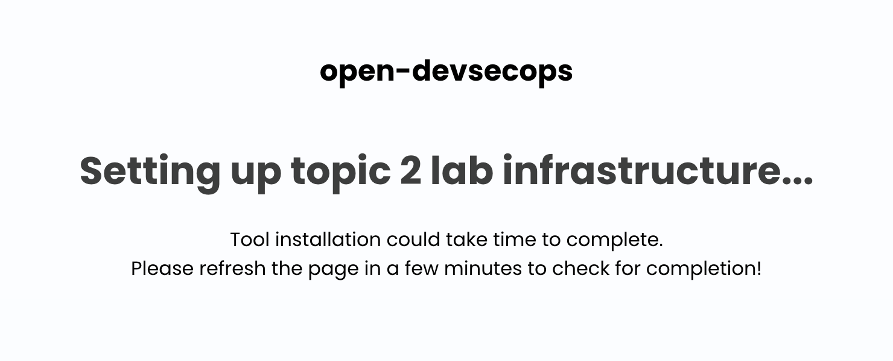
2. Wait for about 2–3 minutes for the VPN Config service to fully initialize. After the following page is loaded, download the VPN Configuration file.
   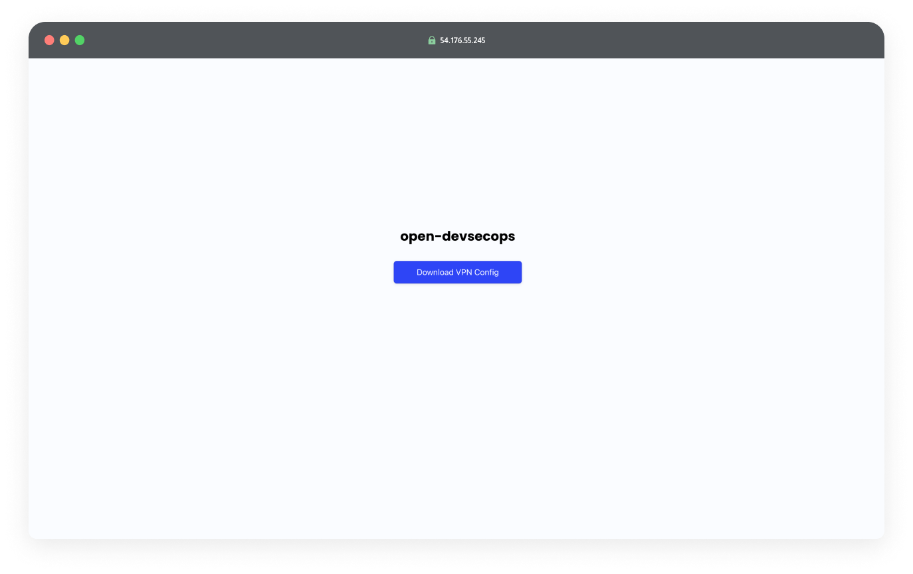
3. Import the VPN Configuration file into your WireGuard client.
4. Activate the VPN connection using WireGuard to securely connect to the internal network.
   

<hr>

## Configuring Jenkins

Once your infrastructure is ready and you have connected to the internal network via VPN, you can proceed to set up Jenkins for the DevOps labs.

1. Navigate to `http://jenkins.internal` in your web browser.
   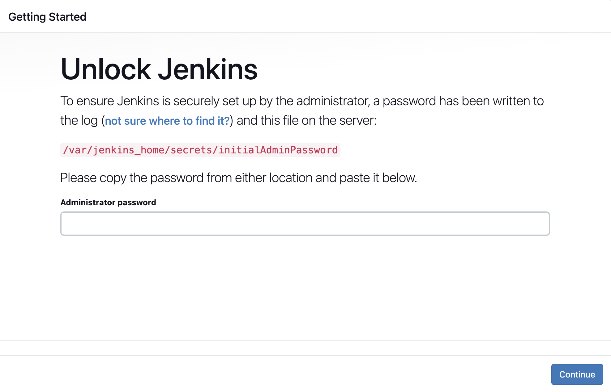
2. To unlock Jenkins and begin setup, you need the initial admin password. Use the command below to retrieve this.

```bash
   ssh -i {path_to_your_cloned_repo}/lab-infra-setup/topic-2-devops/azure/lab_key.pem azureuser@{vm_public_ip} -f "sudo docker exec jenkins cat /var/jenkins_home/secrets/initialAdminPassword"
```

   Make sure you are in the `{path_to_your_cloned_repo}/lab-infra-setup/topic-2-devops/azure` directory where the SSH key is located before you enter the command. 

3. Back in your web browser on the Jenkins unlock page, enter the initial admin password you retrieved to unlock 

4. Select the option to Install suggested plugins.
   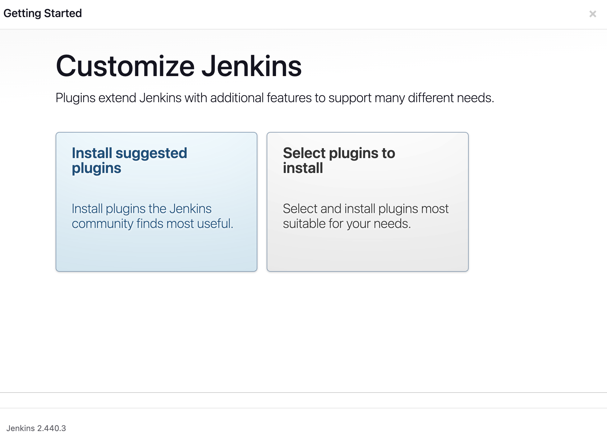

5. Once the plugin installation is complete, proceed to the Create First Admin User step.

6. Fill out the form with the admin username, password.

7. On the Instance Configuration page, ensure the Jenkins URL is set to http://jenkins.internal/. This should be populated automatically.
   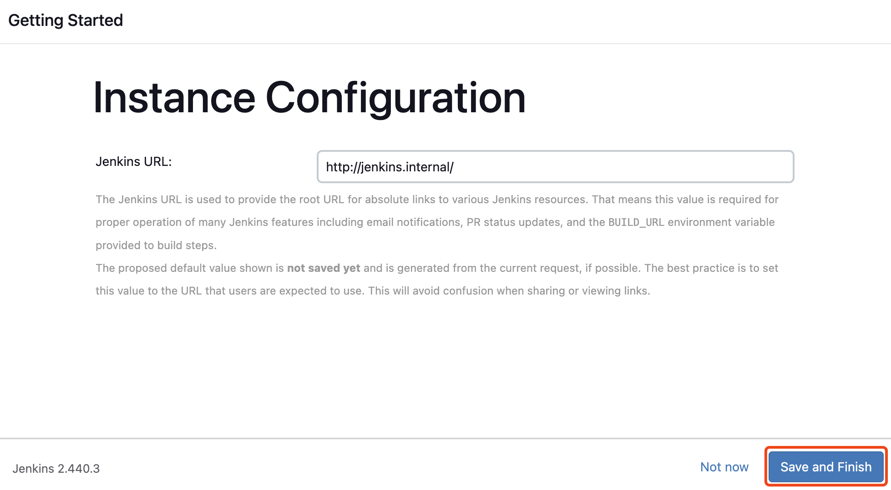

8. Click Save and Finish.

<hr>

## Setting Up Jenkins

Finally, let's set up a student account that has the necessary permissions to create and manage pipelines but does not possess full administrative rights.

1. Click on `Manage Jenkins` from the main menu on the left.

2. Access `Security > Users`.
   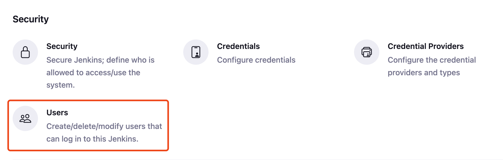

3. Click on Create User to set up a new account.

4. Return to Manage Jenkins and select `Security > Security`.
   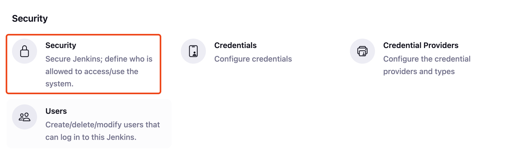

5. Scroll to the Authorization section.

6. Select "Matrix-based security" from the list of Authorization strategies.

7. Click Add user.

8. Enter the username of the student account you created.

9. Configure the permissions for the student account as follows and click on "Save" to apply the changes.

   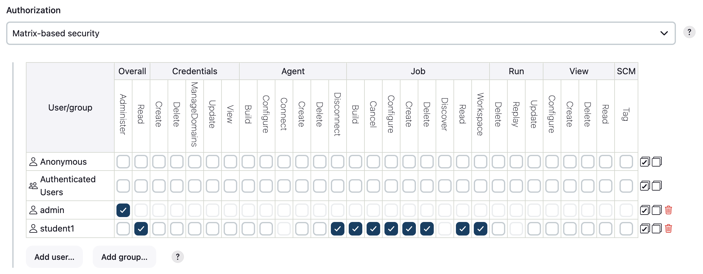


<hr>


## Tear Down Infrastructure After Use (Lab 2 & 3)

To avoid unnecessary charges, it is important to tear down the infrastructure once you have completed the lab.

### Destroy Resources Using Terraform

1. Open your terminal.

2. Navigate to the same directory where you applied your Terraform configuration:

```bash
   cd {path_to_your_cloned_repo}/lab-infra-setup/topic-2-devops/azure
```

3. Run the following command to destroy all resources created by Terraform:

```bash
   terraform destroy
```
   
4. When prompted to `Enter a value:`, enter `yes` to confirm the destruction of all resources.

### Check Destruction Completion

1. Once the destruction is complete, you should see outputs in your terminal similar to the following:

```hcl
   Destroy complete! Resources: 16 destroyed.
```

2. **NOTE**: Some resources that were automatically created (such as certain storage containers, managed identities, or network interfaces) may not be fully destroyed by Terraform. To completely avoid ongoing costs:

   - Go to the [Azure Portal](https://portal.azure.com/) and sign in.
   - Navigate to the 'All resources' and 'Resource groups' tab. 
   - Locate the resource group you created for the lab and manually delete the entire resource group. This ensures that all associated resources are cleaned up. 
   - Then navigate to the 'Container registries' tab and manually delete any container registry that was created during the lab.

   By carefully verifying and manually deleting any leftover resources, you ensure a clean environment and prevent any unexpected Azure charges.

