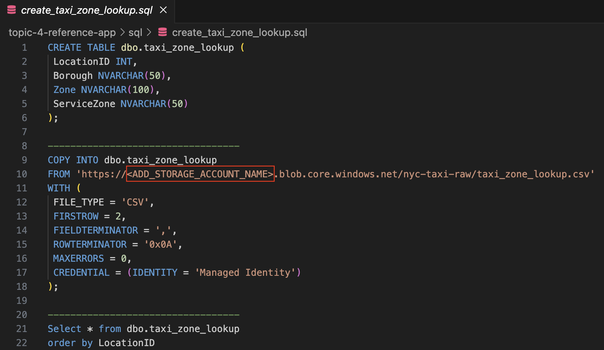
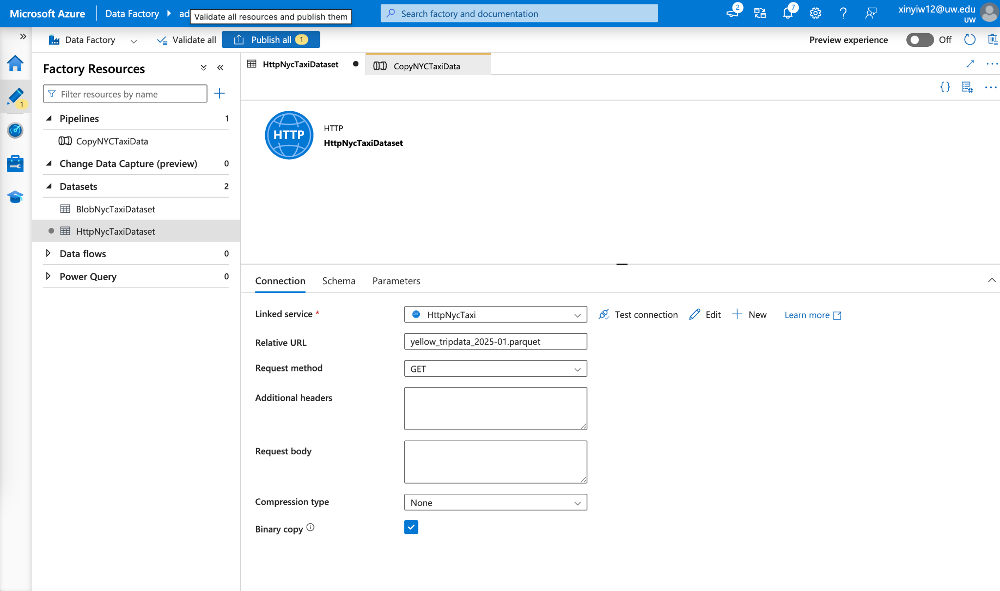
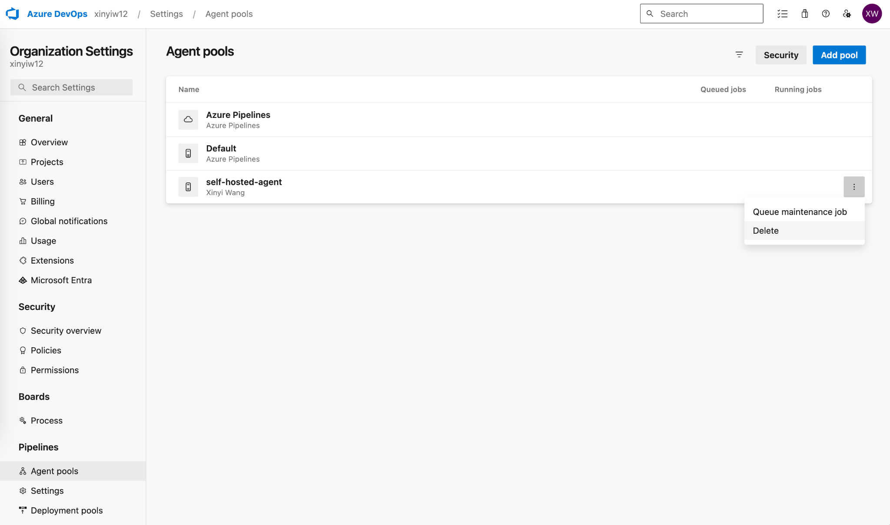

# Chapter 4 - Lab 4 - IaC DataOps Pipeline

<div class="time-pill">ESTIMATED TIME TO COMPLETE: 25–30 MINUTES</div>

## Set up: How to set up DataOps Infrastructure using Terraform

### 1.  Setup PAYG Azure Account

Make sure your Azure account is set to pay as you go (a free subscription will not work for the databricks cluster creation, the CPU requirement exceeds the free subscription limit)

### 2. Clone the GitHub Repo

Open your code editor such as VS code, open the terminal, clone the github repository: lab-infra-setup-dataops, by running this command in the terminal:

```
    git clone https://github.com/open-devsecops/lab-infra-setup-dataops.git
```

After running this command, you will see that in your current directory, there is a new folder showing up called "lab-infra-setup-dataops", as shown below:


### 3.  Configure the Terraform File and Azure DevOps Account

Open the 'azure' folder, open the file called 'variables.tf', and start editing it:

1\) Subscription ID:

Run the following command in the terminal:

```
    az account show \--query id \--output tsv
```

This will show you your Azure subscription ID.

Find the code below in the 'variables.tf' and add the subscription ID to the default section below:

```python
    variable "subscription_id" {
     description = "The Azure subscription ID"
     type        = string
     default     = "ADD_YOUR_SUBSCRIPTION_ID"
    }
```

2\) Azure DevOps Organizations

Go to Azure DevOps organizations


Go to my Azure DevOps organizations and create a new organization:


Remember the name of the organization you put in

After the organization is created, put the name of the organization in the codes below in the 'variables.tf'. Make sure you put the name in **both** variables.

```python
    variable "azuredevops_org" {
     description = "Azure DevOps organization name"
     type        = string
     default     = "ADD_YOUR_DEVOPS_ORGANIZATION_NAME"
    }
    
    
    variable "ado_org_url" {
     description = "Azure DevOps organization URL"
     type        = string
     default     = "https://dev.azure.com/<ADD_YOUR_DEVOPS_ORGANIZATION_NAME>"
    }
```

3\) Azure DevOps Organizations Personal Access Token

You will also need to set up your DevOps personal access token in the Azure portal, and then add it to the 'variables.tf'. This token can not be generated automatically in the CLI.

Go to the Azure DevOps Organizations page


Go into the organization you just created, go to personal access tokens


Create a new personal access token.

Make sure to select your newly created organization.

Select the scopes as 'Full access'.

Set the 'Expiration (UTC)' to 30 days.

You can customize the 'Name'.


After the creation is complete, you will see the personal access token in a pop up window. Copy and paste this personal access token to the code below in the 'variables.tf'.

```python
    variable "azuredevops_pat" {
     description = "Azure DevOps Personal Access Token"
     type        = string
     sensitive   = true
     default     = "ADD_YOUR_DEVOPS_PERSONAL_ACCESS_TOKEN"
    }
```

**4) Client ID, Client Secret, and Tenant ID**

**Add your subscription id into the code below:**

```
    az ad sp create-for-rbac \
      --name "MyServicePrincipal" \
      --role Contributor \
      --scopes /subscriptions/<ADD_YOUR_SUBSCRIPTION_ID>
```

This would create a new service principal under your current subscription

You will receive a response like this in the command line:

```
    {
      "appId": "**************",
      "displayName": "**************",
      "password": "**************",
      "tenant": "**************"
    }
```

The appId is the client_id, the password is the client_secret, and the tenant is the tenant_id

Put the client_id, client_secret, and the tenant_id into the codes below in the 'variables.tf'.

```python
    variable "azure_client_id" {
     description = "Azure Service Principal Client ID"
     type        = string
     default     = "ADD_AZURE_CLIENT_ID"
    }
    
    
    variable "azure_client_secret" {
     description = "Azure Service Principal Client Secret"
     type        = string
     sensitive   = true
     default     = "ADD_AZURE_CLIENT_SECRET"
    }
    
    
    variable "azure_tenant_id" {
     description = "Azure Tenant ID"
     type        = string
     default     = "ADD_AZURE_TENANT_ID"
    }
```

### 3. Run the Terraform File

Save the variables.tf file, then in the command line, run:

```
    terraform init
    terraform plan
    terraform apply
```

### 4. Run the Deployment

The deployment will run for approximately 15 min, after it is successful, you will see a message like this below in the terminal:

```
    <Insert deployment success screenshot>
```

Now the infra set up is done!

### 5. Setup Databricks Access Token

Now we need to set up the databricks personal access token, to ensure that the dataops pipeline can have access to the databricks resources.

Go to Databricks on the portal:


Go to settings


Go to Developer, Manage Access tokens


Click on the 'Generate new token'


Enter a comment for the token, you can just type: azure-devops-pipeline, or anything else you think is appropriate.

Set the Lifetime to 90.

Generate the token.


After the generation is complete, there will be a popup showing you the token.

Copy and paste the generated token into the code below in 'variables.tf':

```python
    variable "databricks_pat" {
     description = "Databricks Personal Access Token"
     type        = string
     sensitive   = true
     default     = "ADD_DATABRICKS_PERSONAL_ACCESS_TOKEN"
    }
```

### 6.  Rerun the Terraform File

Now, rerun the commands below in the terminal to reflect changes in
the variables.tf:

```
    terraform init
    terraform plan
    terraform apply
```

### 7. Create a Git Repo for Azure DataOps Pipeline

Create a git repo for the azure dataops pipeline to read from.

In the terminal, run:

```
    terraform output repo_url
```

Copy the repo_url that is returned

Make sure you're in the 'azure' folder in the 'lab-infra-setup-dataops' folder.

Run the command below in the terminal:

```
    git clone <the repo_url you just copied>
```

You will see a new folder called 'nyc-taxi-repo' showing up in the 'azure' folder.

Go into the 'nyc-taxi-repo' folder, add the following two Python files.

**process_data.py:**

It is used to process the data from the blob storage

**export_to_synapse.py:**

It is used to write the processed data to Synapse:

Then create another .yml file in the 'nyc-taxi-repo' folder called 'azure-pipelines.yml'. This would be the file that contains the logic of the dataops CI/CD pipeline:

**azure-pipelines.yml**

Now we need to create a new folder in the folder 'nyc-taxi-repo' called 'sql', where sql files would be stored. These sql files are used for data modelling in synapse.

Add the following sql files into the 'sql' folder.

**create_fact_trip.sql**

```sql
    CREATE TABLE dbo.fact_trip
    WITH (
    DISTRIBUTION = ROUND_ROBIN
    )
    AS
    SELECT
    t.taxi_type,
    t.pickup_datetime,
    t.dropoff_datetime,
    t.passenger_count,
    t.trip_distance,
    t.fare_amount,
    t.tip_amount,
    t.total_amount,
    zpu.Zone AS pickup_zone,
    zpu.Borough AS pickup_borough,
    zdo.Zone AS dropoff_zone,
    zdo.Borough AS dropoff_borough
    FROM (
    SELECT * FROM dbo.stg_yellow_tripdata
    UNION ALL
    SELECT * FROM dbo.stg_green_tripdata
    ) t
    LEFT JOIN dbo.taxi_zone_lookup zpu ON t.pu_location_id = zpu.LocationID
    LEFT JOIN dbo.taxi_zone_lookup zdo ON t.do_location_id = zdo.LocationID;
```

**create_staging_tables.sql**

```sql
    CREATE TABLE dbo.stg_yellow_tripdata
    WITH (
    DISTRIBUTION = ROUND_ROBIN
    )
    AS
    SELECT
    vendor_id,
    CAST(pickup_datetime AS DATETIME2) AS pickup_datetime,
    CAST(dropoff_datetime AS DATETIME2) AS dropoff_datetime,
    passenger_count,
    trip_distance,
    rate_code_id,
    store_and_fwd_flag,
    pu_location_id,
    do_location_id,
    payment_type,
    fare_amount,
    extra,
    mta_tax,
    tip_amount,
    tolls_amount,
    NULL AS ehail_fee,            -- not exist for yellow.make it NULL to be consisitent with green
    improvement_surcharge,
    total_amount,
    NULL AS trip_type,           -- not exist for yellow.make it NULL to be consisitent with green
    congestion_surcharge,
    airport_fee,
    'yellow' AS taxi_type
    FROM dbo.yellow_tripdata_2025_01;
    
    
    ----------------------------------
    CREATE TABLE dbo.stg_green_tripdata
    WITH (
    DISTRIBUTION = ROUND_ROBIN
    )
    AS
    SELECT
    vendor_id,
    CAST(pickup_datetime AS DATETIME2) AS pickup_datetime,
    CAST(dropoff_datetime AS DATETIME2) AS dropoff_datetime,
    passenger_count,
    trip_distance,
    rate_code_id,
    store_and_fwd_flag,
    pu_location_id,
    do_location_id,
    payment_type,
    fare_amount,
    extra,
    mta_tax,
    tip_amount,
    tolls_amount,
    ehail_fee,
    improvement_surcharge,
    total_amount,
    trip_type,
    congestion_surcharge,
    NULL AS airport_fee,-- not exist for green.make it NULL to be consisitent with yellow
    'green' AS taxi_type
    FROM dbo.green_tripdata_2025_01;
```

**create_taxi_zone_lookup.sql**

```sql
    CREATE TABLE dbo.taxi_zone_lookup (
    LocationID INT,
    Borough NVARCHAR(50),
    Zone NVARCHAR(100),
    ServiceZone NVARCHAR(50)
    );
    
    
    ----------------------------------
    COPY INTO dbo.taxi_zone_lookup
    FROM 'https://nyctaxistoragedataops.blob.core.windows.net/nyc-taxi-raw/taxi_zone_lookup.csv'
    WITH (
    FILE_TYPE = 'CSV',
    FIRSTROW = 2,
    FIELDTERMINATOR = ',',
    ROWTERMINATOR = '0x0A',
    MAXERRORS = 0,
    CREDENTIAL = (IDENTITY = 'Managed Identity')
    );
    
    
    ----------------------------------
    Select * from dbo.taxi_zone_lookup
    order by LocationID
```

**create_view_monthly_revenue.sql**

```sql
    CREATE VIEW dbo.vw_monthly_zone_revenue AS
    SELECT
    FORMAT(pickup_datetime, 'yyyy-MM') AS trip_month,   -- eg. 2025-01
    pickup_zone,                                       
    taxi_type,                                          -- yellow / green
    COUNT(*) AS trip_count,                            
    SUM(total_amount) AS total_revenue                 
    FROM dbo.fact_trip                                   
    WHERE pickup_datetime IS NOT NULL
    GROUP BY
    FORMAT(pickup_datetime, 'yyyy-MM'),
    pickup_zone,
    taxi_type;
    
    
    ----------------------------------
    select * from dbo.vw_monthly_zone_revenue
    order by trip_month, pickup_zone
    ```
    
    **taxi_zone_lookup.sql**
    
    ```sql
    CREATE TABLE dbo.taxi_zone_lookup (
    LocationID INT,
    Borough NVARCHAR(50),
    Zone NVARCHAR(100),
    ServiceZone NVARCHAR(50)
    );
    
    
    ----------------------------------
    COPY INTO dbo.taxi_zone_lookup
    FROM 'https://nyctaxistoragedataops.blob.core.windows.net/nyc-taxi-raw/taxi_zone_lookup.csv'
    WITH (
    FILE_TYPE = 'CSV',
    FIRSTROW = 2,
    FIELDTERMINATOR = ',',
    ROWTERMINATOR = '0x0A',
    MAXERRORS = 0,
    CREDENTIAL = (IDENTITY = 'Managed Identity')
    );
    
    
    ----------------------------------
    Select * from dbo.taxi_zone_lookup
    order by LocationID
    
    
    ----------------------------------
    CREATE TABLE dbo.stg_yellow_tripdata
    WITH (
    DISTRIBUTION = ROUND_ROBIN
    )
    AS
    SELECT
    vendor_id,
    CAST(pickup_datetime AS DATETIME2) AS pickup_datetime,
    CAST(dropoff_datetime AS DATETIME2) AS dropoff_datetime,
    passenger_count,
    trip_distance,
    rate_code_id,
    store_and_fwd_flag,
    pu_location_id,
    do_location_id,
    payment_type,
    fare_amount,
    extra,
    mta_tax,
    tip_amount,
    tolls_amount,
    NULL AS ehail_fee,            -- not exist for yellow.make it NULL to be consisitent with green
    improvement_surcharge,
    total_amount,
    NULL AS trip_type,           -- not exist for yellow.make it NULL to be consisitent with green
    congestion_surcharge,
    airport_fee,
    'yellow' AS taxi_type
    FROM dbo.yellow_tripdata_2025_01;
    
    
    ----------------------------------
    CREATE TABLE dbo.stg_green_tripdata
    WITH (
    DISTRIBUTION = ROUND_ROBIN
    )
    AS
    SELECT
    vendor_id,
    CAST(pickup_datetime AS DATETIME2) AS pickup_datetime,
    CAST(dropoff_datetime AS DATETIME2) AS dropoff_datetime,
    passenger_count,
    trip_distance,
    rate_code_id,
    store_and_fwd_flag,
    pu_location_id,
    do_location_id,
    payment_type,
    fare_amount,
    extra,
    mta_tax,
    tip_amount,
    tolls_amount,
    ehail_fee,
    improvement_surcharge,
    total_amount,
    trip_type,
    congestion_surcharge,
    NULL AS airport_fee,-- not exist for green.make it NULL to be consisitent with yellow
    'green' AS taxi_type
    FROM dbo.green_tripdata_2025_01;
    
    
    ----------------------------------
    CREATE TABLE dbo.fact_trip
    WITH (
    DISTRIBUTION = ROUND_ROBIN
    )
    AS
    SELECT
    t.taxi_type,
    t.pickup_datetime,
    t.dropoff_datetime,
    t.passenger_count,
    t.trip_distance,
    t.fare_amount,
    t.tip_amount,
    t.total_amount,
    zpu.Zone AS pickup_zone,
    zpu.Borough AS pickup_borough,
    zdo.Zone AS dropoff_zone,
    zdo.Borough AS dropoff_borough
    FROM (
    SELECT * FROM dbo.stg_yellow_tripdata
    UNION ALL
    SELECT * FROM dbo.stg_green_tripdata
    ) t
    LEFT JOIN dbo.taxi_zone_lookup zpu ON t.pu_location_id = zpu.LocationID
    LEFT JOIN dbo.taxi_zone_lookup zdo ON t.do_location_id = zdo.LocationID;
    
    
    ----------------------------------
    CREATE VIEW dbo.vw_monthly_zone_revenue AS
    SELECT
    FORMAT(pickup_datetime, 'yyyy-MM') AS trip_month,   -- eg. 2025-01
    pickup_zone,                                       
    taxi_type,                                          -- yellow / green
    COUNT(*) AS trip_count,                            
    SUM(total_amount) AS total_revenue                 
    FROM dbo.fact_trip                                   
    WHERE pickup_datetime IS NOT NULL
    GROUP BY
    FORMAT(pickup_datetime, 'yyyy-MM'),
    pickup_zone,
    taxi_type;
    
    
    ----------------------------------
    select * from dbo.vw_monthly_zone_revenue
    order by trip_month, pickup_zone
```

The final folder structure of 'nyc-taxi-repo' is like this:



In the 'nyc-taxi-repo' folder, run the following commands in the terminal:

```
git add .
git commit -m “added pipeline setup files”
git push
```

This will make sure the local changes we made are reflected in the remote git repo as well.

### 8. Azure Data Factory Linked Service Configuration

Go to the azure portal, find the 'adf-nyc-taxi-25' resource, which is an azure data factory resource. Go into it.


Go into the linked services


Create a new HTTP source (the creation of this source is currently not supported in Terraform, so we have to do it manually)


Use the configuration info below to set it up:

  - **Name**: HttpNycTaxi

  - **Base URL**: https://d37ci6vzurychx.cloudfront.net/trip-data/

  - **Authentication type**: Anonymous


After the creation is complete, make sure you click "Publish all" to publish the change


Go to the Factory Resources page, select the dataset 'HttpNycTxiDataset', choose our newly created 'HttpNycTaxi' as the linked service.


Click 'Publish all' to publish this change.



### 9. Run the Pipeline in Azure DevOps

Now go to Azure DevOps on the azure portal, go to the 'NYC Taxi Pipeline', click 'Run pipeline'.


Click 'Run'


The first time you run this pipeline, you will see that the pipeline will not automatically start.


You would need to click into the first stage called 'Trigger Data Factory', and grant your permission to run this pipeline, by clicking the 'Permit' button shown below.


After the first time you've granted permission, you would not need to do the same and grant permissions again in your future runs of the pipeline.

As you can see, the pipeline has finished running and is successful!


## Post completion: How to delete the lab resources

When finished with the lab,

Go to the Azure portal and delete:

    1. All resources

   2. All resource groups

   3. Go to Azure DevOps, and delete the pipeline: 'nyc-taxi-pipeline'


4\. Go to Azure DevOps -\> [Organization] Settings(not Project Settings) -\> agent pools, and delete the agent called 'self-hosted-agent'




Now you have successfully deleted all resources related to the lab!
