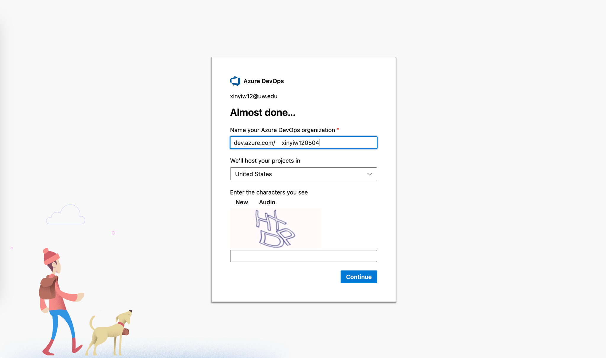
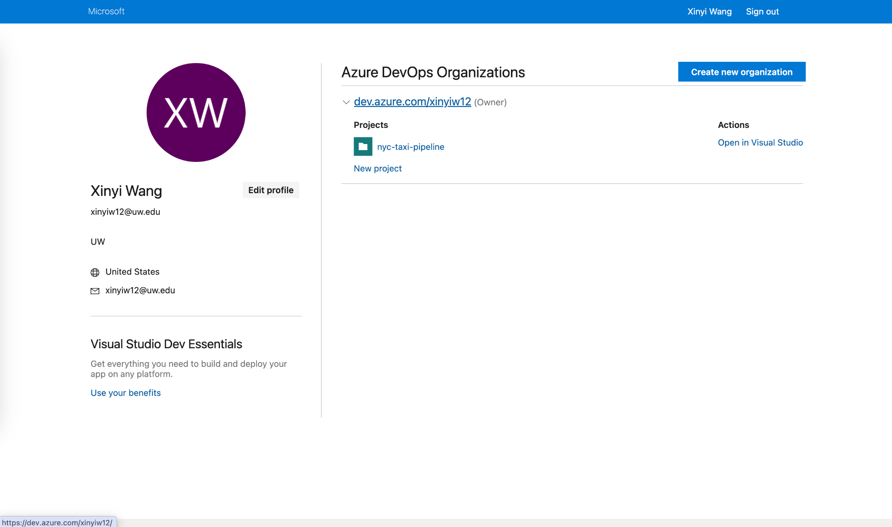
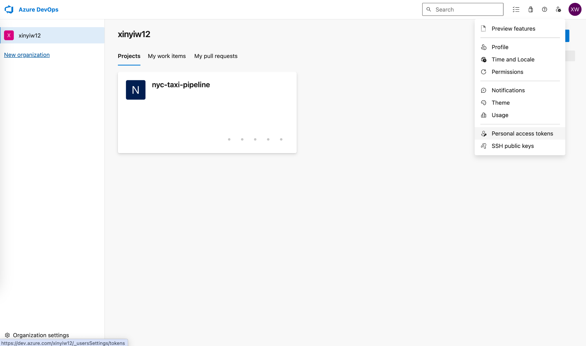
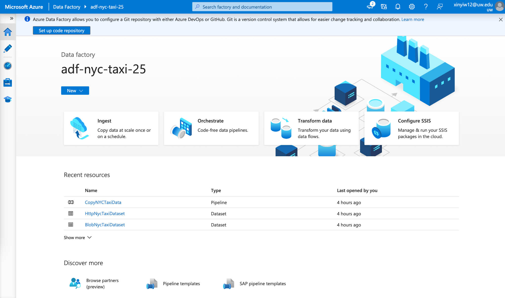
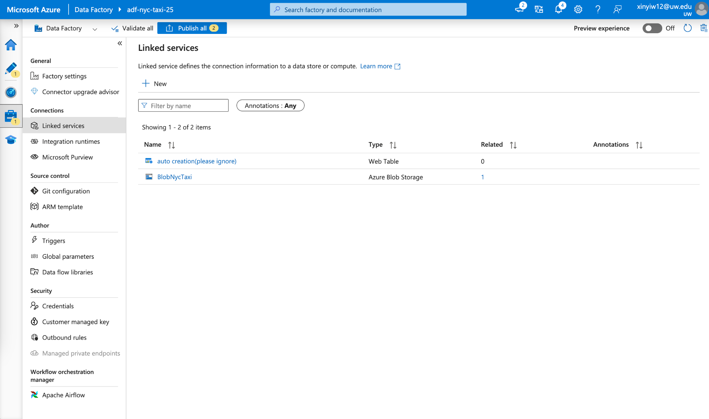
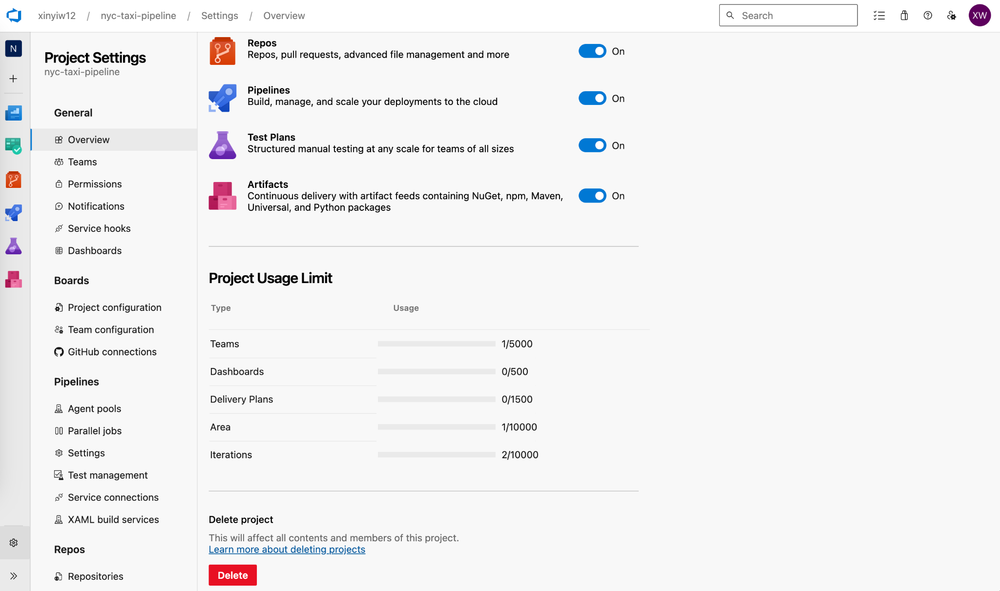

# Chapter 4 - Lab 4 - IaC DataOps Pipeline

<div class="time-pill">ESTIMATED TIME TO COMPLETE: 25–30 MINUTES</div>


## Introduction
In this lab, students will use Terraform to provision the infrastructure for a DataOps CI/CD pipeline, execute the pipeline, and analyze the outputs. 

## Lab Overview

| Section | Topic                                                                                       |
| ------- | ------------------------------------------------------------------------------------------- |
| 1       | Setting up the infrastructure for the DataOps CI\CD pipeline                                |
| 2       | Running the DataOps CI\CD pipeline                                                          |

<hr>

## Prerequisites

### Software Requirements:

Before you begin this lab, ensure you have the following tools installed and ready on your machine:

| Name             | Description                                               | Installation Guide                                                                                |
| ---------------- | --------------------------------------------------------- | ------------------------------------------------------------------------------------------------- |
| Git              | To clone the infrastructure scripts.                      | [Getting Started - Installing Git](https://git-scm.com/book/en/v2/Getting-Started-Installing-Git) |
| Azure CLI        | To interact with Microsoft Azure Services.                | [How to install the Azure CLI](https://learn.microsoft.com/en-us/cli/azure/install-azure-cli)     |
| Terraform        | To provision and manage Azure resources via IaC.          | [Install Terraform](https://developer.hashicorp.com/terraform/downloads)                               |

### Other Requirements:
- **Terminal / Linux Shell Access**: A terminal environment (such as Bash, Zsh, or Windows Subsystem for Linux) is required to run CLI commands, Terraform scripts, and Git operations.  
  
  - On Windows, it's recommended to install [Windows Subsystem for Linux (WSL)](https://learn.microsoft.com/en-us/windows/wsl/install).  
  - On macOS and Linux, a native terminal is already available.  

- **IDE**: You can use any code editor or IDE of your choice. Recommended options include:  
  
  - [Visual Studio Code](https://code.visualstudio.com/)  
  - [JetBrains IDEs](https://www.jetbrains.com/#for-developers)

### Skills and Knowledge

Below are the skills and knowledge expected to successfully complete the lab exercises:

- Basic command-line operations: You are comfortable navigating and executing commands in a terminal.
- Basic Git operations: cloning, forking, committing, pushing.

<hr>

## Setting up the infrastructure for the DataOps CI\CD pipeline
In this section, you are going to set up the infrasturcture for the DataOps CI/CD pipeline we are going to run later. 

### 1.  Set up Azure Account
⚠️ **Caution**  
This tutorial utilizes paid Azure resources, with estimated costs of **approximately $2 per hour**. We recommend that students review these potential charges and plan accordingly before beginning the tutorial.

1.  **Register a new Azure account with free trial**
This would provide you with $200 free credits to use azure resources for 30 days. You will need to provide your email, debit/credit card info, and other information.

Visit the website here: https://azure.microsoft.com/en-us/pricing/purchase-options/azure-account and click on 'Try Azure for Free' to start the process.


2. **Upgrade account to Pay-As-You-Go**
After you set your account as free trial, you will need to upgrade it to "Pay-As-You-Go" to be able to use resources in this lab. 

Visit the website here: https://azure.microsoft.com/en-us/pricing/purchase-options/azure-account and click on 'Pay as you go' to start the upgrade process. 


### 2. Clone the GitHub Repo

Open your code editor such as VS code, open the terminal, clone the github repository: lab-infra-setup-dataops, by running this command in the terminal:

```bash
    git clone https://github.com/open-devsecops/lab-infra-setup-dataops.git
```

After running this command, you will see that in your current directory, there is a new folder showing up called "lab-infra-setup-dataops", as shown below:


### 3.  Configure the Terraform File and Azure DevOps Account

Open the 'azure' folder, open the file called 'variables.tf', and start editing it:

1. **Subscription ID:** 
Log into your azure account in the azure cli by running the code:
```bash
    az login
```

After you have successfully logged in, run the following command in the terminal:

```bash
    az account show --query id --output tsv
```

This will show you your Azure subscription ID.

Find the code below in the 'variables.tf' and add the subscription ID to the default section below:

```python
    variable "subscription_id" {
     description = "The Azure subscription ID"
     type        = string
     default     = "ADD_YOUR_SUBSCRIPTION_ID"
    }
```

2. **Azure DevOps Organizations:**

Go to Azure DevOps organizations


Go to my Azure DevOps organizations and create a new organization:



Remember the name of the organization you put in

After the organization is created, put the name of the organization in the codes below in the 'variables.tf'. Make sure you put the name in **both** variables (You don't need to create a project after the organization is created).

```python
    variable "azuredevops_org" {
     description = "Azure DevOps organization name"
     type        = string
     default     = "ADD_YOUR_DEVOPS_ORGANIZATION_NAME"
    }
    
    
    variable "ado_org_url" {
     description = "Azure DevOps organization URL"
     type        = string
     default     = "https://dev.azure.com/<ADD_YOUR_DEVOPS_ORGANIZATION_NAME>"
    }
```

3.**Azure DevOps Organizations Personal Access Token:**

You will also need to set up your DevOps personal access token in the Azure portal, and then add it to the 'variables.tf'. This token can not be generated automatically in the CLI.

Go to the Azure DevOps Organizations page



Go into the organization you just created, go to personal access tokens



Create a new personal access token.

Make sure to select your newly created organization.

Select the scopes as 'Full access'.

Set the 'Expiration (UTC)' to 30 days.

You can customize the 'Name'.


After the creation is complete, you will see the personal access token in a pop up window. Copy and paste this personal access token to the code below in the 'variables.tf'.

```python
    variable "azuredevops_pat" {
     description = "Azure DevOps Personal Access Token"
     type        = string
     sensitive   = true
     default     = "ADD_YOUR_DEVOPS_PERSONAL_ACCESS_TOKEN"
    }
```

4.**Client ID, Client Secret, and Tenant ID:**

Add your subscription id into the code below:

```bash
    az ad sp create-for-rbac \
      --name "MyServicePrincipal" \
      --role Contributor \
      --scopes /subscriptions/<ADD_YOUR_SUBSCRIPTION_ID>
```

This would create a new service principal under your current subscription

You will receive a response like this in the command line:

```bash
    {
      "appId": "**************",
      "displayName": "**************",
      "password": "**************",
      "tenant": "**************"
    }
```

The appId is the client_id, the password is the client_secret, and the tenant is the tenant_id

Put the client_id, client_secret, and the tenant_id into the codes below in the 'variables.tf'.

```python
    variable "azure_client_id" {
     description = "Azure Service Principal Client ID"
     type        = string
     default     = "ADD_AZURE_CLIENT_ID"
    }
    
    
    variable "azure_client_secret" {
     description = "Azure Service Principal Client Secret"
     type        = string
     sensitive   = true
     default     = "ADD_AZURE_CLIENT_SECRET"
    }
    
    
    variable "azure_tenant_id" {
     description = "Azure Tenant ID"
     type        = string
     default     = "ADD_AZURE_TENANT_ID"
    }
```

### 4.  Run Terraform Commands:

Save the variables.tf file, then in the command line, run:

```bash
    terraform init
    terraform plan
    terraform apply --auto-approve
```

### 5. Run the Deployment

The deployment will run for approximately 15 min, after it is successful, you will see a message like this below in the terminal:

```
    <Insert deployment success screenshot>
```

Now the infra set up is done!

### 6. Setup Databricks Access Token

Now we need to set up the databricks personal access token, to ensure that the dataops pipeline can have access to the databricks resources.

Go to Databricks on the portal:


Go to settings


Go to Developer, Manage Access tokens


Click on the 'Generate new token'


Enter a comment for the token, you can just type: azure-devops-pipeline, or anything else you think is appropriate.

Set the Lifetime to 90.

Generate the token.


After the generation is complete, there will be a popup showing you the token.

Copy and paste the generated token into the code below in 'variables.tf':

```python
    variable "databricks_pat" {
     description = "Databricks Personal Access Token"
     type        = string
     sensitive   = true
     default     = "ADD_DATABRICKS_PERSONAL_ACCESS_TOKEN"
    }
```

### 7.  Rerun the Terraform File

Now, rerun the commands below in the terminal to reflect changes in
the variables.tf:

```bash
    terraform init
    terraform plan
    terraform apply --auto-approve
```

Now you have successfully set up the infrastructure for the Dataops CI/CD pipeline! Congradulations!

<hr>

## Running the DataOps CI\CD pipeline

Next step, we're going to do more specific configurations so that the pipeline would take input data, process them, and create the corresponding outputs. After the configuration, we would be able to run the DataOps pipeline and analyze the pipeline outputs. 

### 1. Create a Git Repo for Azure DataOps Pipeline

Create a git repo for the azure dataops pipeline to read from.

In the terminal, run:

```bash
    terraform output repo_url
```

Copy the repo_url that is returned

Make sure you're in the 'azure' folder in the 'lab-infra-setup-dataops' folder.

Run the command below in the terminal:

```bash
    git clone <the repo_url you just copied>
```

The first time you clone into the repo, you will see a popup window in your IDE asking you to enter a password. This should be the Azure DevOps PAT we generated earlier and kept in the variables.tf. Copy and paste the PAT in the popup window and enter. 

You would see the clone is successful. 

You will see a new folder called 'nyc-taxi-repo' showing up in the 'azure' folder.

Clone another folder to the 'azure' folder by running:
```bash
git clone https://github.com/open-devsecops/topic-4-reference-app-azure.git
```

Copy and paste the content in the 'topic-4-reference-app-azure' folder to the 'nyc-taxi-repo' folder. 
You will see the following content in the 'nyc-taxi-repo' folder: 
**process_data.py:** 
It is used to process the data from the blob storage

**export_to_synapse.py:**
It is used to write the processed data to Synapse:

**azure-pipelines.yml**
This would be the file that contains the logic of the dataops CI/CD pipeline.

There is also a 'sql' folder, where sql files would be stored. These sql files are used for data modelling in synapse.
These sql files are:
**create_fact_trip.sql**
It creates a fact table combining yellow and green taxi trip data with pickup and dropoff zone details from the lookup table for analytics.

**create_staging_tables.sql**
It creates staging tables for yellow and green taxi data by standardizing and transforming raw trip datasets into a consistent schema.

**create_taxi_zone_lookup.sql**
It creates and populates a lookup table mapping location IDs to their corresponding boroughs and zones using external CSV data.

**create_monthly_zone_revenue.sql**
It creates a table that aggregates monthly revenue and trip counts per pickup zone and taxi type from the fact table.

The final folder structure of 'nyc-taxi-repo' is like this:


Go to 'azure-pipelines.yml' and update the 'variables' section. You will need to replace the capitalized words with your storage account name, synapse workspace name, and data factory name. 


You can find these names in 'All resources'.


Go to 'create_taxi_zone_lookup.sql' in the 'sql' folder, and update the storage account name to your current storage account name. You can find your current storage account name in 'All resources' as well. 

In the 'nyc-taxi-repo' folder, run the following commands in the terminal:

```bash
git add .
git commit -m “added pipeline setup files”
git push
```

This will make sure the local changes we made are reflected in the remote git repo as well.

### 2. Azure Data Factory Linked Service Configuration

Go to the azure portal, find the 'adf-nyc-taxi-xxx' resource, which is an azure data factory resource. Go into it.




Go into the linked services



Create a new HTTP source (the creation of this source is currently not supported in Terraform, so we have to do it manually)


Use the configuration info below to set it up:

  - **Name**: HttpNycTaxi

  - **Base URL**: https://d37ci6vzurychx.cloudfront.net/trip-data/

  - **Authentication type**: Anonymous


After the creation is complete, make sure you click "Publish all" to publish the change


Go to the Factory Resources page, select the dataset 'HttpNycTxiDataset', choose our newly created 'HttpNycTaxi' as the linked service.


Click 'Publish all' to publish this change.


### 3. Run the Pipeline in Azure DevOps

Now go to Azure DevOps on the azure portal, go to the 'NYC Taxi Pipeline', click 'Run pipeline'.


Click 'Run'


The first time you run this pipeline, you will see that the pipeline will not automatically start.


You would need to click into the first stage called 'Trigger Data Factory', and grant your permission to run this pipeline, by clicking the 'Permit' button shown below.


After the first time you've granted permission, you would not need to do the same and grant permissions again in your future runs of the pipeline.

As you can see, the pipeline has finished running and is successful!


You can go to your storage account 'nyctaxistoragexxx', go to the 'nyc-taxi-raw' container, and check the ingested yellow and green taxi data from the nyc taxi http source. 


You can launch the databricks workspace 


And see in the 'job runs' section that, the raw nyc taxi data were processed and exported to synapse. 


Finally, you can go to synapse. 


And see the tables created based on the exported data from databricks. 


The 'monthly_zone_revenue' table shows the data modeling result. 
You can run:
```sql
SELECT * FROM dbo.monthly_zone_revenue
ORDER BY trip_month, pickup_zone;
```
to check the table. 


## Post completion: How to delete the lab resources

When finished with the lab,

Go to the Azure portal and delete:

   1. All resources

   2. All resource groups

   3. Go to Azure DevOps, and delete the pipeline: 'nyc-taxi-pipeline'




4. Go to Azure DevOps -\> [Organization] Settings(not Project Settings) -\> agent pools, and delete the agent called 'self-hosted-agent'


Now you have successfully deleted all resources related to the lab!